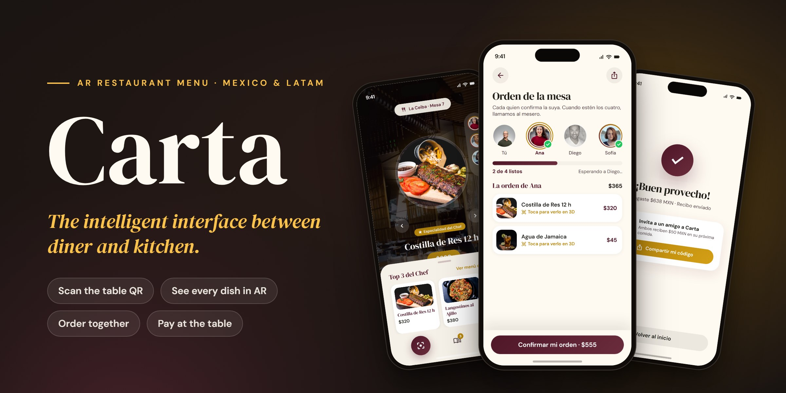
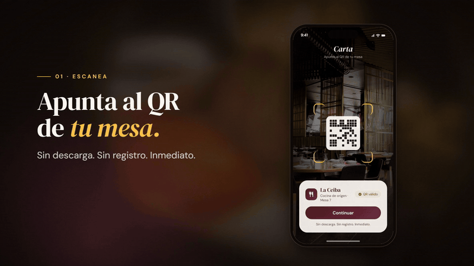
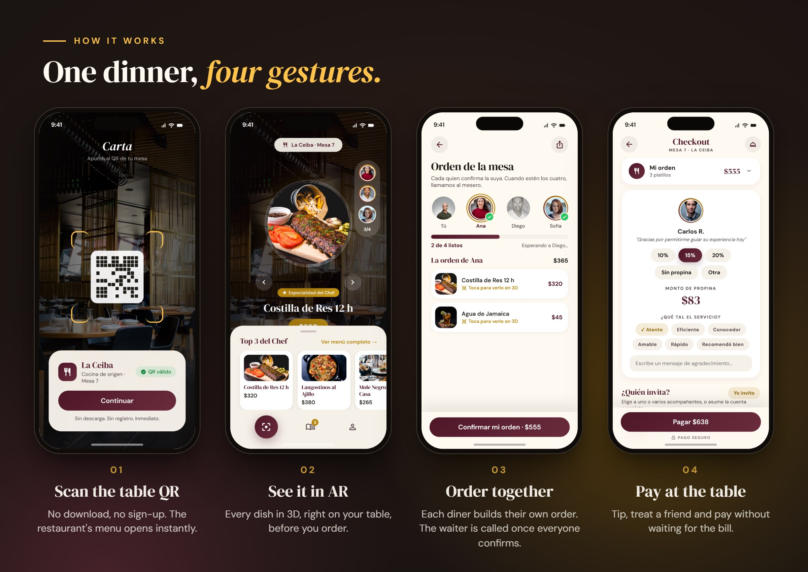
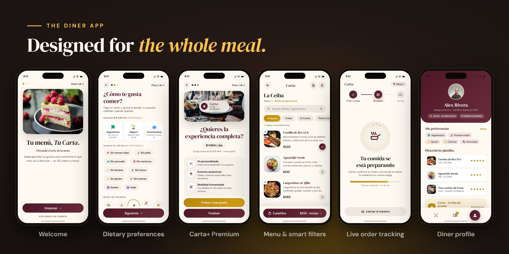
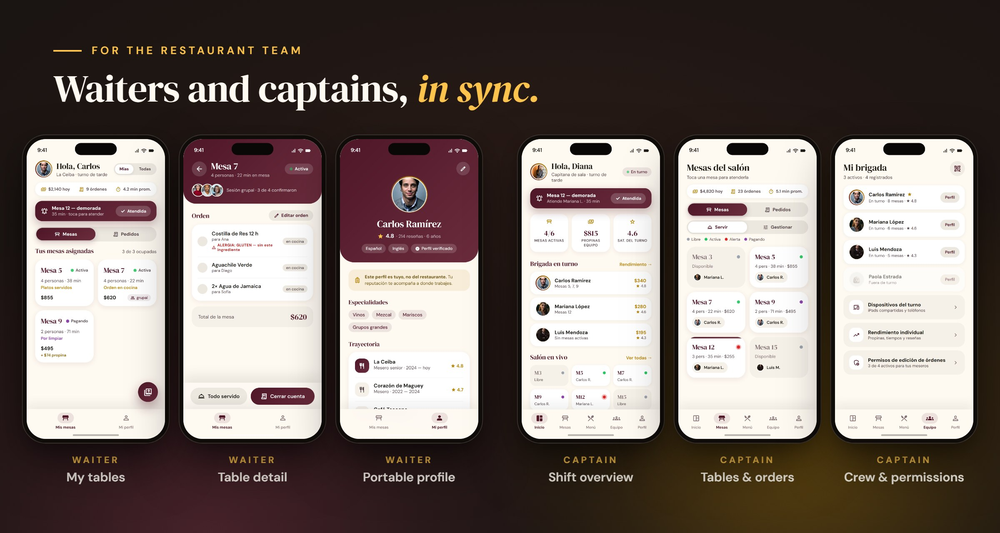
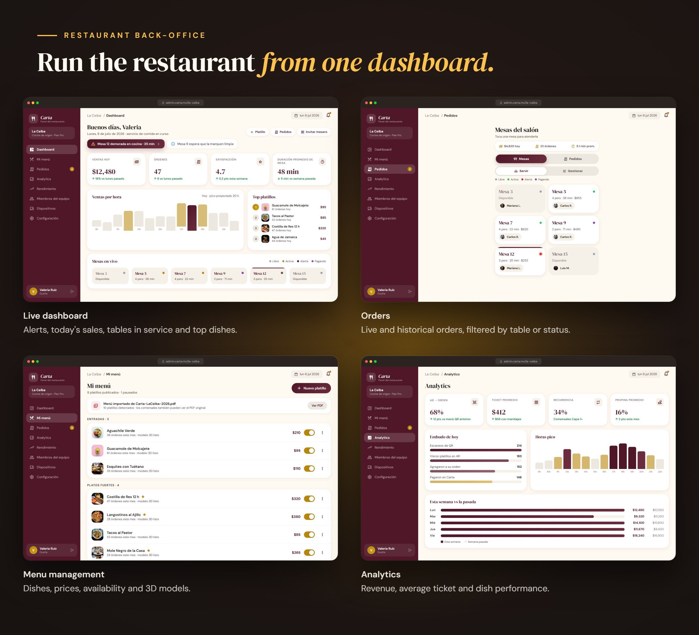
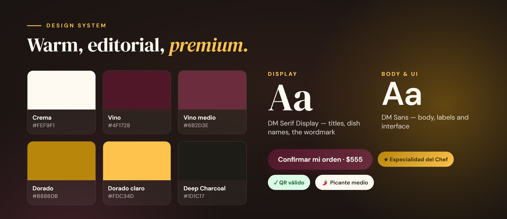
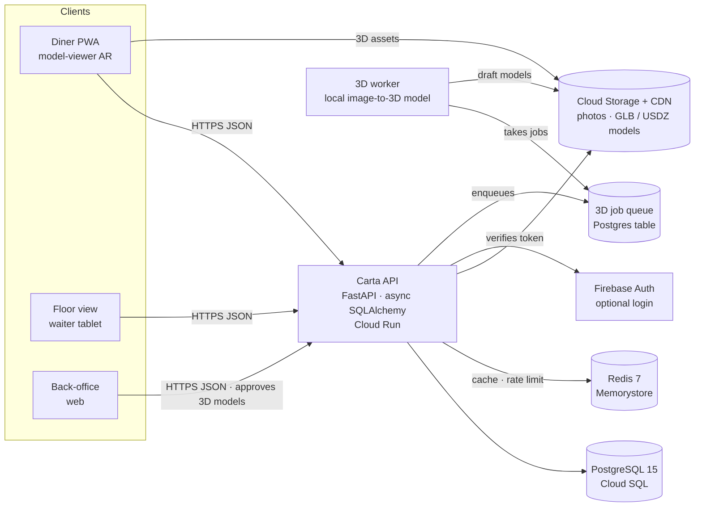
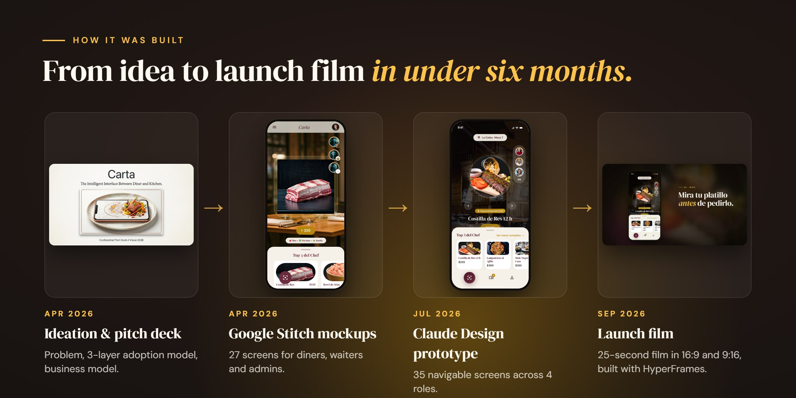

  

  <a href="https://klvinlopez.github.io/carta/"><b>Website</b></a> ·
  <a href="https://klvinlopez.github.io/carta/marketing/video/carta-lanzamiento-16x9.mp4"><b>Launch film</b></a> ·
  <a href="https://klvinlopez.github.io/carta/marketing/video/carta-lanzamiento-9x16.mp4"><b>Vertical cut</b></a> ·
  <a href="https://klvinlopez.github.io/carta/prototipo/"><b>Live prototype</b></a> ·
  <a href="docs/mvp/README.md"><b>MVP design package</b></a>

# Carta

**Carta turns the restaurant QR menu into an interactive, social experience.** Diners scan the QR code on their table — no app, no sign-up — and see every dish in 3D on the table with augmented reality. Everyone at the table builds an order together, and the check gets paid without waiting for the bill. For restaurants, Carta is an operating system for the floor: live orders, a waiter app, a captain view and an analytics back-office.

> **Status:** the product definition, design and MVP technical plan are complete, and the MVP is ready to be built. See [Project status](#project-status).

## Watch the launch film

A 25-second film in two cuts: [16:9 for YouTube and LinkedIn](https://klvinlopez.github.io/carta/marketing/video/carta-lanzamiento-16x9.mp4) and [9:16 for Reels and TikTok](https://klvinlopez.github.io/carta/marketing/video/carta-lanzamiento-9x16.mp4). The source and credits are in [`marketing/video/`](marketing/video/README.md).

## The problem

Menus went digital, but the experience never changed. The QR code on the table still opens a static PDF: long lists of options, no picture of the actual dish, no sense of portion size and no way to filter for allergies or diets. Friends pass one phone around to decide, and the restaurant learns nothing from any of it.

*Digitizing the menu didn't add value — it only changed the format.*

## How it works

## Three layers of adoption

Each layer removes a barrier before asking for anything:

| Layer | For | What it adds |
|---|---|---|
| **0 · Anonymous** | Anyone who scans the QR | A visual menu with 3D/AR previews, allergens and the chef's top 3. Zero friction. |
| **1 · Free account** | Diners at a shared table | A one-tap Google/Apple login that joins the table session: friends share dishes, each person keeps their own order, the waiter is called when everyone is ready, and past visits are saved. |
| **2 · Carta+** (MXN $29/month) | Regulars | AI recommendations, smart dietary filtering, cross-restaurant memory, priority reservations and no ads. Part of each subscription funds meals through partner NGOs. |

## The diner app

## For the restaurant

Waiters own a **portable professional profile**: their ratings, reviews and experience travel with them from restaurant to restaurant, much like an Airbnb host's. Captains run the floor, the crew and device access. Owners manage everything from the back-office:

## Design system

The creative north star is *"The Digital Sommelier"*: the warmth of a fine-dining room with the precision of augmented reality. Cream surfaces, wine-red actions and gold accents, set in DM Serif Display and DM Sans. The full specification is in [`docs/Carta_Design_System.md`](docs/Carta_Design_System.md). The [27 Google Stitch mockups](stitch/README.md) and the [35-screen interactive prototype](prototipo/README.md) both live in this repo, and you can [try the prototype live](https://klvinlopez.github.io/carta/prototipo/).

## Architecture (MVP)

The MVP is deliberately simple: one deployable API, a PWA that needs no install, and a 3D pipeline that never publishes without a human in the loop.

Key decisions, each one documented as an [architecture decision record](docs/mvp/adr/README.md):

| Decision | Why |
|---|---|
| Modular monolith on Cloud Run | Ten pilot restaurants don't justify running many services; the package boundaries allow splitting later. |
| PWA for diners, not a native app | Nobody installs a 40 MB app to read a menu. AR runs through `<model-viewer>`, which hands off to Scene Viewer on Android and AR Quick Look on iOS. |
| Signed guest token, no account | Layer 0 must be frictionless; login is optional and comes later. |
| Polling with ETag every 3 s instead of WebSockets | Stateless, no sticky sessions, and it works on poor networks. |
| Local 3D generation plus human review | Keeps quality and cost under control. The design enforces this with a database constraint, so a model nobody approved can't be published. |
| GLB + USDZ with a weight budget | The minimum needed to cover native AR on both Android and iOS. |

**Stack:** Python 3.11 · FastAPI · SQLAlchemy 2 (async) · Alembic · PostgreSQL 15 · Redis 7 · Firebase Auth · Google Cloud (Cloud Run, Cloud SQL, Memorystore, Cloud Storage) · Terraform · GitHub Actions · PWA with `<model-viewer>`.

## Pilot goals

The MVP will be validated with 5–10 pilot restaurants in Mexico City. The pilot has to show three things: that the AR menu is usable without instructions, that it lifts the average ticket or menu exploration, and that restaurants want to keep it.

| Metric | Target |
|---|---|
| Scan rate (unique scans ÷ tables served) | ≥ 40% |
| AR activation (sessions that open a 3D model) | ≥ 60% |
| Order rate (sessions that confirm an order) | ≥ 25% |
| Average ticket vs. tables without Carta | ≥ +8% |
| Pilot restaurants still active after 6 weeks | ≥ 70% |

## Business model

- **Diners:** free layers supported by contextual ads, plus Carta+ at MXN $29/month or $249/year.
- **Restaurants:** a Pro tier (MXN $249/month) with advanced analytics, custom branding and POS integration, plus self-serve promotions that boost specific dishes.
- **3D artist marketplace:** restaurants hire verified 3D artists inside Carta, and Carta takes a 15–20% commission.
- **Social impact:** "Invitado Extra" routes part of every Carta+ subscription to partner NGOs that feed people in need. Post-meal leftover tracking helps restaurants cut food waste.

The market sizing, personas and competitive landscape are in [`docs/Carta_Market_Analysis.md`](docs/Carta_Market_Analysis.md), and the pitch deck is in [`docs/pitch/`](docs/pitch/Carta_Pitch_Deck.pdf).

## Project status

- [x] Product definition, market analysis and pitch deck — April 2026
- [x] 27 UI mockups in Google Stitch — April 2026
- [x] Interactive prototype: 35 screens and 4 roles (diner, waiter, captain, admin) — July 2026
- [x] MVP technical design package — August 2026: PRD with 24 user stories and 83 EARS acceptance criteria, technical design, 10 ADRs, data model, OpenAPI spec with 42 operations, 3D pipeline, and an implementation plan with 58 tasks, plus test and security strategies
- [x] Launch film in 16:9 and 9:16 — September 2026
- [ ] Build the MVP in seven phases: foundations → data and back-office → diner menu → orders → AR experience → 3D pipeline → analytics, security and pilot

## How it was built

Carta is a solo project by Calvin ([@KlvinLopez](https://github.com/KlvinLopez)), who took it from idea to launch-ready design with AI tools:
- **Claude (Cowork):** ideation, research, the documentation set, the MVP technical plan and the backend skeleton.
- **Google Stitch:** the UI mockups.
- **Claude Design:** the interactive prototype.
- **Claude Code:** this repository and the launch film production.
- **HyperFrames:** the launch film, via the `/brag` skill.

## Repository map

| Path | What's inside |
|---|---|
| [`docs/mvp/`](docs/mvp/README.md) | MVP technical design package — **start here** to build |
| [`docs/`](docs/) | Product definition, diagrams, user stories, market analysis and design system |
| [`docs/pitch/`](docs/pitch/Carta_Pitch_Deck.pdf) | Pitch deck and branding |
| [`prototipo/`](prototipo/README.md) | Interactive prototype (Claude Design) |
| [`stitch/`](stitch/README.md) | 27 Google Stitch mockups (HTML + PNG) |
| [`marketing/video/`](marketing/video/README.md) | Launch films and their HyperFrames source |
| [`app/`](app/), [`migrations/`](migrations/), [`tests/`](tests/) | FastAPI backend skeleton — see the [backend guide](docs/BACKEND.md) |
| [`terraform/`](terraform/), [`.github/workflows/`](.github/workflows/) | Google Cloud infrastructure and CI/CD |
| [`wireframes/`](wireframes/) | First interactive wireframes (React) |
| [`CLAUDE.md`](CLAUDE.md) | Build guardrails for Claude Code |

Most project documentation is written in Spanish, since the product targets Mexico and Latin America.

## License

© 2026 Calvin (KlvinLopez). **All rights reserved.** This repository is public as a portfolio showcase. No license is granted to use, copy, modify or distribute its code, designs or content. Third-party assets keep their own licenses: see [`marketing/video/README.md`](marketing/video/README.md) and the font licenses in [`prototipo/carta-assets/fonts/`](prototipo/carta-assets/fonts/).
