# Carta — Diagramas, User Stories y Flujos de UX (v2)

**Version:** 2.0
**Fecha:** 3 de abril de 2026
**Complemento de:** Carta_Ideacion_v3.md

---

## 1. User Stories por Persona y Fase

### Persona: Comensal Anonimo (Capa 0)

**Fase 1:**
- US-C01: Como comensal, quiero escanear un QR y ver el menu en mi celular para no depender del menu fisico.
- US-C02: Como comensal, quiero ver fotos reales de cada platillo para saber como luce.
- US-C03: Como comensal, quiero ver ingredientes y alergenos de cada platillo para saber si es seguro sin preguntar al mesero.
- US-C04: Como comensal, quiero ver los Top 3 recomendados para decidir mas rapido.
- US-C05: Como comensal, quiero que el menu cargue rapido y se vea bien en mi celular.

**Fase 2:**
- US-C06: Como comensal, quiero filtrar por categoria, precio y dieta para navegar mas rapido.
- US-C07: Como comensal, quiero ver un platillo en 3D sobre mi mesa con AR para conocer el tamano real.
- US-C08: Como comensal, quiero rotar y hacer zoom al modelo 3D para verlo desde todos los angulos.
- US-C09: Como comensal, desde la vista 3D quiero poder agregar el platillo a mi orden o regresar al menu.

### Persona: Comensal Registrado Gratis (Capa 1)

**Fase 2:**
- US-C10: Como comensal registrado, quiero unirme a una sesion grupal con mis amigos en la mesa para coordinar nuestra orden.
- US-C11: Como comensal registrado, quiero enviar un platillo que estoy viendo a mis amigos en la sesion para que lo vean sin tener que pasar mi celular.
- US-C12: Como comensal registrado, quiero armar mi orden personal dentro de la sesion grupal para que el mesero sepa exactamente que pedi yo.
- US-C13: Como comensal registrado, quiero presionar un boton de "Llamar mesero" cuando mi orden este lista, y que se notifique automaticamente cuando todos en la mesa hayan confirmado.
- US-C14: Como comensal registrado, quiero modificar mi orden en cualquier momento antes de que el mesero la cierre.

**Fase 3:**
- US-C15: Como comensal registrado, quiero crear un perfil basico de preferencias alimentarias.
- US-C16: Como comensal registrado, quiero ver cuanto llevo gastado en esta sesion y en mi historial de salidas.
- US-C17: Como comensal registrado, quiero exportar mis datos a un archivo JSON para tener un respaldo.
- US-C18: Como comensal registrado, quiero importar un backup de datos para restaurar mi perfil en un nuevo dispositivo.
- US-C19: Como comensal registrado, quiero probar Premium gratis por 1 mes al registrarme.

### Persona: Comensal Premium (Capa 2)

**Fase 3:**
- US-C20: Como comensal Premium, quiero que el menu me senale platillos como seguro/precaucion/no recomendado segun mi perfil completo de alergias y dietas.
- US-C21: Como comensal Premium, quiero navegar sin anuncios en todos los restaurantes.
- US-C22: Como comensal Premium, quiero que mi perfil y datos se respalden cifrados en la nube automaticamente.
- US-C23: Como comensal Premium, quiero migrar mis datos a un nuevo celular sin perder nada.
- US-C24: Como comensal Premium, quiero poder cancelar mi suscripcion en cualquier momento sin perder mis datos locales.

**Fase 4:**
- US-C25: Como comensal Premium, quiero decirle al asistente IA "tengo antojo de algo picante pero ligero" y recibir recomendaciones del menu actual.
- US-C26: Como comensal Premium, quiero que la IA considere mi historial en otros restaurantes para mejorar recomendaciones.
- US-C27: Como comensal Premium, quiero que las recomendaciones incluyan platillos populares entre usuarios con gustos similares a los mios.
- US-C28: Como comensal Premium, quiero que Carta me recomiende restaurantes cercanos de su red que se ajusten a mi perfil.
- US-C29: Como comensal Premium, quiero ver analytics de mis gastos por categoria, restaurante y tendencias mensuales.
- US-C30: Como comensal Premium, quiero hacer opt-in para compartir mis datos anonimos y recibir Carta Credits a cambio.

**Futuro:**
- US-C31: Como comensal, quiero pre-ordenar mi comida desde el camino al restaurante para que este casi lista cuando llegue.
- US-C32: Como comensal, quiero personalizar un platillo (quitar/agregar ingredientes) desde Carta si el restaurante lo permite.

### Persona: Dueno/Administrador de Restaurante

**Fase 1:**
- US-R01: Como administrador, quiero registrar mi restaurante en Carta para ofrecer un menu digital mejorado.
- US-R02: Como administrador, quiero subir mi menu en PDF y que la IA extraiga automaticamente los platillos con nombre, descripcion y precio.
- US-R03: Como administrador, quiero revisar, editar y completar cada platillo extraido por la IA antes de publicarlo.
- US-R04: Como administrador, quiero agregar platillos manualmente con al menos nombre y precio (lo demas es opcional pero recomendado).
- US-R05: Como administrador, quiero generar QR ilimitados para cada mesa de mi restaurante.
- US-R06: Como administrador, quiero ver un dashboard con escaneos diarios, platillos mas vistos y filtros mas usados.
- US-R07: Como administrador, quiero marcar mis Top 3 platillos recomendados.

**Fase 2:**
- US-R08: Como administrador, quiero subir fotos de un platillo y que la IA genere un modelo 3D automaticamente.
- US-R09: Como administrador, quiero subir mis propios modelos 3D en formato glTF/GLB.
- US-R10: Como administrador, quiero personalizar el menu con logo, colores y estilo de mi restaurante.
- US-R11: Como administrador, quiero QR personalizados con mi logo embebido o explorar usar NFC en mis mesas.
- US-R12: Como administrador, quiero recibir notificacion cuando una mesa ya confirmo su orden y esta lista para el mesero.

**Fase 3:**
- US-R13: Como administrador, quiero pagar por promover platillos especificos, descuentos o promociones en el espacio de anuncios de mi propio menu en Carta.
- US-R14: Como administrador Pro, quiero ver analytics avanzados: tendencias por dia/hora, comparativas entre platillos, horarios pico.
- US-R15: Como administrador Pro, quiero ver las ordenes por mesa con el nombre/identificador de cada comensal para que mi equipo sepa quien pidio que.

**Fase 4:**
- US-R16: Como administrador, quiero solicitar modelos 3D profesionales a artistas verificados a traves del marketplace de Carta.
- US-R17: Como administrador, quiero ver el portafolio, reviews y precios de cada artista antes de contratarlo.
- US-R18: Como administrador Enterprise, quiero integrar Carta con mi sistema de gestion (Zof Restaurant u otro) para sincronizar el menu y recibir ordenes.

---

## 2. Flujo del Comensal (Journey Completo v2)

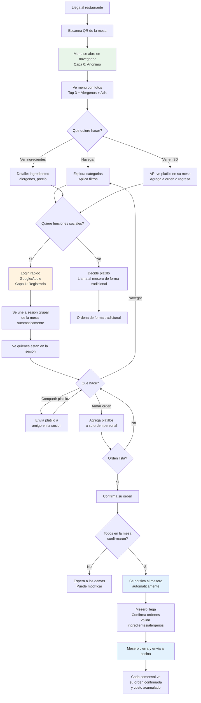

---

## 3. Flujo del Restaurante (Onboarding + PDF Import)

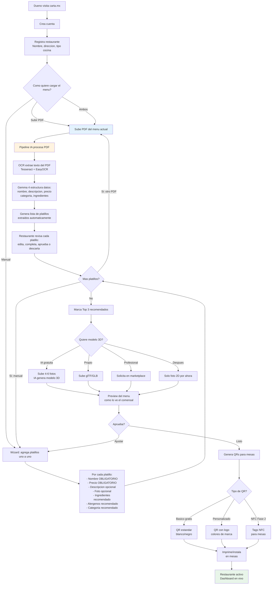

---

## 4. Diagrama de Secuencia: Sesion Grupal + Orden

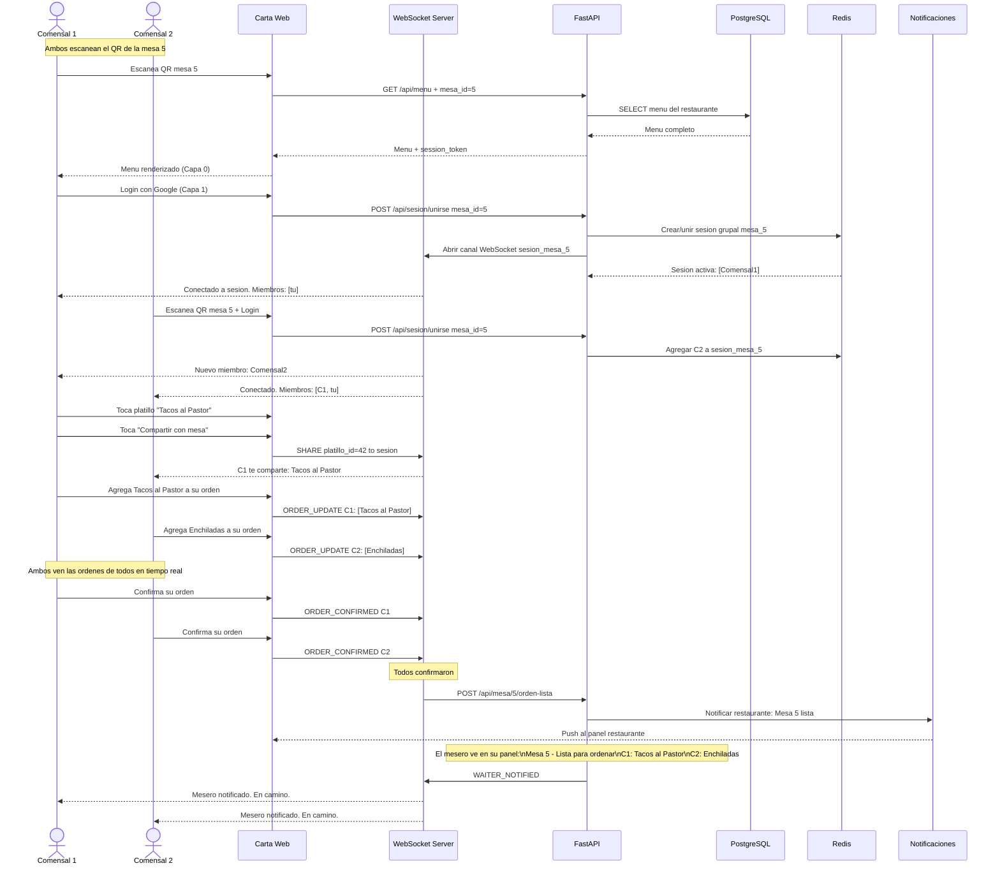

---

## 5. Diagrama de Secuencia: Llamar Mesero + Confirmar Orden

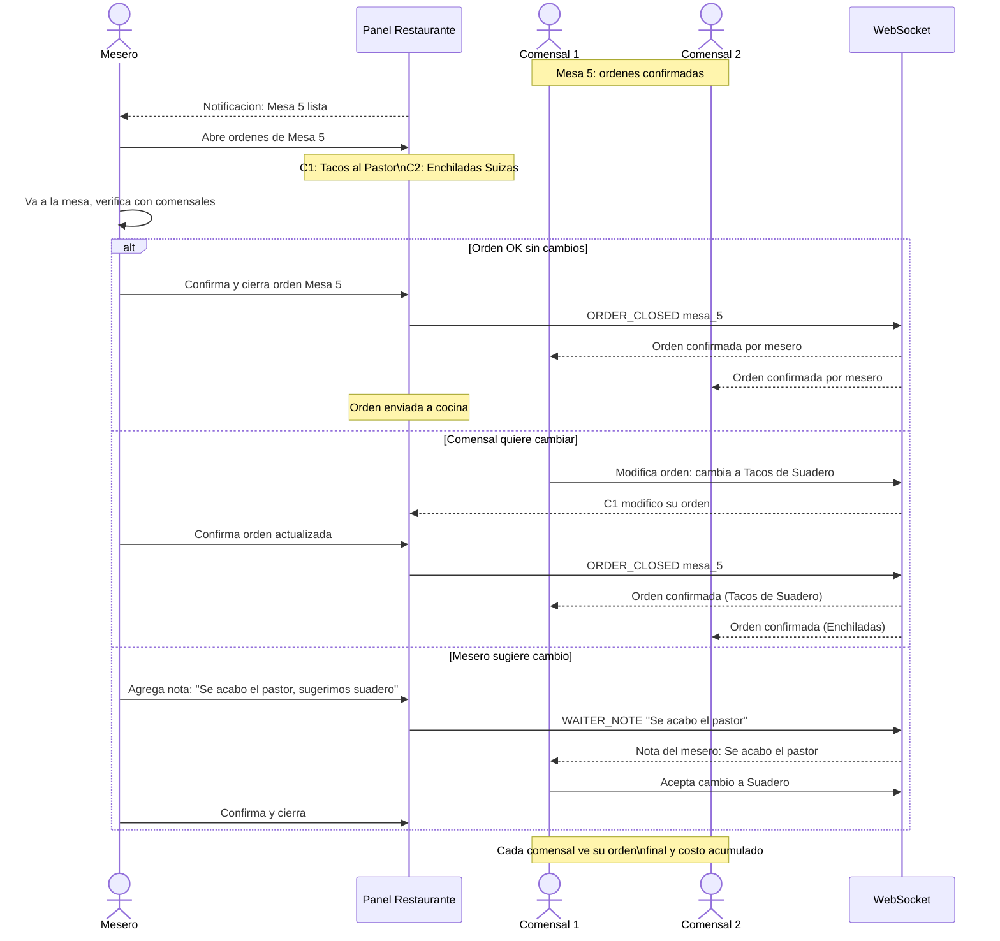

---

## 6. Diagrama de Secuencia: Import PDF con IA

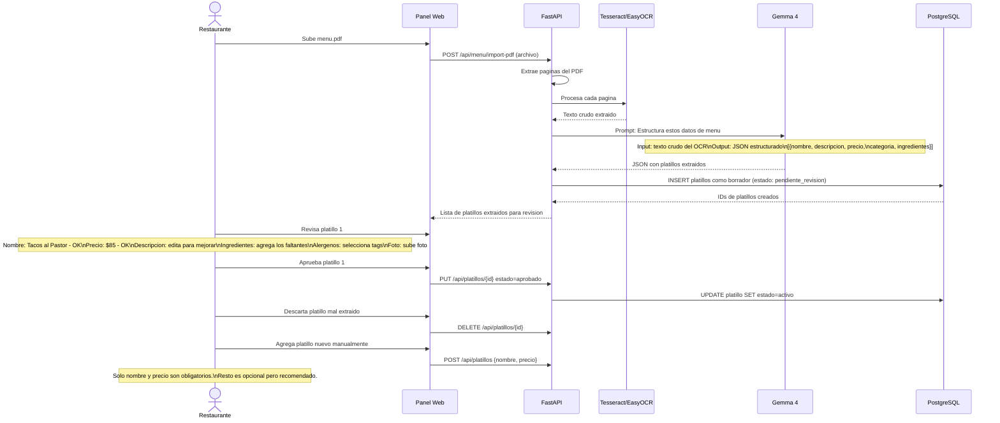

---

## 7. Diagrama de Secuencia: Compartir Platillo con Amigos

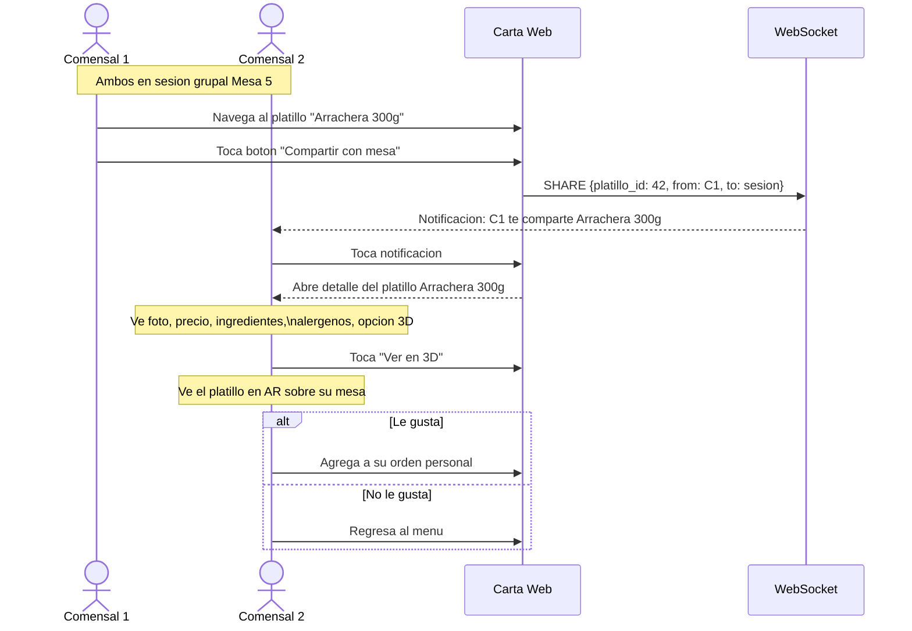

---

## 8. Flujo de Monetizacion Completo (v2)

```mermaid
flowchart TD
    subgraph Comensales
        CA[Capa 0: Anonimo\nVe ads] --> CB[Capa 1: Registrado Gratis\nVe ads + 1 mes trial Premium]
        CB --> CC[Capa 2: Premium\n$29/mes sin ads\n+ todas las features]
        CC --> CD[Opt-in datos anonimos\n= Carta Credits]
    end

    subgraph Restaurantes
        RA[Tier Gratis\nMenu + QR + Analytics basico]
        RA --> RB[Ads Self-Serve\nPagar por promover\nsus propios platillos]
        RA --> RC[Tier Pro $249/mes\nAnalytics avanzado\n+ Ordenes por mesa]
        RC --> RD[Tier Enterprise\nMulti-sucursal\n+ Integraciones]
    end

    subgraph Marketplace
        MA[Artista publica perfil\nPortafolio + precios] --> MB[Restaurante solicita\nmodelo 3D]
        MB --> MC[Artista entrega modelo]
        MC --> MD[Restaurante aprueba]
        MD --> ME[Pago: 80-85% artista\n15-20% Carta]
    end

    subgraph Futuro
        FA[Insights anonimos\nagregados vendidos\na industria restaurantera]
    end

    style CC fill:#4CAF50,color:#fff
    style RC fill:#2196F3,color:#fff
    style ME fill:#FF9800,color:#fff
```

---

## 9. Marketplace de Artistas 3D (Modelo Fiverr)

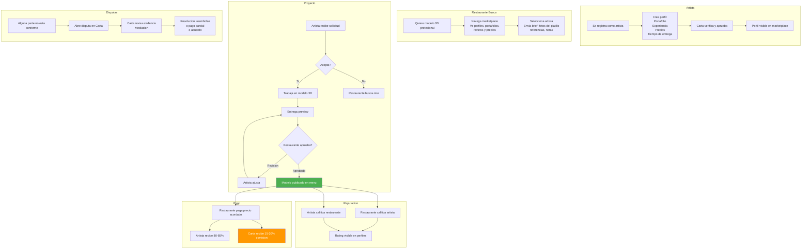

---

## 10. Red de Restaurantes Carta (Grafo de Recomendaciones)

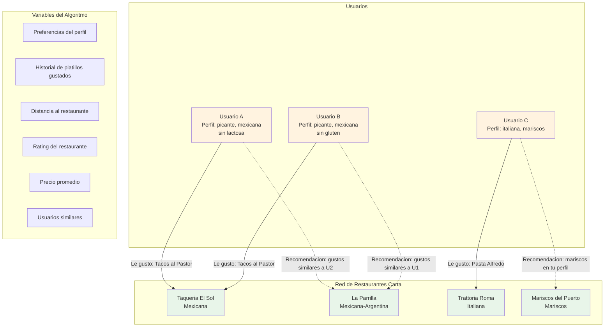

---

## 11. Diagrama de Estados del Comensal (v2)

```mermaid
stateDiagram-v2
    [*] --> Anonimo: Escanea QR

    Anonimo --> NavegandoMenu: Menu cargado
    NavegandoMenu --> ViendoAR: Toca Ver en 3D
    ViendoAR --> NavegandoMenu: Regresa
    ViendoAR --> AgregandoAOrden: Agrega platillo
    NavegandoMenu --> ViendoDetalle: Toca platillo
    ViendoDetalle --> NavegandoMenu: Regresa
    ViendoDetalle --> AgregandoAOrden: Agrega platillo
    NavegandoMenu --> Filtrando: Aplica filtros
    Filtrando --> NavegandoMenu: Resultados

    NavegandoMenu --> Registrandose: Quiere features sociales
    Registrandose --> RegistradoEnSesion: Login exitoso

    state RegistradoEnSesion {
        [*] --> EnSesionGrupal
        EnSesionGrupal --> CompartiendoPlatillo: Comparte con mesa
        CompartiendoPlatillo --> EnSesionGrupal: Enviado
        EnSesionGrupal --> ArmandoOrden: Agrega a orden
        ArmandoOrden --> EnSesionGrupal: Sigue navegando
        ArmandoOrden --> OrdenConfirmada: Confirma orden
        OrdenConfirmada --> ArmandoOrden: Modifica
    }

    RegistradoEnSesion --> EsperandoMesero: Todos confirmaron
    EsperandoMesero --> OrdenCerrada: Mesero confirma
    OrdenCerrada --> ViendoCuenta: Ve costo total

    AgregandoAOrden --> NavegandoMenu: Sin registro solo navega

    NavegandoMenu --> SuscribiendoPremium: Quiere Premium
    SuscribiendoPremium --> Premium: Pago exitoso

    state Premium {
        [*] --> MenuFiltrado: Menu personalizado sin ads
        MenuFiltrado --> AsistenteIA: Abre asistente
        AsistenteIA --> MenuFiltrado: Recibe recomendacion
        MenuFiltrado --> DescubriendoRestaurantes: Explora red Carta
    end

    ViendoCuenta --> [*]: Sale del restaurante
```

---

## 12. Modelo de Datos Conceptual (ER v2)

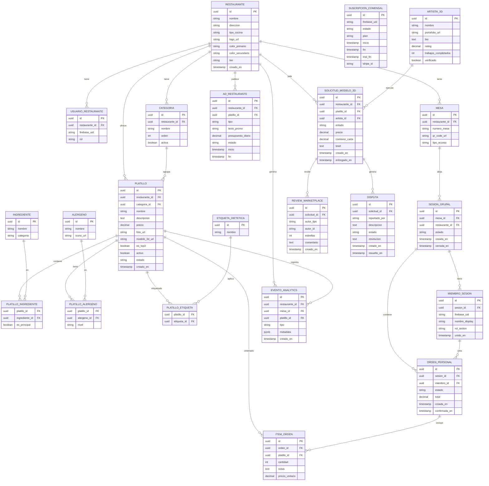

---

## 13. Diagrama de Despliegue (Infraestructura v2)

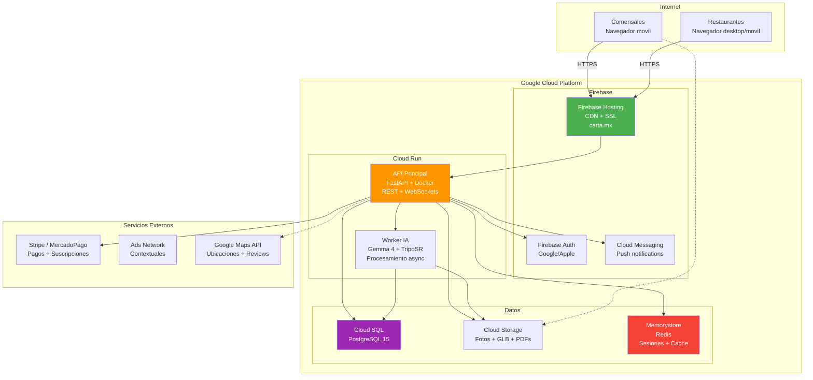

---

## 14. Alternativas al QR (Visual)

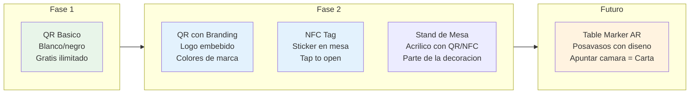
