# Carta — Diagramas, User Stories y Flujos de UX

**Version:** 1.0
**Fecha:** 3 de abril de 2026
**Complemento de:** Carta_Ideacion_v2.md

---

## 1. User Stories por Persona y Fase

### Persona: Comensal (Sin registro — Capa 1)

**Fase 1:**
- US-C01: Como comensal, quiero escanear un QR en la mesa y ver el menu del restaurante en mi celular, para no depender de un menu fisico.
- US-C02: Como comensal, quiero ver fotos reales de cada platillo, para saber como luce antes de ordenar.
- US-C03: Como comensal, quiero ver los ingredientes y alergenos de cada platillo, para saber si es seguro para mi sin preguntarle al mesero.
- US-C04: Como comensal, quiero ver los Top 3 platillos recomendados del restaurante, para decidir mas rapido cuando no se que pedir.
- US-C05: Como comensal, quiero que el menu cargue rapido y se vea bien en mi celular, para no frustarme esperando.

**Fase 2:**
- US-C06: Como comensal, quiero filtrar el menu por categoria (entradas, platos fuertes, postres), para navegar mas rapido.
- US-C07: Como comensal, quiero filtrar por rango de precio, para encontrar opciones dentro de mi presupuesto.
- US-C08: Como comensal, quiero filtrar por etiquetas dieteticas (vegetariano, vegano, sin gluten), para ver solo lo que me interesa.
- US-C09: Como comensal, quiero tocar un platillo y verlo en 3D sobre mi mesa con realidad aumentada, para saber el tamano real de la porcion y como se presenta.
- US-C10: Como comensal, quiero rotar y hacer zoom al modelo 3D, para verlo desde todos los angulos.

### Persona: Comensal Registrado (Capa 2 — Premium)

**Fase 3:**
- US-C11: Como comensal registrado, quiero crear mi perfil de alimentacion (alergias, dietas, restricciones), para que el menu se adapte a mi automaticamente.
- US-C12: Como comensal registrado, quiero que el menu me senale los platillos que son seguros, con precaucion, o no recomendados para mi perfil, para elegir con confianza.
- US-C13: Como comensal registrado, quiero que mis datos se guarden en mi celular y no en la nube, para tener control total de mi informacion.
- US-C14: Como comensal registrado, quiero exportar mis datos a un archivo JSON o Google Drive, para tener un respaldo.
- US-C15: Como comensal registrado, quiero instalar Carta como PWA en mi celular, para acceder rapido sin ir al app store.
- US-C16: Como comensal, quiero suscribirme a Carta Premium para eliminar anuncios y tener la experiencia completa en todos los restaurantes.

**Fase 4:**
- US-C17: Como comensal premium, quiero decirle al asistente IA "tengo antojo de algo picante pero ligero" y que me recomiende del menu actual.
- US-C18: Como comensal premium, quiero que la IA considere mi historial de pedidos en otros restaurantes para mejorar sus recomendaciones.
- US-C19: Como comensal premium, quiero guardar platillos como favoritos y agregarles notas personales.

**Futuro:**
- US-C20: Como comensal, quiero pre-ordenar mi comida desde el camino al restaurante, para que este casi lista cuando llegue.

### Persona: Dueno/Administrador de Restaurante

**Fase 1:**
- US-R01: Como administrador, quiero registrar mi restaurante en Carta, para ofrecer un menu digital mejorado a mis comensales.
- US-R02: Como administrador, quiero agregar, editar y eliminar platillos de mi menu con nombre, descripcion, precio, foto, categoria, ingredientes y alergenos.
- US-R03: Como administrador, quiero generar codigos QR unicos para cada mesa, para que mis comensales puedan escanear y ver el menu.
- US-R04: Como administrador, quiero ver un dashboard con cuantos escaneos hubo hoy, cuales platillos fueron los mas vistos, y que filtros usan los comensales, para tomar mejores decisiones sobre mi menu.
- US-R05: Como administrador, quiero marcar cuales son mis Top 3 platillos recomendados, para destacarlos a los comensales.

**Fase 2:**
- US-R06: Como administrador, quiero subir 4-6 fotos de un platillo y que la IA genere un modelo 3D automaticamente, para que mis comensales lo vean en AR.
- US-R07: Como administrador, quiero subir mis propios modelos 3D en formato glTF/GLB, para tener control total de la presentacion visual.
- US-R08: Como administrador, quiero personalizar el menu con el logo, colores y estilo de mi restaurante, para que sea coherente con mi marca.

**Fase 3:**
- US-R09: Como administrador, quiero ver analytics de que platillos son mas filtrados por alergenos, para considerar opciones alternativas en mi menu.

**Fase 4:**
- US-R10: Como administrador, quiero contratar artistas 3D verificados a traves del marketplace de Carta, para tener modelos profesionales de mis platillos.
- US-R11: Como administrador, quiero suscribirme al tier Pro para acceder a analytics avanzados, branding completo y soporte prioritario.

---

## 2. Flujo de Experiencia del Comensal (Journey Completo)

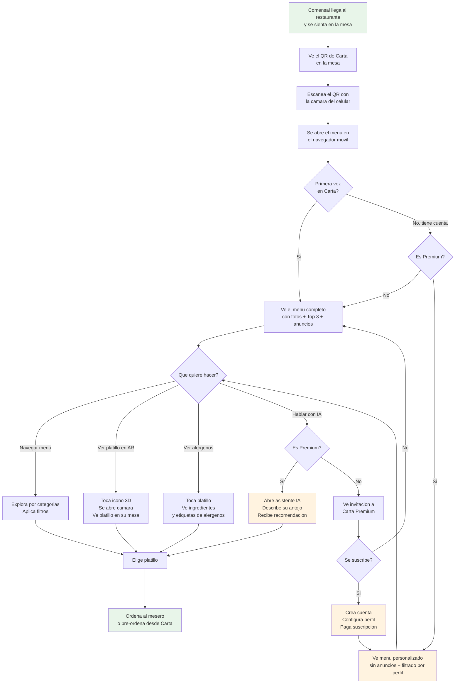

---

## 3. Flujo de Experiencia del Restaurante (Journey Completo)

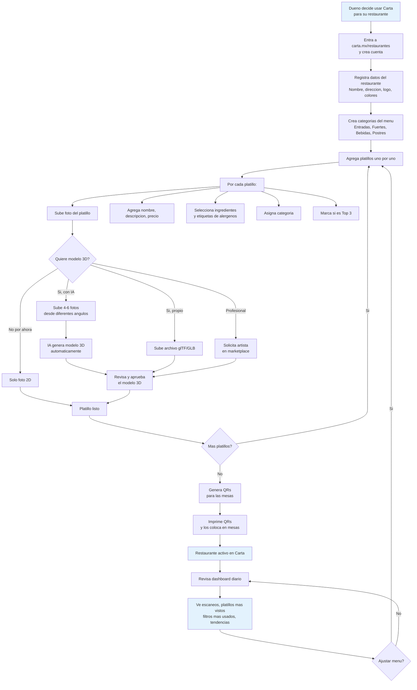

---

## 4. Diagrama de Arquitectura Tecnica Detallado

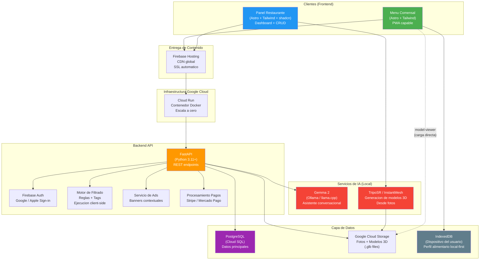

---

## 5. Diagramas de Secuencia

### 5.1 Escaneo de QR y Carga del Menu

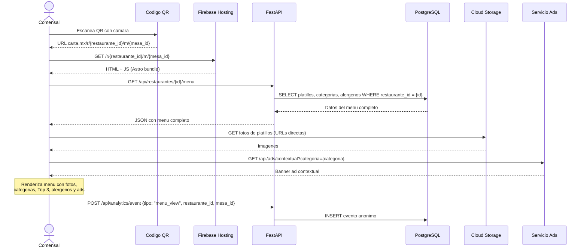

### 5.2 Visualizacion AR de un Platillo

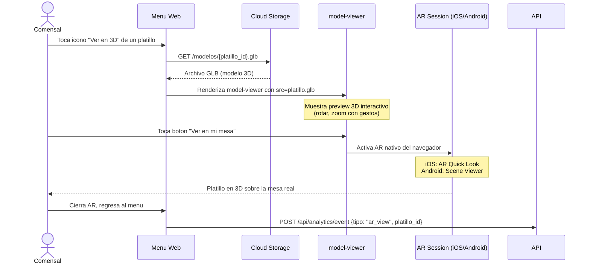

### 5.3 Registro y Configuracion de Perfil (Capa 2)

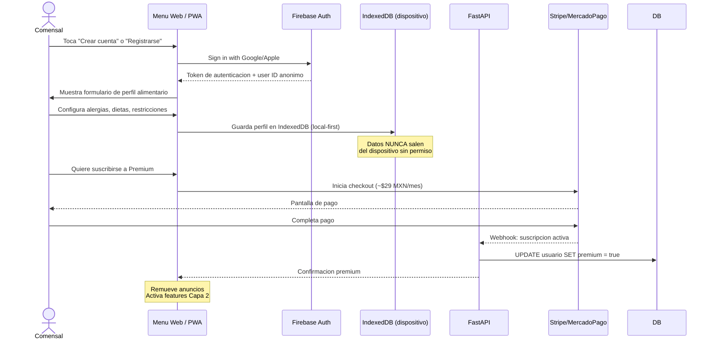

### 5.4 Filtrado Inteligente por Perfil (Local-First)

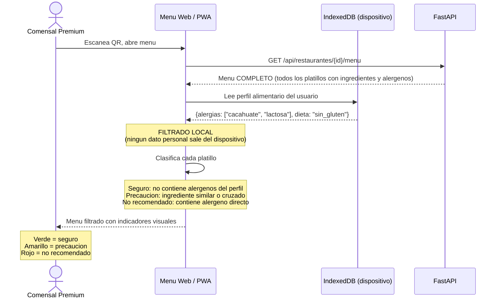

### 5.5 Asistente IA Conversacional (Fase 4)

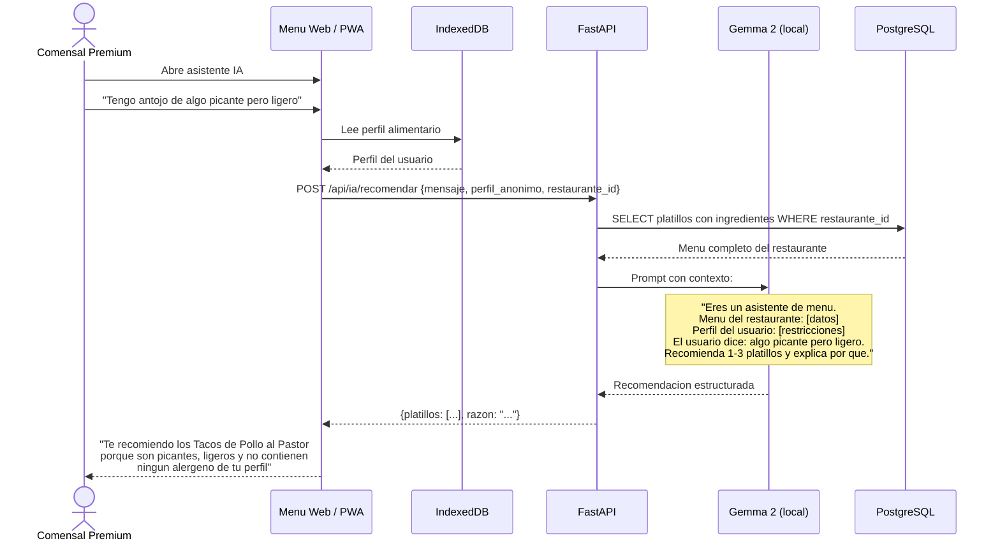

---

## 6. Flujo de Onboarding del Restaurante (Detallado)

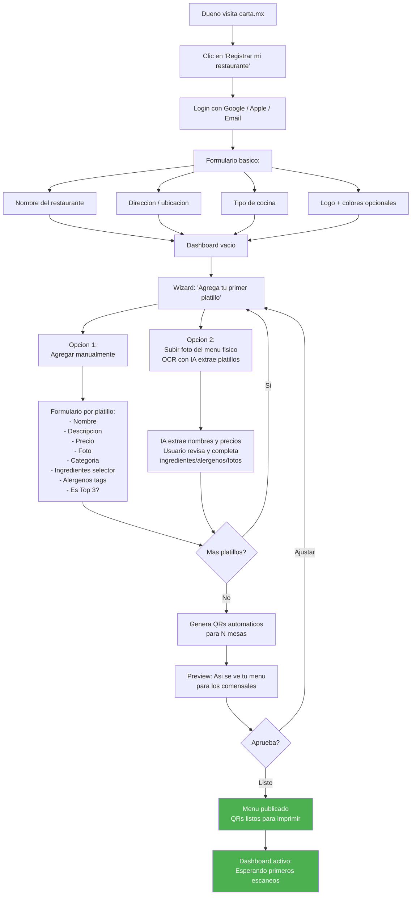

---

## 7. Diagrama de Estados del Comensal

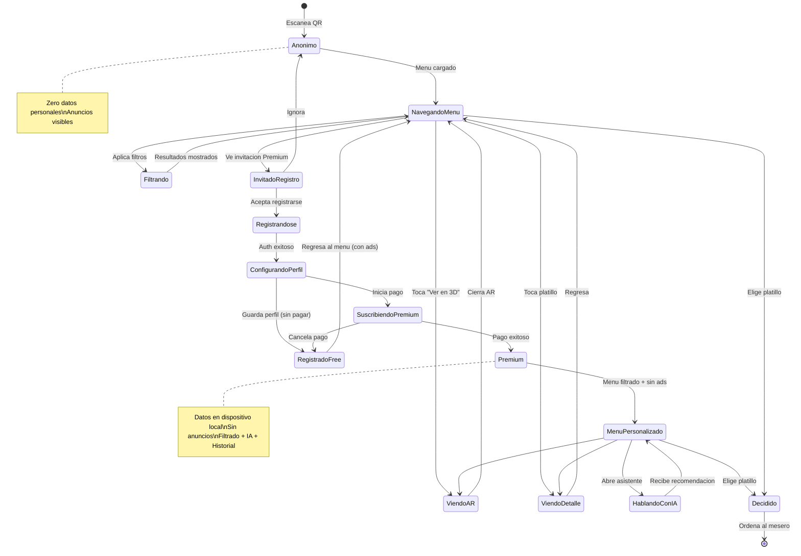

---

## 8. Modelo de Datos Conceptual (ER)

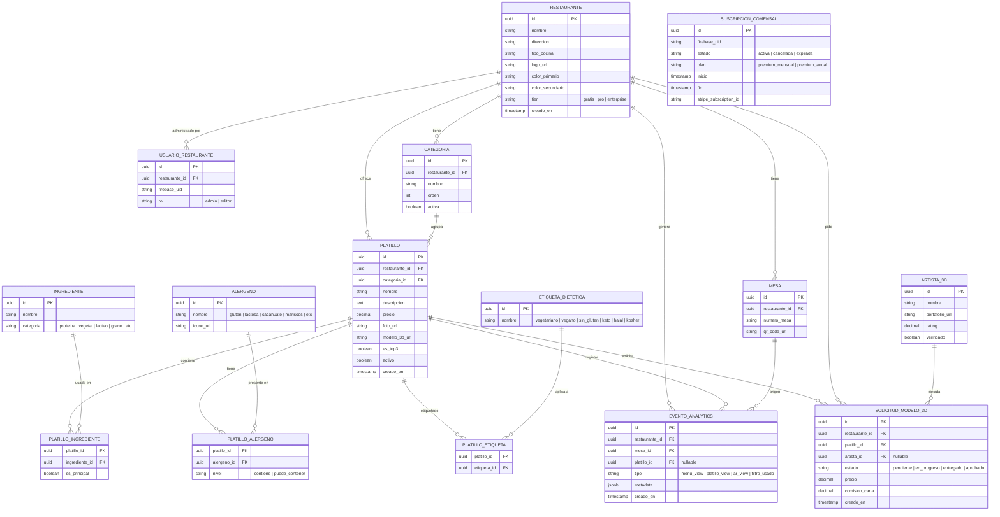

---

## 9. Diagrama de Despliegue (Infraestructura)

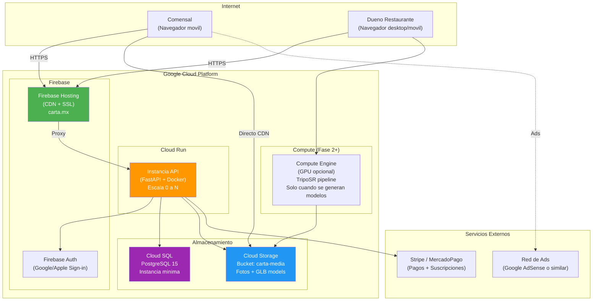

---

## 10. Flujo de Monetizacion Completo

```mermaid
flowchart TD
    subgraph Comensal
        A[Usa Carta gratis] --> B[Ve anuncios contextuales]
        B --> C{Le gustan\nlas features Capa 2?}
        C -->|Si| D[Se suscribe a Premium\n$29 MXN/mes o $249/ano]
        C -->|No| E[Sigue usando gratis\nCarta gana por ads]
        D --> F[Sin anuncios\n+ Perfil + IA + Historial]
    end

    subgraph Restaurante
        G[Se registra gratis] --> H[Usa tier gratuito\nMenu + Analytics basico]
        H --> I{Necesita mas?}
        I -->|Si| J[Sube a Pro\n$199-299 MXN/mes]
        I -->|No| K[Sigue en tier gratis]
        J --> L[Analytics avanzado\n+ Branding completo\n+ Soporte prioritario]
    end

    subgraph Marketplace
        M[Restaurante quiere\nmodelos 3D pro] --> N[Publica solicitud\nen marketplace]
        N --> O[Artista verificado\nentrega modelo]
        O --> P[Restaurante paga\nArtista recibe 80-85%\nCarta recibe 15-20%]
    end

    style D fill:#4CAF50,color:#fff
    style J fill:#2196F3,color:#fff
    style P fill:#FF9800,color:#fff
```

---

## 11. Mapa de Features por Fase (Visual)

```mermaid
graph LR
    subgraph Fase_1["Fase 1: El Menu que Si Sirve"]
        F1A[Menu visual responsive]
        F1B[Fotos de platillos]
        F1C[Ingredientes + Alergenos]
        F1D[Top 3 recomendados]
        F1E[QR por mesa]
        F1F[Panel restaurante CRUD]
        F1G[Dashboard analytics]
        F1H[Anuncios contextuales]
    end

    subgraph Fase_2["Fase 2: Ver para Creer"]
        F2A[AR con model-viewer]
        F2B[Pipeline 3D con IA]
        F2C[Upload modelos propios]
        F2D[Filtros menu]
        F2E[Branding restaurante]
    end

    subgraph Fase_3["Fase 3: Tu Menu Tu Perfil"]
        F3A[Auth Google/Apple]
        F3B[Perfil alimentario local]
        F3C[Filtrado inteligente]
        F3D[PWA installable]
        F3E[Carta Premium suscripcion]
        F3F[Export datos JSON/GDrive]
    end

    subgraph Fase_4["Fase 4: Carta Completo"]
        F4A[Asistente IA Gemma]
        F4B[Historial cross-restaurant]
        F4C[Marketplace artistas 3D]
        F4D[Tiers restaurante Pro/Enterprise]
        F4E[Landing publica + onboarding]
    end

    Fase_1 --> Fase_2 --> Fase_3 --> Fase_4

    style Fase_1 fill:#E8F5E9
    style Fase_2 fill:#E3F2FD
    style Fase_3 fill:#FFF3E0
    style Fase_4 fill:#F3E5F5
```
