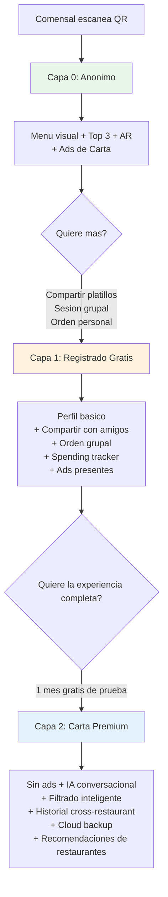
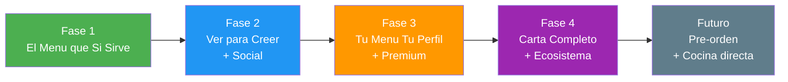
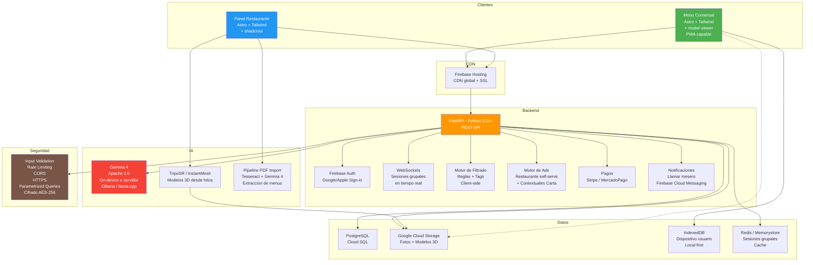
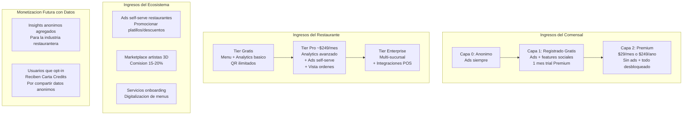

# Carta — Documento de Ideacion y Definicion del Proyecto

**Version:** 3.1
**Fecha:** 3 de abril de 2026
**Autor:** Calvin
**Estado:** Ideacion / Pre-MVP
**Licencia:** Codigo cerrado (propietario)

---

## 1. Declaracion del Problema

### El problema que resolvemos

En pleno 2026, la experiencia de elegir que comer en un restaurante sigue siendo fundamentalmente la misma que hace 30 anos. Ya sea un menu fisico o un codigo QR que abre un PDF o pagina web estatica, el comensal enfrenta los mismos problemas:

**Para el comensal:**
- Sobrecarga de opciones sin forma de filtrar o priorizar
- Cero personalizacion: el menu ignora alergias, dietas, restricciones religiosas o preferencias personales
- Falta de informacion visual real: no se sabe como luce el platillo, que tamano tiene la porcion, o como esta presentado
- Dependencia del mesero para resolver dudas sobre ingredientes o alergenos
- No existe memoria entre visitas ni entre restaurantes: cada vez se empieza de cero
- Cuando vas en grupo, no hay forma de compartir o coordinar lo que cada quien quiere pedir
- No hay control de cuanto gastas comiendo fuera

**Para el restaurante:**
- No tienen datos sobre que buscan sus clientes o por que no ordenan ciertos platillos
- El menu no comunica sus mejores platillos de forma efectiva
- Digitalizar el menu actual (QR) no agrego valor real, solo cambio el formato
- Sin herramientas para entender el comportamiento de sus comensales
- No pueden promocionar platillos especificos o descuentos de forma inteligente
- Los meseros pierden tiempo explicando ingredientes y buscando quien pidio cada platillo

### Por que importa

Los codigos QR para menus fueron una solucion de emergencia durante la pandemia que se quedo por inercia, no por merito. Representan una oportunidad perdida: tenemos los celulares mas poderosos de la historia en cada mesa y los usamos para mostrar un PDF. Carta propone que esos mismos celulares se conviertan en la interfaz inteligente entre el comensal y la cocina.

### Disclaimer legal importante

Carta es un motor de recomendaciones y un canal de comunicacion entre el restaurante y los comensales. Los datos de ingredientes, alergenos, precios y disponibilidad son proporcionados y alojados por los restaurantes. Carta no es responsable de la exactitud de esta informacion. El mesero siempre confirma la orden, los ingredientes y cualquier restriccion alimentaria antes de enviar a cocina.

---

## 2. Vision del Producto

**Carta** es una plataforma que transforma la experiencia de elegir comida en restaurantes mediante menus inteligentes, personalizados y visualmente inmersivos.

**Mision:** Que ningun comensal vuelva a sentirse perdido frente a un menu. Que cada restaurante pueda ofrecer una experiencia de seleccion moderna sin necesidad de un equipo de tecnologia.

**Destino:** Reemplazar los menus tradicionales y QR estaticos a nivel nacional (Mexico) y eventualmente global. Que "Carta" se convierta en sinonimo de la experiencia moderna de elegir comida, como Uber lo es para el transporte.

**Vision futura:** Mas alla del menu, Carta evoluciona hacia la experiencia completa: pre-ordenar desde el camino, saber cuanto gastas comiendo fuera, descubrir restaurantes afines a tu perfil, y contribuir a reducir el desperdicio alimentario. La carta es solo el punto de entrada a un ecosistema de experiencia gastronomica con impacto social positivo.

**Proposito social:** Carta no solo mejora la experiencia de comer fuera — tambien busca reducir el desperdicio de alimentos, apoyar a poblaciones vulnerables, e incentivar practicas sostenibles en la industria restaurantera. Alineado con los Objetivos de Desarrollo Sostenible (ODS) de la ONU.

---

## 2.1 Branding & Identidad Visual

### Tagline

**"The Intelligent Interface Between Diner and Kitchen."**
(En espanol: "La interfaz inteligente entre el comensal y la cocina.")

### Logo principal

El logo de Carta es un icono de menu/carta abierto en estilo lineal, en color vino/burgundy (#6B2D3E aprox), sobre fondo crema claro (#F5F0E8 aprox). El logotipo tipografico usa una serif elegante que comunica tradicion gastronomica + modernidad.

### Sistema de temas por restaurante

Carta no impone una identidad visual unica a todos los restaurantes. En cambio, ofrece un sistema de personalizacion por temas que permite que cada restaurante se sienta "en casa" dentro de Carta:

**5 temas de color base:**

| Tema | Color dominante | Tono | Uso sugerido |
|------|----------------|------|-------------|
| Vino | Burgundy/Vino (#6B2D3E) | Clasico, elegante | Restaurantes formales, cocina europea, vinotecas |
| Verde | Verde bosque (#3D5A3E) | Organico, fresco | Restaurantes saludables, vegetarianos, farm-to-table |
| Azul | Azul profundo (#2C5F7C) | Marino, confiable | Marisquerias, cocina fusion, casual dining |
| Ocre | Ocre/Dorado (#B8860B) | Calido, artesanal | Cocina mexicana, parrillas, hornos de lena |
| Cafe | Cafe oscuro (#5C3A1E) | Acogedor, intimo | Cafeterias, bistros, brunch spots |

**Integracion del logo del restaurante:**

El icono de Carta funciona como un "contenedor" visual: el logo del restaurante se integra dentro del icono de la carta/menu. Si el restaurante no tiene logo, se muestra el icono default de Carta. Esto se configura desde el panel de administracion del restaurante (selector de tema visible en el dashboard).

**Aplicaciones fisicas del branding:**

- **Stand de mesa en madera:** Soporte acrilico/madera con QR grabado + logo de Carta + nombre del restaurante. Parte de la decoracion, no un sticker pegado. (Posible revenue futuro: venta de stands premium personalizados.)
- **App movil:** El tema seleccionado por el restaurante se aplica a toda la interfaz del comensal al escanear su QR. Cada restaurante "se siente" diferente dentro de Carta.
- **Panel de configuracion:** El restaurante elige su tema desde un dropdown con preview en tiempo real.

### Paleta global de Carta (fuera de restaurantes)

Para el sitio web, marketing, y materiales de Carta como marca (no dentro de la experiencia de un restaurante especifico):

- **Primario:** Crema/Beige claro (#F5F0E8) — fondos
- **Secundario:** Gris oscuro/Negro suave (#2D2D2D) — texto principal
- **Acento:** Dorado/Cobre (#B8860B, #8B6914) — CTAs, highlights, flechas del flywheel
- **Carta Vino (#6B2D3E):** Logo, elementos de marca core

### Tono de comunicacion

Pitch deck en ingles para inversionistas internacionales. Producto y documentacion tecnica en espanol (mercado primario: Mexico). Tono: profesional pero accesible, sin jerga innecesaria. Narrativa centrada en impacto ("para y por la gente").

---

## 3. Arquitectura de Tres Capas (Clave para la Adopcion)

El diseno de Carta se basa en una estrategia de TRES capas que maximiza la conversion gradual:

### Capa 0: Experiencia Anonima (Sin registro, sin instalacion)

**Acceso:** El comensal escanea un QR en la mesa. Se abre el menu en el navegador.

**Lo que obtiene:**
- Menu visual mejorado con branding del restaurante
- Fotos de platillos, ingredientes, alergenos
- Top 3 platillos recomendados / mas vendidos
- Visualizacion AR de platillos en 3D (model-viewer)
- Filtros basicos (categoria, precio)
- Anuncios (del restaurante o contextuales de Carta)

**Lo que NO puede hacer:**
- No hay sesion grupal. El usuario anonimo navega por su cuenta
- No puede compartir platillos con otros comensales
- No puede hacer orden digital ni llamar al mesero desde Carta
- No se guardan datos, no hay historial, no hay perfil
- Para ordenar, llama al mesero de forma tradicional (levantar la mano)

**Esto ya es significativamente mejor que un QR estatico.** El incentivo para registrarse aparece de forma natural: "Tus amigos en la mesa ya estan compartiendo platillos. Unete con un tap."

### Capa 1: Registrado Gratis (Login rapido, funciones sociales)

**Acceso:** Login con Google/Apple (1 tap). Se puede registrar en CUALQUIER momento durante la sesion, incluso despues de haber estado navegando como anonimo. La transicion es fluida: no pierde su lugar en el menu, solo se agregan las features sociales.

**Lo que obtiene adicional a Capa 0:**
- Perfil basico de preferencias alimentarias (sin filtrado inteligente avanzado)
- Compartir platillos con amigos registrados en la misma mesa
- Sesion grupal: todos los REGISTRADOS que escanean el QR de la mesa se unen a una sesion
- Orden personal dentro de la sesion grupal
- Boton "Llamar mesero" cuando la orden esta lista
- Spending tracker: cuanto llevas gastado en esta visita y en total historico
- Guardar datos localmente + exportar a JSON
- 1 mes de prueba gratis de Premium al registrarse
- Anuncios siguen presentes

### Capa 2: Carta Premium (~$29 MXN/mes o $249 MXN/ano)

**Acceso:** Suscripcion recurrente. 1 mes de prueba gratis.

**Lo que obtiene adicional a Capa 1:**
- Eliminacion total de anuncios en todos los restaurantes
- Perfil alimentario completo con filtrado inteligente avanzado (seguro/precaucion/no recomendado)
- Asistente IA conversacional (Gemma 4, on-device o servidor)
- Historial cross-restaurant con recomendaciones que mejoran con el tiempo
- Descubrimiento de restaurantes: "Basado en tu perfil y ubicacion, te recomendamos X"
- Recomendaciones de platillos basadas en usuarios con gustos similares
- Cloud backup cifrado de perfil y datos
- Migracion de datos entre dispositivos
- Analytics personal avanzado: gastos por categoria, restaurantes favoritos, tendencias
- Nutricion tracking: seguimiento de lo que comes para apoyar planes nutricionales
- Impacto ambiental: registrar al final de cada sesion cuanta comida dejaste (para reducir desperdicio)
- "Invitado Extra": parte de tu suscripcion se destina a alimentar a una persona vulnerable (ver seccion Impacto Social)
- Acceso anticipado a nuevas features

### Escenarios de Mesa: Quien Puede Hacer Que

```mermaid
graph TD
    subgraph Escenario_1[Escenario 1: Todos anonimos]
        A1[Todos escanean QR] --> A2[Cada quien navega\nel menu por su cuenta]
        A2 --> A3[No hay sesion grupal\nNo comparten platillos\nNo orden digital]
        A3 --> A4[Llaman al mesero\nde forma tradicional]
    end

    subgraph Escenario_2[Escenario 2: Mixto]
        B1[Algunos anonimos\nAlgunos registrados] --> B2[Registrados se unen\na sesion grupal]
        B2 --> B3[Registrados comparten\nplatillos entre si]
        B1 --> B4[Anonimos navegan\npor su cuenta]
        B4 --> B5[Si quieren unirse:\nregistro con 1 tap\nSe unen a sesion existente]
        B3 --> B6[Cuando registrados\nconfirman orden:\nse notifica al mesero]
        B4 --> B7[Anonimos ordenan\ncon el mesero directo]
    end

    subgraph Escenario_3[Escenario 3: Todos registrados]
        C1[Todos registrados] --> C2[Sesion grupal completa]
        C2 --> C3[Comparten platillos\nOrdenes personales\nLlamar mesero]
        C3 --> C4[Todos confirman\nSe notifica al mesero\nMesero valida y cierra]
    end

    subgraph Escenario_4[Escenario 4: Todos Premium]
        D1[Todos Premium] --> D2[Sesion grupal completa\n+ IA + Filtrado]
        D2 --> D3[Menus filtrados por perfil\nIA recomienda para cada uno\nExperiencia sin ads]
        D3 --> D4[Nutricion tracking\nImpacto ambiental\nDivision de cuenta]
    end

    style Escenario_1 fill:#E8F5E9
    style Escenario_2 fill:#FFF3E0
    style Escenario_3 fill:#E3F2FD
    style Escenario_4 fill:#F3E5F5
```

**Regla clave:** El mesero SIEMPRE confirma las ordenes antes de enviar a cocina, independientemente del escenario. Carta facilita la seleccion; el mesero valida.

**Registro dinamico mid-session:** Un usuario anonimo puede registrarse en cualquier momento con 1 tap (Google/Apple). Al hacerlo, se une automaticamente a la sesion grupal existente de su mesa sin perder su navegacion actual. Su experiencia se enriquece al instante con features sociales.

### Sobre el precio: $29 MXN/mes

**Es el precio correcto?** Si. Contexto de mercado en Mexico:
- Spotify: ~$115 MXN/mes
- YouTube Premium: ~$129 MXN/mes
- Netflix basico: ~$99 MXN/mes
- Carta Premium: $29 MXN/mes (4-5x mas barato que cualquier suscripcion de entretenimiento)

**Angulo de marketing:** "Menos de 1 peso al dia para saber siempre que comer." Es menos que un chicle. El precio bajo maximiza conversion y minimiza churn. Conforme Carta agregue mas features y red de restaurantes, se puede ajustar gradualmente.

**Descuento anual:** $249 MXN/ano = ~$20.75/mes (28% de descuento). Incentiva compromiso a largo plazo.

**Estrategia de precios promocionales para lanzamiento:**

El objetivo en las primeras fases es masa critica de usuarios, no rentabilidad inmediata. Por eso:

- **Fase 1 (Early Adopters):** Premium a $9 MXN/mes (o $79 MXN/ano) para los primeros 500 suscriptores. Este precio se mantiene de por vida para ellos ("Founder Price"). Genera lealtad extrema y boca a boca.
- **Fase 2 (Crecimiento):** Premium a $19 MXN/mes para los siguientes 2,000 suscriptores. Aun por debajo del precio objetivo, pero creando urgencia ("precio de lanzamiento, subira pronto").
- **Fase 3 (Precio final):** $29 MXN/mes para todos los nuevos suscriptores. Los early adopters mantienen su precio original.
- **Restaurantes:** Primer mes gratis en cualquier plan. Los primeros 50 restaurantes que se unan reciben 6 meses gratis de plan Pro como "Restaurante Pionero Carta" con badge especial permanente.
- **Cupones de referido:** Un usuario Premium puede regalar 1 mes gratis a un amigo. Si el amigo se suscribe, ambos reciben 1 mes extra gratis. Costo de adquisicion bajo y organico.

Esta estrategia sacrifica ingresos a corto plazo pero construye la base de usuarios necesaria para que el efecto de red haga el trabajo pesado. Cuando un restaurante ve que 200 de sus comensales ya usan Carta, no necesitas venderle nada.

---

## 4. Funcionalidades Clave (Feature Map)

### 4.1 Para el Comensal

| Feature | Capa | Fase |
|---------|------|------|
| Menu visual mejorado con branding del restaurante | 0 | Fase 1 |
| Fotos, ingredientes y alergenos por platillo | 0 | Fase 1 |
| Top 3 recomendados / mas vendidos | 0 | Fase 1 |
| Anuncios (del restaurante o contextuales) | 0 | Fase 1 |
| Filtros basicos (categoria, precio) | 0 | Fase 2 |
| Modelos 3D de platillos con AR | 0 | Fase 2 |
| Login rapido (Google/Apple) | 1 | Fase 2 |
| Sesion grupal (todos en la mesa conectados) | 1 | Fase 2 |
| Compartir platillos con amigos en la sesion | 1 | Fase 2 |
| Orden personal dentro de sesion grupal | 1 | Fase 2 |
| Boton "Llamar mesero" | 1 | Fase 2 |
| Spending tracker (cuanto llevo gastando) | 1 | Fase 3 |
| Perfil alimentario basico | 1 | Fase 3 |
| 1 mes gratis de Premium | 1 | Fase 3 |
| Exportar datos a JSON / cargar backup local | 1 | Fase 3 |
| Filtrado inteligente avanzado por perfil | 2 | Fase 3 |
| Sin anuncios | 2 | Fase 3 |
| Cloud backup cifrado + migracion entre dispositivos | 2 | Fase 3 |
| Asistente IA conversacional (Gemma 4) | 2 | Fase 4 |
| Historial cross-restaurant | 2 | Fase 4 |
| Recomendaciones de restaurantes en la red Carta | 2 | Fase 4 |
| Recomendaciones basadas en usuarios similares | 2 | Fase 4 |
| Analytics personal (gastos, categorias, tendencias) | 2 | Fase 4 |
| Pre-orden desde el camino al restaurante | 2 | Futuro |
| Personalizacion de platillos (modificaciones) | 1 | Futuro |

### 4.2 Para el Restaurante

| Feature | Fase |
|---------|------|
| Panel web para gestionar menu (CRUD platillos) | Fase 1 |
| Importacion de menu desde PDF con IA (OCR + NLP) | Fase 1 |
| Subida de fotos por platillo | Fase 1 |
| Etiquetado de ingredientes y alergenos | Fase 1 |
| Campos mandatorios: nombre + precio. Resto recomendado | Fase 1 |
| Dashboard analytics basico (escaneos, platillos mas vistos) | Fase 1 |
| QR basicos ilimitados por mesa | Fase 1 |
| Personalizacion visual (logo, colores, categorias) | Fase 2 |
| QR personalizados con branding + alternativas NFC | Fase 2 |
| Notificacion cuando mesa esta lista para ordenar | Fase 2 |
| Generacion AI de modelos 3D (local, sin costo) | Fase 2 |
| Importacion de modelos 3D propios (glTF/GLB) | Fase 2 |
| Anuncios self-serve (promocionar platillos/descuentos propios) | Fase 3 |
| Dashboard analytics Pro (tendencias, horarios, comparativas) | Fase 3 |
| Vista de ordenes por mesa con nombres de comensales | Fase 3 |
| Integracion con sistemas de gestion (Zof Restaurant, etc.) | Fase 4 |
| Marketplace de artistas 3D estilo Fiverr | Fase 4 |
| Envio directo de ordenes a cocina | Futuro |

---

## 5. Roadmap por Fases

### Fase 1 — "El Menu que Si Sirve"

**Objetivo:** Demostrar que un menu digital puede ser drasticamente mejor que un QR actual. Validar con 1-3 restaurantes reales.

**Criterio para avanzar:** Al menos 1 restaurante real usando Carta con retroalimentacion positiva.

**Alcance:**
- Backend: API REST con Python/FastAPI (CRUD completo)
- Panel restaurante: registro, creacion de menu, subida de fotos, ingredientes/alergenos
- Importacion de menu desde PDF: subir PDF existente, IA extrae platillos con nombre, descripcion, precio. Hibrido OCR (Tesseract/EasyOCR) + LLM (Gemma 4) para parsing inteligente independiente del formato. Restaurante revisa, edita y completa
- Campos mandatorios: nombre + precio. Ingredientes, alergenos, foto, categoria: opcionales pero recomendados
- Menu comensal: web app responsive via QR, fotos, ingredientes, alergenos, Top 3
- Dashboard analytics basico para restaurante
- QR ilimitados por mesa, generados automaticamente
- Anuncios contextuales basicos (Capa 0)
- Sin login de comensal, sin AR, sin IA, sin sesiones grupales

### Fase 2 — "Ver para Creer + Social"

**Objetivo:** Introducir AR inmersiva y features sociales/grupales.

**Criterio para avanzar:** AR funcionando end-to-end. Sesion grupal validada con grupo de prueba real.

**Alcance:**
- AR con model-viewer + pipeline 3D con IA local (TripoSR/InstantMesh)
- Login rapido Google/Apple (Firebase Auth) → Capa 1
- Sesion grupal: todos los que escanean el QR de la misma mesa se unen a una sesion en tiempo real
- Compartir platillos: enviar a otros miembros de la sesion un platillo que estas viendo
- Orden personal: cada comensal arma su orden individual dentro de la sesion
- Boton "Llamar mesero": cuando todos confirman su orden, se notifica al restaurante que la mesa esta lista. Comensales pueden modificar antes de que el mesero cierre
- Filtros avanzados en menu (categoria, precio, etiquetas dieteticas)
- Personalizacion visual del menu por restaurante
- QR personalizados con logo del restaurante embebido + exploracion de alternativas (NFC tags, table markers AR)

### Fase 3 — "Tu Menu, Tu Perfil + Premium"

**Objetivo:** Personalizacion profunda + monetizacion del comensal.

**Criterio para avanzar:** Motor de filtrado validado. Al menos 1 suscripcion Premium activa.

**Alcance:**
- Perfil alimentario (Capa 1: basico. Capa 2: completo con filtrado inteligente)
- Datos local-first en IndexedDB. Export a JSON gratis. Cloud backup cifrado para Premium
- Migracion entre dispositivos: importar JSON manual (gratis) o sync automatico (Premium)
- 1 mes de prueba gratis de Premium al registrarse
- Suscripcion Carta Premium (~$29 MXN/mes o $249/ano) via Stripe/MercadoPago
- Filtrado inteligente (Premium): seguro / precaucion / no recomendado
- Spending tracker: cuanto llevas en esta sesion, historial de gastos por restaurante
- PWA installable
- Anuncios self-serve para restaurantes: pagar por promover platillos, descuentos, promociones en el espacio de ads de su propio menu. Si no pagan, se muestran ads contextuales de Carta
- Dashboard Pro para restaurantes (pago): tendencias, horarios pico, comparativas, vista de ordenes por mesa
- Seguridad: input validation y sanitization en toda la API, parametrized queries (SQLAlchemy previene SQL injection por default), rate limiting, CORS configurado, HTTPS obligatorio, cifrado de datos sensibles, audit logging

### Fase 4 — "Carta Completo + Ecosistema"

**Objetivo:** IA conversacional, red de restaurantes, marketplace.

**Criterio para avanzar:** Plataforma estable y escalable. Comunidad de restaurantes activa.

**Alcance:**
- Asistente IA conversacional con Gemma 4 (Apache 2.0): ejecutable on-device en celulares potentes (modelo pequeno ~2B) o en servidor (modelo 27B/12B). Multimodal: texto + imagen. Recomendaciones consideran: menu del restaurante, perfil del usuario, platillos populares entre usuarios similares, y recomendaciones del restaurante
- Historial cross-restaurant: la IA mejora con cada visita
- Red de restaurantes Carta: recomendacion de restaurantes basada en perfil + ubicacion + Google Maps reviews. Grafo de nodos: usuario → platillos gustados → restaurantes → usuarios similares → nuevos restaurantes. Variables: preferencias, distancia, rating, precio promedio, tipo de cocina
- Marketplace de artistas 3D estilo Fiverr: perfiles de artistas con portafolio, reviews, precios. Perfiles de restaurantes (cadena/pyme). Carta como intermediario (comision 15-20%). Sistema de disputas y resolucion. Rating bidireccional
- Tiers formalizados para restaurantes (Gratis/Pro/Enterprise)
- Integracion con sistemas de gestion de restaurantes y POS (Zof Restaurant, Square, Toast, Clip, etc.): sincronizar menu, precios, disponibilidad en tiempo real, y envio de ordenes directo al POS del restaurante
- Landing publica + onboarding self-service

### Futuro

- Pre-orden desde el camino al restaurante
- Envio directo de ordenes a cocina (sin pasar por mesero)
- Personalizacion de platillos (quitar/agregar ingredientes)
- Modo grupo avanzado: votacion de restaurante, menu compartido
- Division de cuenta inteligente: ver cuanto gasto cada quien y facilitar el pago dividido
- Nutricion tracking: seguimiento de habitos alimentarios para apoyar planes de nutriologos
- Impacto ambiental personal: registrar cuanta comida dejaste al final de cada sesion, ver tu evolucion, reducir desperdicio
- Experiencia "Mesa Premium": cuando todos los comensales son Premium, UI especial, IA grupal, ordenes especiales
- Programa de lealtad integrado por restaurante
- Carta for Charity: canalizar comida sobrante de restaurantes a poblaciones vulnerables (ver seccion Impacto Social)
- Certificaciones Carta: insignias para restaurantes (sostenibilidad, origen de ingredientes, RSE) tipo Michelin/Airbnb Plus
- Integracion nutricionistas: marketplace de nutriologos certificados, consultas incluidas/descuento en Premium
- Integracion apps de salud: Apple Health, Google Fit, MyFitnessPal, wearables (glucosa, actividad fisica)
- Alertas nutricionales inteligentes: avisos suaves cuando un platillo no se alinea con tu plan nutricional

---

## 6. Arquitectura Tecnica

### Stack

**Backend (fortaleza de Calvin):**
- Python 3.11+ con FastAPI
- SQLAlchemy 2.0 + PostgreSQL
- Redis/Memorystore para sesiones grupales en tiempo real y cache
- WebSockets (FastAPI + websockets) para sesiones grupales
- Firebase Auth (gratis hasta 50K usuarios)
- Stripe / Mercado Pago para suscripciones y marketplace
- Firebase Cloud Messaging para notificaciones (llamar mesero)

**Frontend:**
- Astro + Tailwind CSS + shadcn/ui
- model-viewer para AR
- PWA capable

**IA (todo local/propio, sin costos por API):**
- Gemma 4 (Apache 2.0): 4 tamanos, el mas pequeno cabe en movil. Multimodal (texto, imagen, video, audio). Modelo 27B para servidor, 2B para on-device
- TripoSR / InstantMesh para modelos 3D
- Pipeline PDF: Tesseract/EasyOCR para OCR + Gemma 4 para parsing inteligente y estructuracion

**Infraestructura (Google Cloud):**
- Cloud Run (API, escala a cero)
- Firebase Hosting (frontend, CDN)
- Cloud SQL PostgreSQL
- Google Cloud Storage (media)
- Memorystore Redis (sesiones, cache)

**Seguridad:**
- Parametrized queries via SQLAlchemy (previene SQL injection)
- Input validation con Pydantic (FastAPI lo incluye nativamente)
- Rate limiting por IP y por usuario
- CORS configurado solo para dominios de Carta
- HTTPS obligatorio (Firebase Hosting lo da automatico)
- Cifrado AES-256 para datos sensibles en cloud backup
- Sanitizacion de inputs en frontend y backend
- Audit logging de acciones administrativas
- Los usuarios NO tienen acceso directo a la DB ni a endpoints internos. La API es el unico punto de contacto, completamente validada

---

## 7. Modelo de Negocio

### Filosofia: Accesible para Todos, Sostenible para Calvin

### Fuentes de Ingreso

**1. Anuncios (ingreso pasivo permanente)**
Dos tipos de anuncios:
- **Ads self-serve del restaurante (prioridad):** El restaurante paga por promover sus propios platillos, descuentos o promociones dentro de su propio menu en Carta. Ejemplo: "Hoy 2x1 en margaritas" o "Prueba nuestro nuevo postre". Esto es valor directo para el restaurante.
- **Ads contextuales de Carta (default):** Cuando el restaurante no paga por su espacio de ads, Carta muestra anuncios contextuales basados en el perfil gastronomico del usuario (nunca de restaurantes competidores). Productos relacionados a comida, bebidas, servicios de delivery, etc.

**2. Carta Premium (~$29 MXN/mes o $249/ano)**
Suscripcion recurrente con 1 mes de prueba gratis. Features premium que justifican el pago continuo:
- IA conversacional (tiene costo real de compute)
- Cloud backup (tiene costo de almacenamiento)
- Recomendaciones cross-restaurant (procesamiento continuo)
- Sin anuncios
- Analytics personal avanzado

**3. Tiers para Restaurantes**
- **Gratis:** Menu completo, QR, analytics basico. Suficiente para empezar.
- **Pro (~$249 MXN/mes):** Analytics avanzado, ads self-serve, vista de ordenes por mesa, branding completo, soporte prioritario.
- **Enterprise (custom):** Multi-sucursal, integraciones POS, API dedicada, SLA.

**4. Marketplace Artistas 3D (comision 15-20%)**
Modelo tipo Fiverr. Carta como intermediario. Rating bidireccional. Resolucion de disputas.

**5. Monetizacion de datos (futuro, con consentimiento)**
Insights anonimos y agregados (nunca datos individuales) sobre tendencias gastronomicas, vendidos a la industria. Usuarios que hacen opt-in a compartir datos anonimos reciben "Carta Credits" (descuentos o beneficios). Los datos individuales SIEMPRE son del usuario.

**6. "Invitado Extra" (incluido en Premium)**
Parte de cada suscripcion Premium se destina a alimentar a una persona vulnerable. Es un perk con nombre propio y narrativa: "Con tu suscripcion a Carta Premium, cada mes invitas a alguien a comer." Esto no solo genera impacto social sino que es un diferenciador emocional poderoso para la conversion a Premium. Ver seccion Impacto Social.

---

## 8. Impacto Social y Sostenibilidad

### Vision: Carta como Agente de Cambio

Carta no solo mejora la experiencia de comer fuera. Tiene la oportunidad unica de usar sus datos y red de restaurantes para generar impacto social real, alineado con los Objetivos de Desarrollo Sostenible (ODS) de la ONU.

```mermaid
graph TD
    subgraph Para_Comensales[Para Comensales]
        C1[Registro de porciones:\nal final de la sesion\nindica cuanta comida dejaste]
        C1 --> C2[Analytics de desperdicio\npersonal a lo largo del tiempo]
        C2 --> C3[Recomendaciones de porciones\nbasadas en tu historial\npara que pidas lo justo]
    end

    subgraph Para_Restaurantes[Para Restaurantes]
        R1[Dashboard de desperdicio:\ncuanta comida se desperdicia\npor platillo y mesa]
        R1 --> R2[Optimizar porciones\ny reducir merma]
        R2 --> R3[Canalizar sobrantes\na ONGs/comedores\nvia Carta for Charity]
    end

    subgraph Invitado_Extra[Invitado Extra - Premium]
        IE1[Parte de cada suscripcion\nPremium se destina a\nalimentar personas vulnerables]
        IE1 --> IE2[Carta mapea comedores\ny ONGs locales]
        IE2 --> IE3[Se canaliza recurso\neconomico o comida]
        IE3 --> IE4[El suscriptor ve su\nimpacto acumulado:\nX comidas donadas]
    end

    subgraph Certificaciones[Certificaciones Carta - Futuro]
        CT1[Carta envia evaluadores\na restaurantes]
        CT1 --> CT2[Evaluan: sostenibilidad\norigen de ingredientes\nRSE, desperdicio]
        CT2 --> CT3[Insignias visibles\nen el menu del restaurante]
        CT3 --> CT4[Los comensales eligen\nrestaurantes certificados]
        CT4 --> CT5[Restaurantes mejoran\npracticas para obtener\nmejores insignias]
    end

    style IE1 fill:#4CAF50,color:#fff
    style CT3 fill:#FF9800,color:#fff
```

### "Invitado Extra" — El Perk Emocional de Premium

Cada suscripcion Premium destina una porcion (~$5 MXN/mes) a un fondo administrado por Carta que financia comidas para personas vulnerables a traves de ONGs y comedores comunitarios aliados. El suscriptor recibe en su perfil un contador: "Has invitado a X personas a comer." Este perk tiene tres funciones: genera impacto real, diferencia a Carta de cualquier competidor, y crea un vinculo emocional con la marca que reduce el churn.

### Reduccion de Desperdicio Alimentario

**Para comensales (Premium):** Al final de cada sesion, opcion de registrar cuanta comida dejaron en el plato (todo, casi todo, mitad, poco, nada). Con el tiempo, Carta aprende sus patrones y recomienda porciones mas adecuadas o sugiere compartir platillos. El comensal ve su evolucion: "Has reducido tu desperdicio un 30% en 3 meses."

**Para restaurantes (Enterprise):** Dashboard de desperdicio por platillo y por mesa. Datos agregados y anonimos que muestran que platillos se dejan mas, que tamanos de porcion son excesivos, y oportunidades de optimizacion. Esto ahorra dinero al restaurante Y reduce impacto ambiental.

### Carta for Charity — Canalizar Sobrantes

En fases avanzadas, Carta puede funcionar como puente entre restaurantes con comida sobrante y organizaciones que la distribuyen a poblaciones vulnerables. Carta mapea la logistica: que restaurante tiene sobrante, que ONG/comedor esta cerca, y facilita la conexion. Los restaurantes que participan reciben la insignia "Carta Solidario" visible en su menu.

### Certificaciones Carta — El Michelin de la Sostenibilidad (Futuro Lejano)

Cuando Carta tenga suficiente marca y red, puede crear un sistema de certificaciones con evaluadores que visitan restaurantes y evaluan: sostenibilidad, origen de ingredientes, practicas laborales, manejo de desperdicio, responsabilidad social. Las insignias son visibles en el menu de Carta y motivan a los comensales a elegir restaurantes certificados. Esto crea un ciclo virtuoso: los restaurantes mejoran para obtener insignias, los comensales premian a los que las tienen.

**Incentivos concretos para restaurantes certificados:**

- **Prioridad en algoritmos de recomendacion:** Los restaurantes con certificaciones Carta aparecen primero en las recomendaciones cross-restaurant. Un restaurante con insignia "Carta Sostenible" tiene un boost natural cuando un comensal busca donde comer.
- **Badges visibles en busqueda:** Insignias destacadas junto al nombre del restaurante en cualquier listado o busqueda dentro de Carta. Funcionan como una senal de confianza inmediata para el comensal ("Carta Verified", "Carta Sostenible", "Carta Solidario").
- **Acceso a analytics premium sin costo adicional:** Restaurantes certificados reciben metricas avanzadas como parte de su certificacion, incentivando a los que estan en plan basico a buscar la certificacion.
- **Prioridad en programas de Carta for Charity:** Los restaurantes certificados son los primeros en conectarse con ONGs y comedores comunitarios, fortaleciendo su imagen de RSE (Responsabilidad Social Empresarial).
- **Documentacion para beneficios fiscales:** Carta puede generar reportes de impacto social que el restaurante puede usar como evidencia de RSE ante autoridades fiscales, facilitando potenciales deducciones o beneficios legales.
- **Marketing compartido:** Restaurantes certificados aparecen en comunicaciones de Carta (redes sociales, newsletter, website), dando visibilidad gratuita.

**Niveles de certificacion (propuesta):**

- **Carta Verified:** Cumple estandares basicos de calidad de datos (menu completo, alergenos declarados, fotos reales). Requisito minimo.
- **Carta Sostenible:** Practicas verificadas de reduccion de desperdicio, origen de ingredientes local/sustentable.
- **Carta Solidario:** Participa activamente en Carta for Charity, dona comida sobrante regularmente.
- **Carta Excelencia:** Combinacion de las tres anteriores. El maximo reconocimiento.

### Integracion con Nutricionistas — La Comida como Medicina

Carta reconoce que la alimentacion es la base de la salud. En fases avanzadas, la plataforma integra nutricionistas certificados que pueden trabajar con los comensales Premium de forma digital:

**Modelo de integracion:**

- **Marketplace de nutricionistas:** Similar al marketplace de artistas 3D, los nutricionistas crean perfiles verificados con su cedula profesional, especialidades (deportiva, clinica, pediatrica, etc.), y resenas de otros usuarios.
- **Modelo de comision:** Carta cobra un 10-15% de comision por consulta facilitada a traves de la plataforma. El nutricionista pone su tarifa, Carta es el canal.
- **Perk Premium:** Los suscriptores de Capa 2 reciben una consulta mensual incluida o con descuento significativo (50%+). Esto agrega valor tangible a la suscripcion y refuerza la propuesta de "Carta cuida tu salud".
- **Alertas inteligentes:** Si un comensal tiene un plan nutricional activo y esta por ordenar algo que no se alinea con su estrategia (exceso de sodio, calorias, etc.), Carta muestra una alerta suave — nunca bloquea, solo informa. "Tu nutriologa recomendo reducir sodio. Este platillo tiene alto contenido. ¿Deseas ver alternativas?"
- **Seguimiento integrado:** El nutricionista puede ver (con permiso explicito del usuario) el historial de consumo cross-restaurant para dar recomendaciones mas precisas. Siempre con consentimiento opt-in.

**Integracion con apps de salud y fitness (Futuro):**

Carta puede conectarse con ecosistemas de salud existentes para enriquecer la experiencia nutricional:

- **Apple Health / Google Fit:** Sincronizar datos de actividad fisica para ajustar recomendaciones calorias ("Hoy corriste 5km, puedes darte un extra").
- **MyFitnessPal / Lose It!:** Exportar datos de consumo en restaurantes para que el comensal mantenga un registro unificado de su alimentacion.
- **Apps de nutriologos:** API abierta para que nutricionistas que usen sus propias apps puedan recibir datos de Carta (con permiso del usuario).
- **Wearables:** En el futuro, datos de glucosa (CGMs como Dexcom/Libre) para personas con diabetes podrian informar alertas en tiempo real sobre platillos.

Todo esto refuerza la filosofia: **la comida es medicina, y Carta es el puente entre lo que comes y tu salud.**

**Alineacion con ODS:**
- ODS 2: Hambre Cero (Invitado Extra + Carta for Charity)
- ODS 12: Produccion y Consumo Responsables (reduccion de desperdicio)
- ODS 3: Salud y Bienestar (nutricion tracking, alergenos, integracion con nutricionistas, apps de salud)
- ODS 9: Industria, Innovacion e Infraestructura (digitalizacion de restaurantes)

---

## 9. Proyecciones Financieras por Volumen de Usuarios

### Supuestos

- Conversion a Capa 1 (registro gratis): 30% de escaneos unicos
- Conversion a Premium: 5% de registrados
- Conversion restaurantes a Pro: 10% de restaurantes activos
- CPM de ads: $50 MXN (conservador para Mexico)
- Cada usuario escanea ~3 veces/mes en promedio

### Escenario A: 1,000 usuarios / 50 restaurantes

| Concepto | Ingreso mensual | Costo mensual |
|----------|----------------|---------------|
| Ads (3,000 scans x $50 CPM) | $150 MXN | - |
| Premium (15 usuarios x $29) | $435 MXN | - |
| Restaurantes Pro (5 x $249) | $1,245 MXN | - |
| **Total ingresos** | **$1,830 MXN** | - |
| Cloud Run (API) | - | $100 MXN (~$5 USD) |
| Cloud SQL PostgreSQL | - | $200 MXN (~$10 USD) |
| Cloud Storage | - | $40 MXN (~$2 USD) |
| Firebase (Auth + Hosting) | - | $0 |
| Dominio (prorrateado) | - | $25 MXN |
| **Total costos** | - | **$365 MXN** |
| **Utilidad neta** | **$1,465 MXN/mes** | |
| **Margen** | **80%** | |

### Escenario B: 10,000 usuarios / 200 restaurantes

| Concepto | Ingreso mensual | Costo mensual |
|----------|----------------|---------------|
| Ads (30,000 scans x $50 CPM) | $1,500 MXN | - |
| Ads self-serve restaurantes (20 x $500) | $10,000 MXN | - |
| Premium (150 usuarios x $29) | $4,350 MXN | - |
| Restaurantes Pro (20 x $249) | $4,980 MXN | - |
| Marketplace 3D (comisiones) | $3,000 MXN | - |
| **Total ingresos** | **$23,830 MXN** | - |
| Cloud Run | - | $600 MXN (~$30 USD) |
| Cloud SQL | - | $1,000 MXN (~$50 USD) |
| Cloud Storage | - | $200 MXN (~$10 USD) |
| Redis/Memorystore | - | $600 MXN (~$30 USD) |
| Firebase | - | $100 MXN |
| Stripe fees (~3.6%) | - | $858 MXN |
| **Total costos** | - | **$3,358 MXN** |
| **Utilidad neta** | **$20,472 MXN/mes** | |
| **Margen** | **86%** | |

### Escenario C: 100,000 usuarios / 1,000 restaurantes

| Concepto | Ingreso mensual | Costo mensual |
|----------|----------------|---------------|
| Ads (300,000 scans x $50 CPM) | $15,000 MXN | - |
| Ads self-serve restaurantes (100 x $500) | $50,000 MXN | - |
| Premium (1,500 usuarios x $29) | $43,500 MXN | - |
| Restaurantes Pro (100 x $249) | $24,900 MXN | - |
| Marketplace 3D | $15,000 MXN | - |
| **Total ingresos** | **$148,400 MXN** | - |
| Cloud Run (autoescalado) | - | $4,000 MXN (~$200 USD) |
| Cloud SQL (instancia mayor) | - | $4,000 MXN (~$200 USD) |
| Cloud Storage | - | $2,000 MXN (~$100 USD) |
| Redis/Memorystore | - | $2,000 MXN (~$100 USD) |
| GPU para IA (si servidor) | - | $4,000 MXN (~$200 USD) |
| Firebase | - | $500 MXN |
| Stripe fees | - | $5,342 MXN |
| **Total costos** | - | **$21,842 MXN** |
| **Utilidad neta** | **$126,558 MXN/mes** | |
| **Margen** | **85%** | |

### Nota sobre las proyecciones

Estos numeros son estimaciones conservadoras. El punto clave es que el modelo de Carta es extremadamente eficiente en costos gracias a la infraestructura serverless (escala a cero cuando no hay trafico). Los costos solo crecen cuando hay usuarios, y para entonces ya hay ingresos. El negocio es rentable desde el Escenario A.

---

## 10. Modelo de Privacidad y Soberania de Datos

### Principios

1. **Los datos del usuario son del usuario.** Siempre.
2. **Local-first.** Perfil alimentario en el dispositivo, no en la nube (por default).
3. **Minimo necesario.** El servidor solo recibe lo que necesita.
4. **Exportabilidad total.** Exportar a JSON gratis. Cloud backup con Premium.
5. **Monetizacion de datos solo con opt-in explicito.** El usuario decide si comparte datos anonimos a cambio de Carta Credits.

### Implementacion por capa

- **Capa 0:** Zero datos personales. Analytics anonimos y agregados. Ads contextuales, no behavioral.
- **Capa 1:** ID anonimo via Firebase Auth. Perfil basico en IndexedDB local. Sesion grupal usa IDs temporales. Export a JSON.
- **Capa 2:** Perfil completo local + cloud backup cifrado AES-256. Historial cross-restaurant con ID anonimo. Migracion entre dispositivos via sync cifrado o import JSON.

---

## 11. Alternativas al QR Tradicional

El QR en la mesa no tiene que ser feo. Opciones por fase:

| Alternativa | Descripcion | Fase |
|-------------|-------------|------|
| QR basico (gratis) | QR estandar blanco/negro, generado automaticamente | Fase 1 |
| QR con branding | QR con logo del restaurante embebido, colores de marca, forma personalizada | Fase 2 |
| NFC tag en mesa | Sticker NFC bajo la mesa o en un stand. El comensal acerca el celular, se abre Carta. Sin necesidad de camara | Fase 2 |
| Table marker AR | Un marcador visual en la mesa (tipo coaster/posavasos con diseno del restaurante). Al apuntar la camara, se abre Carta con el menu ya en AR | Futuro |
| Stand de mesa | Pequeno display acrilico con el QR/NFC integrado, personalizado con marca del restaurante. Parte de la decoracion de la mesa | Fase 2 |

La clave es que el punto de acceso sea parte de la experiencia del restaurante, no un parche pegado.

---

## 12. Riesgos y Mitigaciones

| Riesgo | Impacto | Mitigacion |
|--------|---------|------------|
| Restaurantes no quieren cargar datos | Alto | Import PDF con IA. Wizard guiado. Servicio de onboarding |
| Modelos 3D generados se ven mal | Medio | Fotos como fallback. Marketplace de artistas. 3D es bonus, no requisito |
| Baja adopcion comensales | Alto | Capa 0 sin friccion. AR genera wow/boca a boca |
| Sobrecarga como dev solo | Alto | Fases bien definidas. AI como multiplicador. No todo a la vez |
| Anuncios molestan | Medio | Discretos y contextuales. Premium muy barato para quitar |
| Nombre Carta ya registrado | Medio | Verificar IMPI. Tener alternativas |
| Vulnerabilidades de seguridad | Alto | SQLAlchemy previene injection. Pydantic valida inputs. Rate limiting. HTTPS. Audit logs |
| Competidores copian la idea | Medio | Velocidad de ejecucion. Red de restaurantes es moat. Features integradas son dificiles de replicar |
| Sesiones grupales con latencia | Medio | WebSockets + Redis. Fallback a polling si WebSocket falla |

---

## 13. Proximos Pasos Inmediatos

1. Validar nombre y dominio (IMPI + dominios)
2. Crear repositorio privado en GitHub
3. Disenar schema de base de datos Fase 1
4. Wireframes del menu comensal
5. Wireframes del panel restaurante + dashboard
6. Configurar infra minima (Google Cloud + Firebase)
7. Contactar 1-3 restaurantes piloto

---

## Apendice: Glosario

- **Capa 0/1/2:** Niveles de acceso del comensal (anonimo / registrado gratis / premium)
- **Sesion grupal:** Conexion en tiempo real entre todos los comensales que escanearon el QR de la misma mesa
- **Orden personal:** Seleccion individual de platillos dentro de una sesion grupal
- **PWA:** Progressive Web App
- **model-viewer:** Web component de Google para 3D/AR en navegador
- **Gemma 4:** Modelo de IA de Google, Apache 2.0, multimodal, ejecutable on-device
- **TripoSR:** Modelo open source de StabilityAI para 3D desde fotos
- **FastAPI:** Framework Python para APIs
- **SQLAlchemy:** ORM de Python
- **Firebase Auth:** Servicio gratuito de Google para autenticacion
- **Cloud Run:** Servicio serverless de Google Cloud (escala a cero)
- **NFC:** Near Field Communication, tecnologia de proximidad sin contacto
- **Fiverr-style:** Modelo de marketplace donde freelancers ofrecen servicios con perfiles, portafolios y reviews
- **Carta Credits:** Beneficios/descuentos que recibe el usuario por compartir datos anonimos (opt-in)
- **Carta Verified/Sostenible/Solidario/Excelencia:** Niveles de certificacion para restaurantes basados en calidad de datos, sostenibilidad, impacto social
- **RSE:** Responsabilidad Social Empresarial
- **ODS:** Objetivos de Desarrollo Sostenible de la ONU
- **Founder Price:** Precio promocional permanente para los primeros suscriptores de Carta Premium
- **CGM:** Monitor Continuo de Glucosa (wearable para diabetes)
