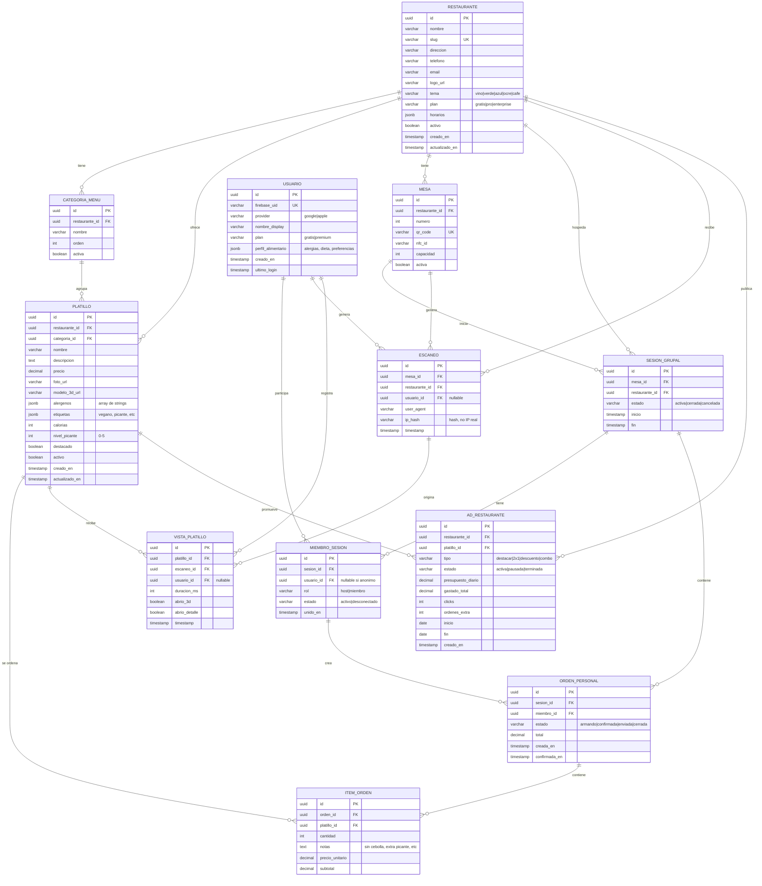

# Carta — Schema de Base de Datos Fase 1

**Version:** 1.0
**Fecha:** 4 de abril de 2026
**Motor:** PostgreSQL 15+ (Cloud SQL)
**ORM:** SQLAlchemy 2.0

---

## Diagrama ER (Mermaid)



---

## SQL (PostgreSQL)

```sql
-- ==================================================
-- Carta — Schema Fase 1
-- PostgreSQL 15+ / Cloud SQL
-- ==================================================

-- Extension para UUIDs
CREATE EXTENSION IF NOT EXISTS "uuid-ossp";

-- ==================================================
-- RESTAURANTE
-- ==================================================
CREATE TABLE restaurante (
    id UUID PRIMARY KEY DEFAULT uuid_generate_v4(),
    nombre VARCHAR(200) NOT NULL,
    slug VARCHAR(100) UNIQUE NOT NULL,
    direccion TEXT,
    telefono VARCHAR(20),
    email VARCHAR(200),
    logo_url VARCHAR(500),
    tema VARCHAR(20) NOT NULL DEFAULT 'vino'
        CHECK (tema IN ('vino', 'verde', 'azul', 'ocre', 'cafe')),
    plan VARCHAR(20) NOT NULL DEFAULT 'gratis'
        CHECK (plan IN ('gratis', 'pro', 'enterprise')),
    horarios JSONB DEFAULT '{}',
    activo BOOLEAN NOT NULL DEFAULT true,
    creado_en TIMESTAMP WITH TIME ZONE NOT NULL DEFAULT NOW(),
    actualizado_en TIMESTAMP WITH TIME ZONE NOT NULL DEFAULT NOW()
);

CREATE INDEX idx_restaurante_slug ON restaurante(slug);
CREATE INDEX idx_restaurante_activo ON restaurante(activo) WHERE activo = true;

-- ==================================================
-- CATEGORIA_MENU
-- ==================================================
CREATE TABLE categoria_menu (
    id UUID PRIMARY KEY DEFAULT uuid_generate_v4(),
    restaurante_id UUID NOT NULL REFERENCES restaurante(id) ON DELETE CASCADE,
    nombre VARCHAR(100) NOT NULL,
    orden INTEGER NOT NULL DEFAULT 0,
    activa BOOLEAN NOT NULL DEFAULT true,
    UNIQUE(restaurante_id, nombre)
);

CREATE INDEX idx_categoria_restaurante ON categoria_menu(restaurante_id);

-- ==================================================
-- PLATILLO
-- ==================================================
CREATE TABLE platillo (
    id UUID PRIMARY KEY DEFAULT uuid_generate_v4(),
    restaurante_id UUID NOT NULL REFERENCES restaurante(id) ON DELETE CASCADE,
    categoria_id UUID REFERENCES categoria_menu(id) ON DELETE SET NULL,
    nombre VARCHAR(200) NOT NULL,
    descripcion TEXT,
    precio DECIMAL(10,2) NOT NULL CHECK (precio >= 0),
    foto_url VARCHAR(500),
    modelo_3d_url VARCHAR(500),
    alergenos JSONB DEFAULT '[]',
    etiquetas JSONB DEFAULT '[]',
    calorias INTEGER,
    nivel_picante INTEGER DEFAULT 0 CHECK (nivel_picante BETWEEN 0 AND 5),
    destacado BOOLEAN NOT NULL DEFAULT false,
    activo BOOLEAN NOT NULL DEFAULT true,
    creado_en TIMESTAMP WITH TIME ZONE NOT NULL DEFAULT NOW(),
    actualizado_en TIMESTAMP WITH TIME ZONE NOT NULL DEFAULT NOW()
);

CREATE INDEX idx_platillo_restaurante ON platillo(restaurante_id);
CREATE INDEX idx_platillo_categoria ON platillo(categoria_id);
CREATE INDEX idx_platillo_activo ON platillo(restaurante_id, activo) WHERE activo = true;
CREATE INDEX idx_platillo_alergenos ON platillo USING GIN (alergenos);
CREATE INDEX idx_platillo_etiquetas ON platillo USING GIN (etiquetas);

-- ==================================================
-- MESA
-- ==================================================
CREATE TABLE mesa (
    id UUID PRIMARY KEY DEFAULT uuid_generate_v4(),
    restaurante_id UUID NOT NULL REFERENCES restaurante(id) ON DELETE CASCADE,
    numero INTEGER NOT NULL,
    qr_code VARCHAR(100) UNIQUE NOT NULL,
    nfc_id VARCHAR(100),
    capacidad INTEGER DEFAULT 4,
    activa BOOLEAN NOT NULL DEFAULT true,
    UNIQUE(restaurante_id, numero)
);

CREATE INDEX idx_mesa_qr ON mesa(qr_code);
CREATE INDEX idx_mesa_restaurante ON mesa(restaurante_id);

-- ==================================================
-- USUARIO
-- ==================================================
CREATE TABLE usuario (
    id UUID PRIMARY KEY DEFAULT uuid_generate_v4(),
    firebase_uid VARCHAR(128) UNIQUE NOT NULL,
    provider VARCHAR(20) NOT NULL CHECK (provider IN ('google', 'apple')),
    nombre_display VARCHAR(100),
    plan VARCHAR(20) NOT NULL DEFAULT 'gratis'
        CHECK (plan IN ('gratis', 'premium')),
    perfil_alimentario JSONB DEFAULT '{}',
    creado_en TIMESTAMP WITH TIME ZONE NOT NULL DEFAULT NOW(),
    ultimo_login TIMESTAMP WITH TIME ZONE NOT NULL DEFAULT NOW()
);

CREATE INDEX idx_usuario_firebase ON usuario(firebase_uid);
CREATE INDEX idx_usuario_plan ON usuario(plan);

-- ==================================================
-- SESION_GRUPAL
-- ==================================================
CREATE TABLE sesion_grupal (
    id UUID PRIMARY KEY DEFAULT uuid_generate_v4(),
    mesa_id UUID NOT NULL REFERENCES mesa(id) ON DELETE CASCADE,
    restaurante_id UUID NOT NULL REFERENCES restaurante(id) ON DELETE CASCADE,
    estado VARCHAR(20) NOT NULL DEFAULT 'activa'
        CHECK (estado IN ('activa', 'cerrada', 'cancelada')),
    inicio TIMESTAMP WITH TIME ZONE NOT NULL DEFAULT NOW(),
    fin TIMESTAMP WITH TIME ZONE
);

CREATE INDEX idx_sesion_mesa ON sesion_grupal(mesa_id);
CREATE INDEX idx_sesion_activa ON sesion_grupal(mesa_id, estado) WHERE estado = 'activa';
CREATE INDEX idx_sesion_restaurante ON sesion_grupal(restaurante_id);

-- ==================================================
-- MIEMBRO_SESION
-- ==================================================
CREATE TABLE miembro_sesion (
    id UUID PRIMARY KEY DEFAULT uuid_generate_v4(),
    sesion_id UUID NOT NULL REFERENCES sesion_grupal(id) ON DELETE CASCADE,
    usuario_id UUID REFERENCES usuario(id) ON DELETE SET NULL,
    rol VARCHAR(20) NOT NULL DEFAULT 'miembro'
        CHECK (rol IN ('host', 'miembro')),
    estado VARCHAR(20) NOT NULL DEFAULT 'activo'
        CHECK (estado IN ('activo', 'desconectado')),
    unido_en TIMESTAMP WITH TIME ZONE NOT NULL DEFAULT NOW()
);

CREATE INDEX idx_miembro_sesion ON miembro_sesion(sesion_id);
CREATE INDEX idx_miembro_usuario ON miembro_sesion(usuario_id);

-- ==================================================
-- ORDEN_PERSONAL
-- ==================================================
CREATE TABLE orden_personal (
    id UUID PRIMARY KEY DEFAULT uuid_generate_v4(),
    sesion_id UUID NOT NULL REFERENCES sesion_grupal(id) ON DELETE CASCADE,
    miembro_id UUID NOT NULL REFERENCES miembro_sesion(id) ON DELETE CASCADE,
    estado VARCHAR(20) NOT NULL DEFAULT 'armando'
        CHECK (estado IN ('armando', 'confirmada', 'enviada', 'cerrada')),
    total DECIMAL(10,2) DEFAULT 0,
    creada_en TIMESTAMP WITH TIME ZONE NOT NULL DEFAULT NOW(),
    confirmada_en TIMESTAMP WITH TIME ZONE
);

CREATE INDEX idx_orden_sesion ON orden_personal(sesion_id);
CREATE INDEX idx_orden_miembro ON orden_personal(miembro_id);

-- ==================================================
-- ITEM_ORDEN
-- ==================================================
CREATE TABLE item_orden (
    id UUID PRIMARY KEY DEFAULT uuid_generate_v4(),
    orden_id UUID NOT NULL REFERENCES orden_personal(id) ON DELETE CASCADE,
    platillo_id UUID NOT NULL REFERENCES platillo(id) ON DELETE CASCADE,
    cantidad INTEGER NOT NULL DEFAULT 1 CHECK (cantidad > 0),
    notas TEXT,
    precio_unitario DECIMAL(10,2) NOT NULL,
    subtotal DECIMAL(10,2) NOT NULL
);

CREATE INDEX idx_item_orden ON item_orden(orden_id);
CREATE INDEX idx_item_platillo ON item_orden(platillo_id);

-- ==================================================
-- ESCANEO (Analytics)
-- ==================================================
CREATE TABLE escaneo (
    id UUID PRIMARY KEY DEFAULT uuid_generate_v4(),
    mesa_id UUID NOT NULL REFERENCES mesa(id) ON DELETE CASCADE,
    restaurante_id UUID NOT NULL REFERENCES restaurante(id) ON DELETE CASCADE,
    usuario_id UUID REFERENCES usuario(id) ON DELETE SET NULL,
    user_agent VARCHAR(500),
    ip_hash VARCHAR(64),
    timestamp TIMESTAMP WITH TIME ZONE NOT NULL DEFAULT NOW()
);

CREATE INDEX idx_escaneo_restaurante ON escaneo(restaurante_id);
CREATE INDEX idx_escaneo_mesa ON escaneo(mesa_id);
CREATE INDEX idx_escaneo_timestamp ON escaneo(restaurante_id, timestamp);

-- ==================================================
-- VISTA_PLATILLO (Analytics)
-- ==================================================
CREATE TABLE vista_platillo (
    id UUID PRIMARY KEY DEFAULT uuid_generate_v4(),
    platillo_id UUID NOT NULL REFERENCES platillo(id) ON DELETE CASCADE,
    escaneo_id UUID REFERENCES escaneo(id) ON DELETE SET NULL,
    usuario_id UUID REFERENCES usuario(id) ON DELETE SET NULL,
    duracion_ms INTEGER,
    abrio_3d BOOLEAN DEFAULT false,
    abrio_detalle BOOLEAN DEFAULT false,
    timestamp TIMESTAMP WITH TIME ZONE NOT NULL DEFAULT NOW()
);

CREATE INDEX idx_vista_platillo ON vista_platillo(platillo_id);
CREATE INDEX idx_vista_timestamp ON vista_platillo(platillo_id, timestamp);

-- ==================================================
-- AD_RESTAURANTE
-- ==================================================
CREATE TABLE ad_restaurante (
    id UUID PRIMARY KEY DEFAULT uuid_generate_v4(),
    restaurante_id UUID NOT NULL REFERENCES restaurante(id) ON DELETE CASCADE,
    platillo_id UUID NOT NULL REFERENCES platillo(id) ON DELETE CASCADE,
    tipo VARCHAR(20) NOT NULL
        CHECK (tipo IN ('destacar', '2x1', 'descuento', 'combo')),
    estado VARCHAR(20) NOT NULL DEFAULT 'activa'
        CHECK (estado IN ('activa', 'pausada', 'terminada')),
    presupuesto_diario DECIMAL(10,2),
    gastado_total DECIMAL(10,2) DEFAULT 0,
    clicks INTEGER DEFAULT 0,
    ordenes_extra INTEGER DEFAULT 0,
    inicio DATE NOT NULL,
    fin DATE,
    creado_en TIMESTAMP WITH TIME ZONE NOT NULL DEFAULT NOW()
);

CREATE INDEX idx_ad_restaurante ON ad_restaurante(restaurante_id);
CREATE INDEX idx_ad_activa ON ad_restaurante(restaurante_id, estado) WHERE estado = 'activa';

-- ==================================================
-- TRIGGERS: auto-update timestamps
-- ==================================================
CREATE OR REPLACE FUNCTION update_timestamp()
RETURNS TRIGGER AS $$
BEGIN
    NEW.actualizado_en = NOW();
    RETURN NEW;
END;
$$ LANGUAGE plpgsql;

CREATE TRIGGER tr_restaurante_timestamp
    BEFORE UPDATE ON restaurante
    FOR EACH ROW EXECUTE FUNCTION update_timestamp();

CREATE TRIGGER tr_platillo_timestamp
    BEFORE UPDATE ON platillo
    FOR EACH ROW EXECUTE FUNCTION update_timestamp();

-- ==================================================
-- TRIGGER: auto-calculate orden total
-- ==================================================
CREATE OR REPLACE FUNCTION recalcular_total_orden()
RETURNS TRIGGER AS $$
BEGIN
    UPDATE orden_personal
    SET total = (
        SELECT COALESCE(SUM(subtotal), 0)
        FROM item_orden
        WHERE orden_id = COALESCE(NEW.orden_id, OLD.orden_id)
    )
    WHERE id = COALESCE(NEW.orden_id, OLD.orden_id);
    RETURN NEW;
END;
$$ LANGUAGE plpgsql;

CREATE TRIGGER tr_item_orden_total
    AFTER INSERT OR UPDATE OR DELETE ON item_orden
    FOR EACH ROW EXECUTE FUNCTION recalcular_total_orden();
```

---

## Notas de Diseño

**UUIDs como PK:** Permiten generar IDs sin secuencias centralizadas. Importante para inserciones distribuidas y URLs no predecibles.

**JSONB para alergenos y etiquetas:** Mas flexible que tablas de relacion N:N para esta fase. Se puede migrar a tablas dedicadas en Fase 2 si el filtrado lo requiere. PostgreSQL soporta indices GIN sobre JSONB para busquedas eficientes.

**perfil_alimentario como JSONB:** El perfil vive localmente en el dispositivo (IndexedDB). El servidor solo recibe una copia si el usuario es Premium y opta por cloud backup. No se usa para tracking.

**ip_hash en escaneos:** Nunca guardamos la IP real. Solo un hash para detectar escaneos duplicados. Alineado con el modelo de privacidad.

**Soft deletes:** Usamos `activo = false` en lugar de DELETE para restaurantes, platillos y mesas. Preserva integridad referencial con ordenes historicas.

**Indices parciales:** `WHERE activo = true` y `WHERE estado = 'activa'` evitan escanear registros inactivos. Critico cuando la tabla crece.

**Fase 2 agrega:** ARTISTA_3D, SOLICITUD_MODELO_3D, REVIEW_MARKETPLACE, DISPUTA, SUSCRIPCION, PAGO, INVITADO_EXTRA_LOG, NUTRICIONISTA, CONSULTA_NUTRICION.
