# Carta — Diagramas Tecnicos y de UX

**Version:** 1.0
**Fecha:** 3 de abril de 2026
**Complemento de:** Carta_Ideacion_v2.md

---

## 1. User Stories

### 1.1 Comensal — Capa 1 (Sin registro)

**US-C01:** Como comensal, quiero escanear un QR en la mesa y ver el menu del restaurante en mi navegador, para no depender de un menu fisico ni instalar ninguna app.

**US-C02:** Como comensal, quiero ver fotos reales de cada platillo junto con su descripcion y precio, para tener una idea clara de lo que voy a ordenar.

**US-C03:** Como comensal, quiero ver los ingredientes y alergenos de cada platillo, para saber si puedo comerlo sin tener que preguntarle al mesero.

**US-C04:** Como comensal, quiero ver los Top 3 platillos mas vendidos o recomendados, para tener un punto de partida cuando no se que elegir.

**US-C05:** Como comensal, quiero filtrar platillos por categoria, precio o tipo de dieta, para reducir las opciones y encontrar algo rapido.

**US-C06:** Como comensal, quiero ver un modelo 3D del platillo en realidad aumentada sobre mi mesa, para saber el tamano real de la porcion y como se ve antes de ordenar.

### 1.2 Comensal — Capa 2 (Carta Premium)

**US-C07:** Como comensal registrado, quiero crear un perfil con mis alergias, dietas y restricciones alimentarias, para que el menu se adapte automaticamente a mi.

**US-C08:** Como comensal registrado, quiero que el menu me muestre cuales platillos son seguros, cuales debo tener precaucion y cuales evitar segun mi perfil, para elegir sin preocupacion.

**US-C09:** Como comensal premium, quiero hablar con un asistente IA y decirle "tengo antojo de algo picante pero ligero" y que me recomiende del menu actual, para no tener que leer todo el menu.

**US-C10:** Como comensal premium, quiero que mis preferencias y pedidos anteriores en otros restaurantes mejoren las recomendaciones, para que cada vez sea mas facil elegir.

**US-C11:** Como comensal registrado, quiero exportar mis datos (perfil, historial) en un archivo JSON o respaldarlos en Google Drive, para tener control total sobre mi informacion.

**US-C12:** Como comensal premium, quiero no ver anuncios en ningun restaurante, para tener una experiencia limpia y sin distracciones.

### 1.3 Restaurante

**US-R01:** Como dueno de restaurante, quiero registrarme en Carta y crear mi menu digital con platillos, categorias, precios y fotos, para ofrecer una experiencia moderna a mis clientes.

**US-R02:** Como dueno de restaurante, quiero etiquetar los ingredientes y alergenos de cada platillo, para que mis clientes con restricciones alimentarias puedan elegir con confianza.

**US-R03:** Como dueno de restaurante, quiero marcar mis Top 3 platillos recomendados, para guiar a clientes indecisos hacia mis mejores opciones.

**US-R04:** Como dueno de restaurante, quiero generar codigos QR unicos para cada mesa o para el restaurante en general, para que mis clientes accedan al menu digital facilmente.

**US-R05:** Como dueno de restaurante, quiero ver un dashboard con cuantos escaneos tuve hoy, cuales platillos son los mas vistos, y cuales filtros usa mas la gente, para tomar decisiones informadas sobre mi menu.

**US-R06:** Como dueno de restaurante, quiero personalizar los colores, logo y estilo de mi menu digital, para que refleje la identidad de mi marca.

**US-R07:** Como dueno de restaurante, quiero subir fotos de mis platillos desde diferentes angulos y que se genere un modelo 3D automaticamente, para que mis clientes puedan verlo en realidad aumentada.

**US-R08:** Como dueno de restaurante, quiero contratar a un artista 3D verificado a traves de Carta para que haga modelos profesionales de mis platillos, para tener la mejor calidad visual posible.

---

## 2. User Journeys (Mapas de Viaje del Usuario)

### 2.1 Journey del Comensal — Capa 1

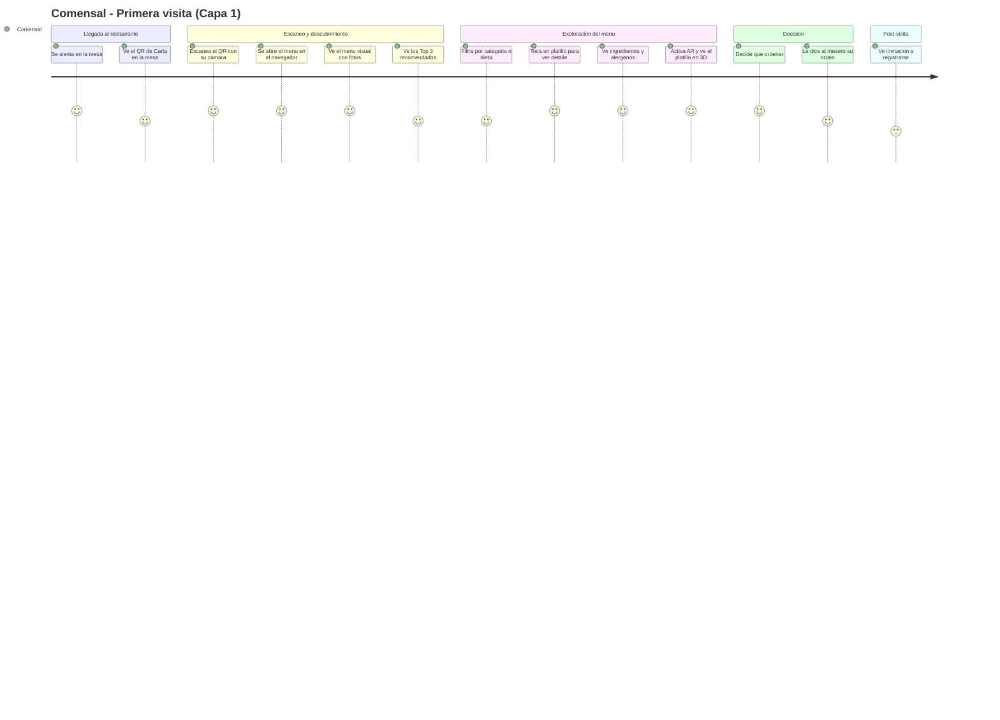

### 2.2 Journey del Comensal — Capa 2 (Premium)

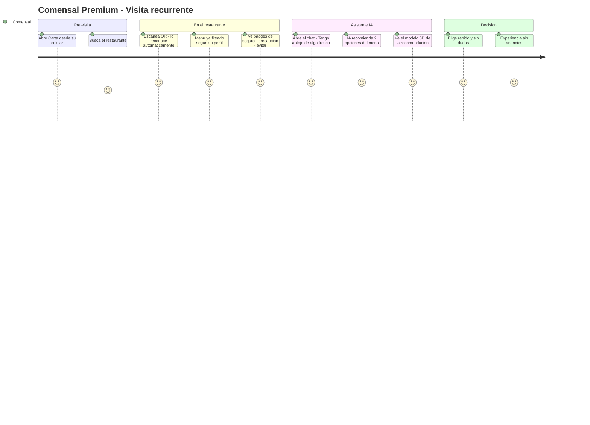

### 2.3 Journey del Restaurante

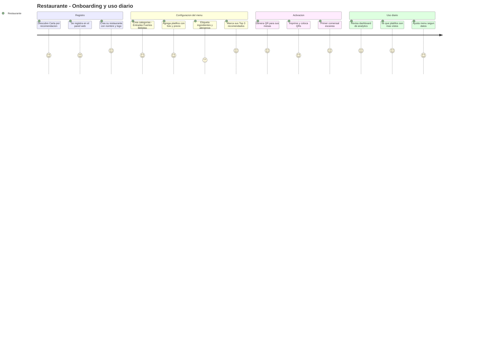

---

## 3. Flujos de Experiencia de Usuario (UX Flows)

### 3.1 Flujo del Comensal — Capa 1 (Completo)

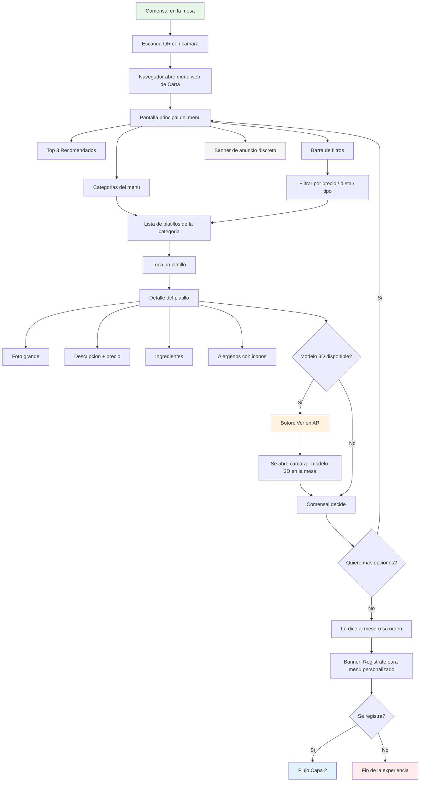

### 3.2 Flujo del Comensal — Registro y Capa 2

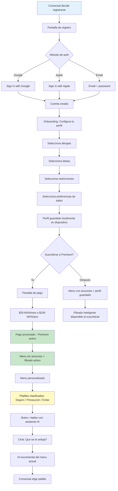

### 3.3 Flujo del Panel de Restaurante

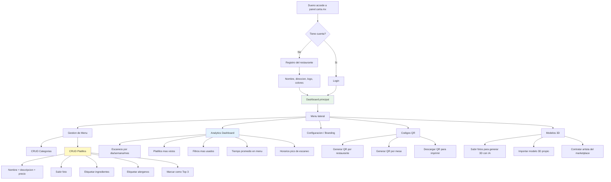

---

## 4. Arquitectura Tecnica Detallada

### 4.1 Diagrama de Componentes

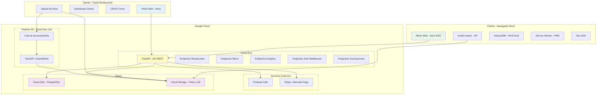

### 4.2 Diagrama de Deployment (Google Cloud)

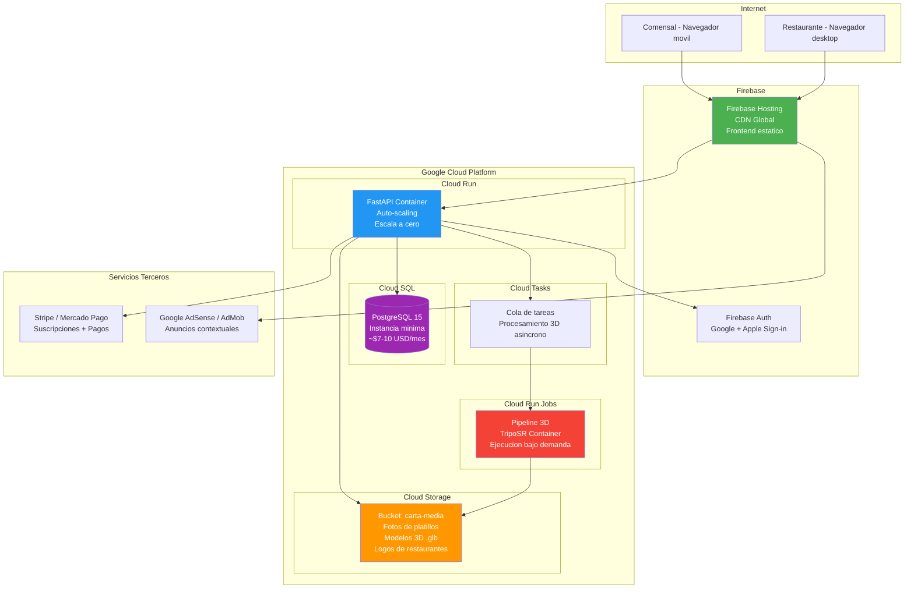

---

## 5. Diagrama Entidad-Relacion (ERD)

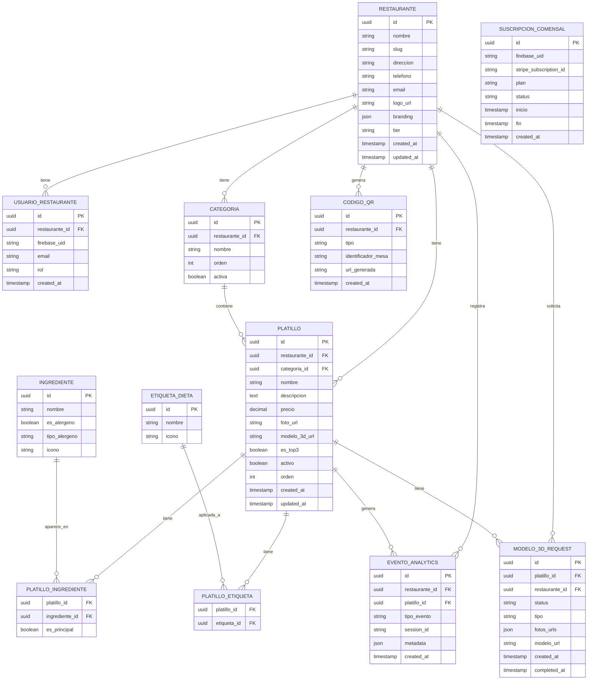

---

## 6. Diagramas de Secuencia

### 6.1 Escaneo de QR y Visualizacion del Menu

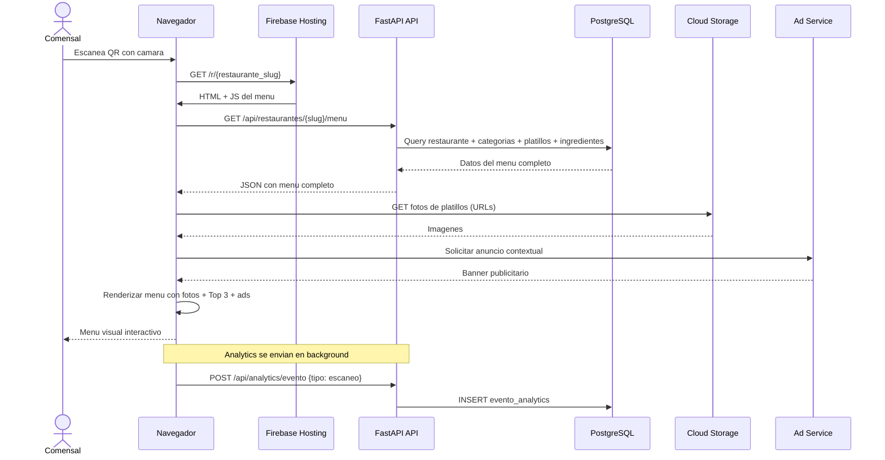

### 6.2 Visualizacion AR de un Platillo

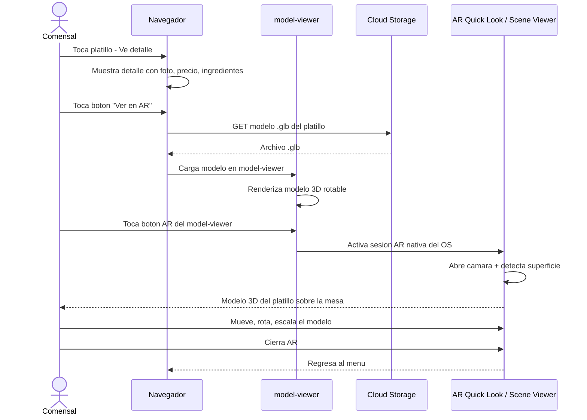

### 6.3 Registro y Configuracion de Perfil

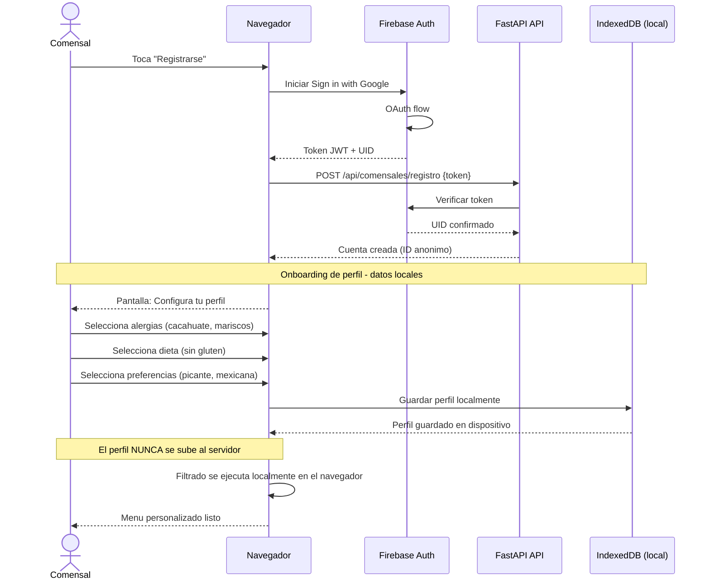

### 6.4 Asistente IA Conversacional (Fase 4)

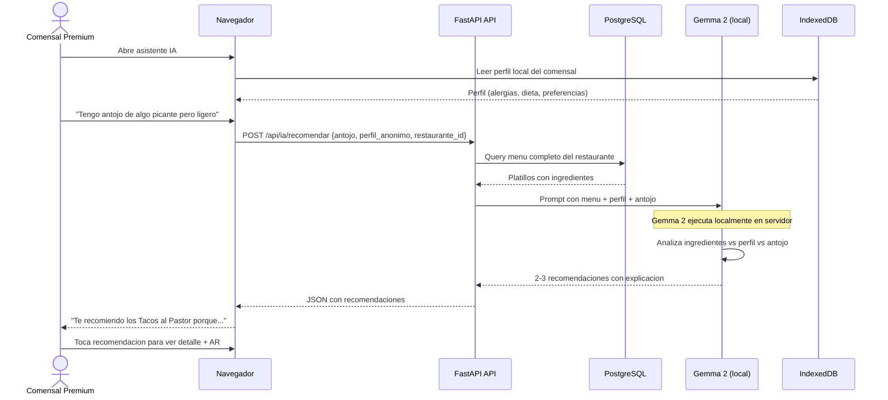

### 6.5 Onboarding de Restaurante

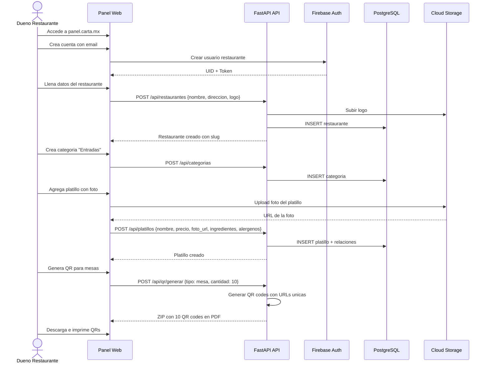

---

## 7. Flujo de Datos y Privacidad

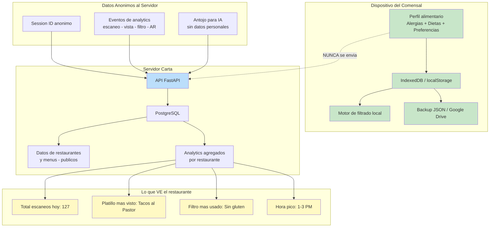

### Resumen de que dato va donde

| Dato | Donde se almacena | Quien puede verlo |
|------|-------------------|-------------------|
| Perfil alimentario (alergias, dietas) | Dispositivo del comensal (IndexedDB) | Solo el comensal |
| Preferencias de sabor | Dispositivo del comensal | Solo el comensal |
| Historial de platillos vistos | Dispositivo del comensal | Solo el comensal |
| Menu del restaurante | Servidor (PostgreSQL) | Publico (cualquier comensal) |
| Fotos y modelos 3D | Cloud Storage | Publico (cualquier comensal) |
| Eventos de analytics | Servidor (PostgreSQL) | Restaurante (agregados), Calvin (raw) |
| Datos de suscripcion | Stripe/Mercado Pago + servidor | Calvin (admin), comensal (su suscripcion) |
| Session ID | Temporal en navegador | Servidor (anonimo) |

---

## 8. Diagrama de Estados — Pipeline 3D

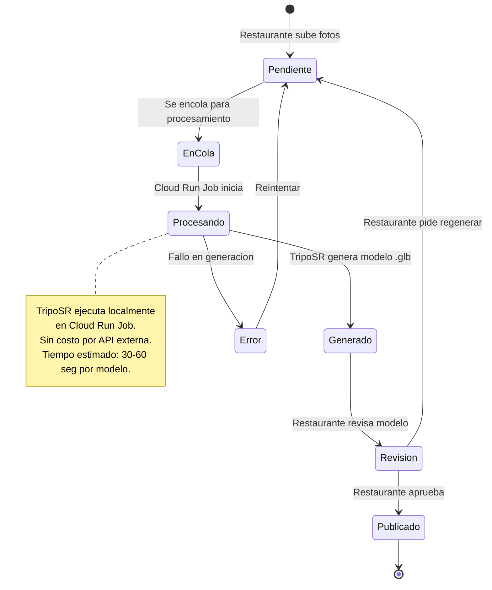

---

## 9. Diagrama de Monetizacion por Fase

```mermaid
gantt
    title Activacion de Fuentes de Ingreso por Fase
    dateFormat X
    axisFormat %s

    section Comensal
    Anuncios en capa gratuita           :active, ads, 1, 4
    Suscripcion Carta Premium           :premium, 3, 4

    section Restaurante
    Tier Gratis                         :active, free, 1, 4
    Tier Pro                            :pro, 3, 4
    Tier Enterprise                     :enterprise, 4, 4

    section Ecosistema
    Marketplace Artistas 3D             :marketplace, 4, 4
    Servicios de Onboarding             :onboarding, 4, 4
```

| Fase | Fuentes de ingreso activas | Ingreso estimado mensual |
|------|---------------------------|-------------------------|
| Fase 1 | Ads + Restaurante gratis (sin ingreso de restaurante) | ~$500-2,000 MXN (solo ads) |
| Fase 2 | Ads (mas escaneos por wow del AR) | ~$2,000-5,000 MXN |
| Fase 3 | Ads + Carta Premium + Restaurante Pro | ~$8,000-15,000 MXN |
| Fase 4 | Todo activo | ~$15,000-30,000+ MXN |

---

## 10. Mapa de Navegacion del Menu Comensal

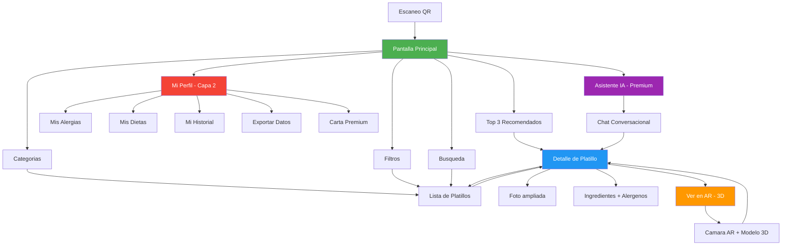
