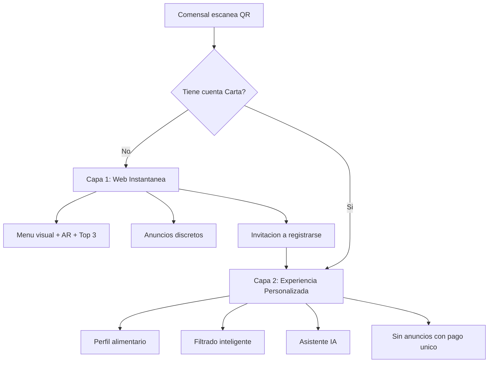
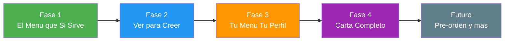
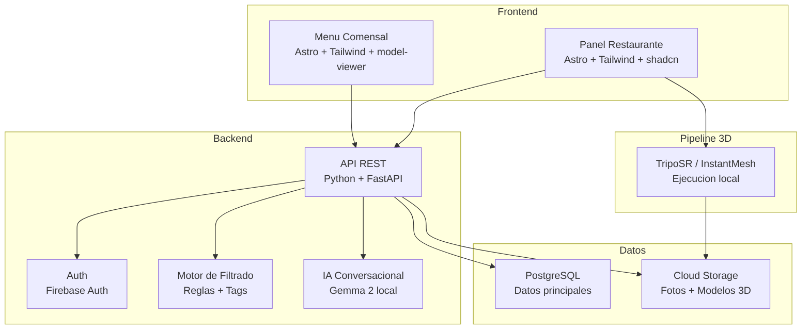
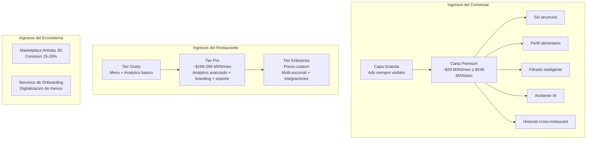
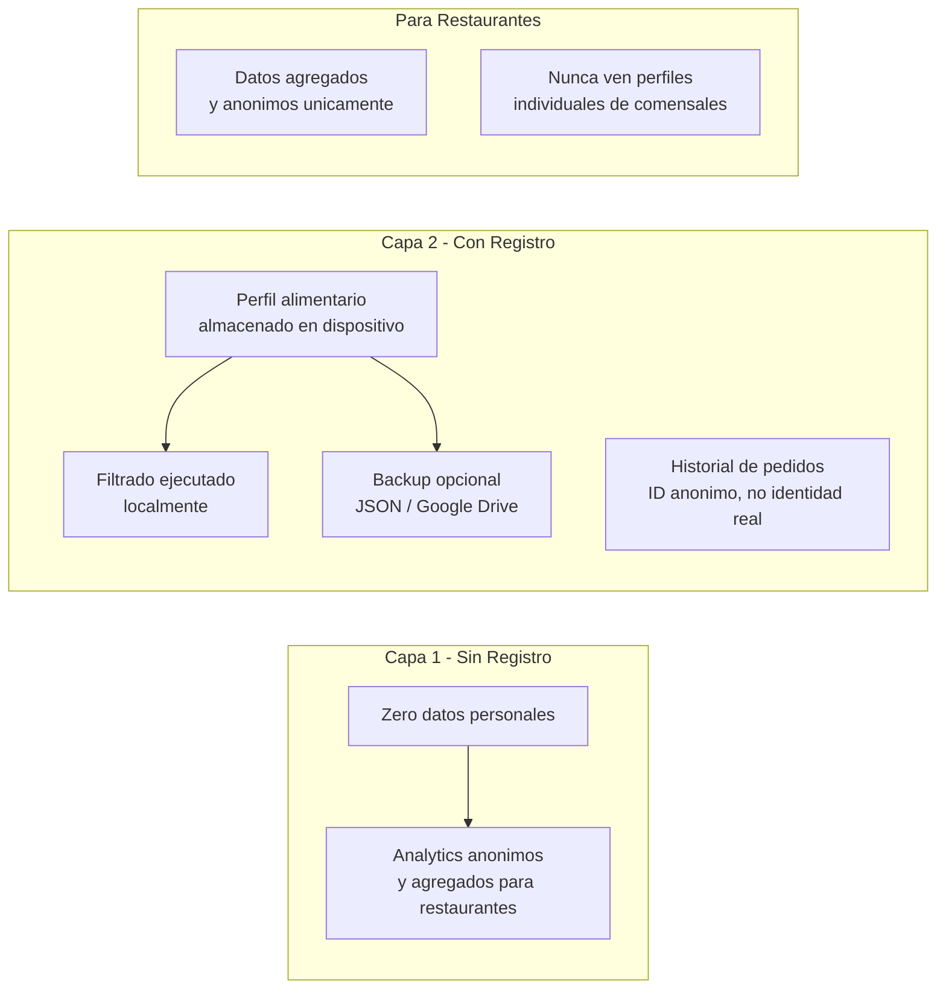

# Carta — Documento de Ideacion y Definicion del Proyecto

**Version:** 2.0
**Fecha:** 3 de abril de 2026
**Autor:** Calvin
**Estado:** Ideacion / Pre-MVP
**Licencia:** Codigo cerrado (propietario)

---

## 1. Declaracion del Problema

### El problema que resolvemos

En pleno 2026, la experiencia de elegir que comer en un restaurante sigue siendo fundamentalmente la misma que hace 30 anos. Ya sea un menu fisico o un codigo QR que abre un PDF o pagina web estatica, el comensal enfrenta los mismos problemas:

**Para el comensal:**
- Sobrecarga de opciones sin forma de filtrar o priorizar
- Cero personalizacion: el menu ignora alergias, dietas, restricciones religiosas o preferencias personales
- Falta de informacion visual real: no se sabe como luce el platillo, que tamano tiene la porcion, o como esta presentado
- Dependencia del mesero para resolver dudas sobre ingredientes o alergenos
- No existe memoria entre visitas ni entre restaurantes: cada vez se empieza de cero

**Para el restaurante:**
- No tienen datos sobre que buscan sus clientes o por que no ordenan ciertos platillos
- El menu no comunica sus mejores platillos de forma efectiva
- Digitalizar el menu actual (QR) no agrego valor real, solo cambio el formato
- Sin herramientas para entender el comportamiento de sus comensales

### Por que importa

Los codigos QR para menus fueron una solucion de emergencia durante la pandemia que se quedo por inercia, no por merito. Representan una oportunidad perdida: tenemos los celulares mas poderosos de la historia en cada mesa y los usamos para mostrar un PDF. Carta propone que esos mismos celulares se conviertan en la interfaz inteligente entre el comensal y la cocina.

---

## 2. Vision del Producto

**Carta** es una plataforma que transforma la experiencia de elegir comida en restaurantes mediante menus inteligentes, personalizados y visualmente inmersivos.

**Mision:** Que ningun comensal vuelva a sentirse perdido frente a un menu. Que cada restaurante pueda ofrecer una experiencia de seleccion moderna sin necesidad de un equipo de tecnologia.

**Destino:** Reemplazar los menus tradicionales y QR estaticos a nivel nacional (Mexico) y eventualmente global. Que "Carta" se convierta en sinonimo de la experiencia moderna de elegir comida, como Uber lo es para el transporte.

**Vision futura:** Mas alla del menu, Carta evoluciona hacia la experiencia completa: pre-ordenar desde el camino al restaurante, que tu comida este casi lista cuando llegues, eliminar tiempos de espera innecesarios. La carta es solo el punto de entrada.

---

## 3. Arquitectura de Dos Capas (Clave para la Adopcion)

El diseno de Carta se basa en una estrategia de dos capas que minimiza la friccion de adopcion:

### Capa 1: Experiencia Web Instantanea (Sin instalacion)

**Acceso:** El comensal escanea un codigo QR en la mesa con la camara de su celular. Se abre una web app directamente en el navegador.

**Lo que obtiene sin instalar nada:**
- Menu visual mejorado y personalizado por el restaurante (colores, branding, categorias)
- Top 3 platillos mas vendidos o recomendados por la casa
- Visualizacion AR de platillos en 3D usando `<model-viewer>` de Google (funciona nativamente en Safari/iOS via AR Quick Look y en Chrome/Android via Scene Viewer, sin instalar nada)
- Filtros basicos: tipo de platillo, rango de precio, vegetariano/vegano
- Informacion de alergenos e ingredientes por platillo
- Anuncios discretos (fuente de ingreso, removibles con pago unico)

**Tecnologia clave:** `<model-viewer>` de Google permite experiencias AR directamente en el navegador movil sin ninguna app. El usuario toca un boton, se abre la camara, y ve el platillo en 3D sobre su mesa.

**Propuesta de valor:** Incluso sin registrarse, la experiencia ya es drasticamente superior a cualquier QR actual. Esto genera el "wow factor" que impulsa el boca a boca.

#### Nota tecnica: `<model-viewer>` vs Three.js

Estas dos tecnologias no son competencia sino capas complementarias:

| | `<model-viewer>` | Three.js |
|--|-------------------|----------|
| **Que es** | Web component de Google (construido SOBRE Three.js) | Libreria 3D de bajo nivel para la web |
| **Complejidad** | Una linea de HTML: `<model-viewer src="taco.glb" ar>` | Cientos de lineas: escena, camara, renderer, luces, controles |
| **AR nativo** | Si. Usa AR Quick Look (iOS) y Scene Viewer (Android) automaticamente | Requiere implementar WebXR manualmente, soporte limitado en iOS |
| **Curva de aprendizaje** | Minima. Si sabes HTML, lo usas en 5 minutos | Alta. Graficos 3D, shaders, geometria |
| **Personalizacion** | Limitada a lo que el componente expone (suficiente para platillos) | Total. Animaciones custom, efectos, escenas interactivas |
| **Caso de uso Carta** | Fases 1-3: mostrar platillos en AR, rotar, zoom | Fase 4+: experiencias inmersivas futuras |

**Decision para Carta:** Empezar con `<model-viewer>` en las primeras fases. Funciona sin instalar nada, AR nativo en ambas plataformas, implementacion trivial para dev solo. Three.js se reserva como evolucion futura si se necesitan experiencias mas elaboradas.

### Capa 2: Experiencia Personalizada (Con registro/app)

**Acceso:** Desde la experiencia web, se invita al usuario a registrarse (o instalar la PWA) para desbloquear funciones avanzadas.

**Lo que obtiene al registrarse:**
- Perfil de alimentacion: alergias, intolerancias, dietas (keto, vegana, sin gluten, etc.), restricciones religiosas (halal, kosher), indicaciones de nutriologo
- Filtrado inteligente automatico: el menu se adapta al perfil, resaltando platillos seguros y senalando los que contienen alergenos
- Asistente IA conversacional: "Tengo antojo de algo picante pero ligero" y la IA recomienda del menu actual con base en ingredientes y preparacion
- Historial entre restaurantes: la IA aprende de lo que has pedido antes en otros establecimientos para mejorar recomendaciones
- Favoritos y notas personales por platillo
- Suscripcion Carta Premium (~$29 MXN/mes o $249 MXN/ano) para eliminar anuncios y desbloquear toda la Capa 2

---

## 4. Funcionalidades Clave (Feature Map)

### 4.1 Para el Comensal

| Feature | Capa | Fase |
|---------|------|------|
| Menu visual mejorado con branding del restaurante | 1 | Fase 1 |
| Informacion de ingredientes y alergenos por platillo | 1 | Fase 1 |
| Top 3 recomendados / mas vendidos | 1 | Fase 1 |
| Anuncios discretos en capa gratuita | 1 | Fase 1 |
| Filtros basicos (categoria, precio, dieta) | 1 | Fase 2 |
| Modelos 3D de platillos con AR | 1 | Fase 2 |
| Perfil de alimentacion personal | 2 | Fase 3 |
| Filtrado inteligente con base en perfil | 2 | Fase 3 |
| Suscripcion Carta Premium (sin ads + features Capa 2) | 2 | Fase 3 |
| Asistente IA conversacional | 2 | Fase 4 |
| Historial entre restaurantes | 2 | Fase 4 |
| Pre-orden desde el camino al restaurante | 2 | Futuro |

### 4.2 Para el Restaurante

| Feature | Fase |
|---------|------|
| Panel web para gestionar menu (CRUD platillos) | Fase 1 |
| Subida de fotos por platillo | Fase 1 |
| Etiquetado de ingredientes y alergenos | Fase 1 |
| Dashboard de analytics (escaneos, platillos mas vistos, filtros mas usados) | Fase 1 |
| Personalizacion visual (logo, colores, categorias) | Fase 2 |
| Generacion AI de modelos 3D a partir de fotos (local, sin costo) | Fase 2 |
| Importacion de modelos 3D propios (glTF/GLB) | Fase 2 |
| Marketplace de artistas 3D | Fase 4 |

---

## 5. Roadmap por Fases

### Fase 1 — "El Menu que Si Sirve"

**Objetivo:** Demostrar que un menu digital puede ser drasticamente mejor que un QR actual. Validar con 1-3 restaurantes reales. Dar valor inmediato al restaurante con analytics desde el dia uno.

**Criterio para avanzar:** Al menos 1 restaurante real usando Carta en sus mesas con retroalimentacion positiva de comensales y restaurante viendo su dashboard.

**Alcance:**
- Backend: API REST con Python/FastAPI para restaurantes y menus (CRUD completo)
- Panel restaurante: web app para registrar restaurantes, crear platillos con nombre, descripcion, precio, foto, categoria, ingredientes y etiquetas de alergenos
- Dashboard de analytics para restaurante: escaneos por dia, platillos mas vistos, tiempo promedio en menu, filtros mas usados
- Menu comensal: web app responsive accesible por QR, con diseno limpio, fotos de platillos, seccion de ingredientes/alergenos, y badge de "Top 3 recomendados"
- Anuncios discretos integrados en la experiencia del comensal
- Generacion de QR unico por restaurante/mesa
- Sin login de comensal, sin AR, sin IA

**Entregable:** Un restaurante real usando Carta en sus mesas. Dashboard mostrando datos reales. Retroalimentacion directa de comensales.

**Metricas de exito:** Escaneos del QR, tiempo en el menu, platillos mas vistos, feedback cualitativo.

### Fase 2 — "Ver para Creer"

**Objetivo:** Introducir la experiencia visual inmersiva que diferencia a Carta de cualquier competidor.

**Criterio para avanzar:** Pipeline de 3D funcionando end-to-end (fotos -> modelo -> AR en navegador) y al menos 5 platillos con modelo 3D en un restaurante piloto.

**Alcance:**
- Integracion de `<model-viewer>` para visualizacion AR en navegador
- Pipeline de generacion de modelos 3D: el restaurante sube 4-6 fotos desde diferentes angulos y se genera un modelo basico usando IA generativa local (TripoSR o InstantMesh, ejecutables localmente, sin costo por uso)
- Opcion de subir modelos 3D propios (formatos glTF/GLB)
- Filtros en el menu: categoria, rango de precio, etiquetas dieteticas
- Personalizacion visual del menu por restaurante (logo, paleta de colores)

**Entregable:** Comensales pueden ver platillos en 3D sobre su mesa desde el navegador. Restaurantes pueden personalizar su menu.

**Metricas de exito:** Porcentaje de usuarios que activan AR, engagement con modelos 3D, retroalimentacion de restaurantes sobre el pipeline.

### Fase 3 — "Tu Menu, Tu Perfil"

**Objetivo:** Introducir la capa personalizada. El menu se adapta al usuario. Activar monetizacion del comensal.

**Criterio para avanzar:** Motor de filtrado validado con al menos 3 perfiles de prueba reales (celiaco, vegano, alergico a mariscos) en 2+ restaurantes. Al menos 1 suscripcion activa procesada.

**Alcance:**
- Sistema de registro/login de comensales (Firebase Auth — Sign in with Google/Apple, gratuito)
- Perfil de alimentacion: alergias, dietas, restricciones, preferencias
- Datos almacenados localmente en el dispositivo del usuario (local-first)
- Opcion de exportar/respaldar perfil (archivo JSON, Google Drive)
- Motor de filtrado inteligente: platillos clasificados como "seguro", "precaucion" o "no recomendado" segun perfil
- PWA installable para que el usuario "instale" la app desde el navegador sin app store
- Suscripcion Carta Premium (~$29 MXN/mes o $249 MXN/ano): elimina anuncios + desbloquea Capa 2 completa (perfil, filtrado, historial)

**Entregable:** Comensales con perfiles ven menus adaptados. Primer flujo de monetizacion recurrente activo.

**Metricas de exito:** Tasa de registro, conversion a suscripcion, comensales que reportan "el menu me mostro exactamente lo que podia comer", churn rate mensual.

### Fase 4 — "Carta Completo"

**Objetivo:** La experiencia completa con IA conversacional y ecosistema de servicios.

**Criterio para avanzar:** Esta es la version de lanzamiento publico completo. Se completa cuando la plataforma es estable y escalable.

**Alcance:**
- Asistente IA conversacional usando modelo local (Gemma 2 de Google o similar, ejecutable on-device o en servidor propio): el comensal describe su antojo en lenguaje natural y la IA recomienda platillos del menu actual
- Historial cross-restaurant: recomendaciones mejoran con el tiempo
- Marketplace de artistas 3D: restaurantes solicitan modelos profesionales, artistas verificados los crean, Carta cobra comision (15-20%)
- Tiers de pago formalizados para restaurantes
- Landing page publica, onboarding self-service para restaurantes

**Entregable:** Plataforma completa lista para escalar a nivel nacional.

### Futuro — "Mas alla del Menu"

Ideas para fases posteriores:
- Pre-orden desde el camino: escanea el QR virtual del restaurante, elige tu comida, y cuando llegas ya esta casi lista
- Integracion con sistemas POS de restaurantes
- Modo grupo: todos en la mesa eligen desde sus celulares, se consolida una sola orden
- Recomendaciones cruzadas: "a personas con gustos similares les encanto X en el restaurante Y"

---

## 6. Arquitectura Tecnica

### Stack

**Backend (fortaleza de Calvin):**
- **Lenguaje:** Python 3.11+
- **Framework:** FastAPI (asincrono, rapido, documentacion automatica con Swagger)
- **Base de datos:** PostgreSQL (relacional, robusto, gratis, soporte nativo para JSON)
- **ORM:** SQLAlchemy 2.0 (el estandar de Python para bases de datos)
- **Autenticacion:** Firebase Auth de Google (gratis hasta 50,000 usuarios/mes, soporta Sign in with Google y Apple out of the box, cero costo inicial)
- **Procesamiento de pagos:** Stripe o Mercado Pago (para suscripciones de comensales y comisiones del marketplace)

**Frontend (minimo viable, maximo impacto):**
- **Menu comensal:** Astro — genera HTML estatico ultra-rapido, perfecto para menus que se cargan por QR. Funciona como PWA.
- **Panel restaurante:** Misma tecnologia, area protegida con auth
- **AR:** `<model-viewer>` de Google — web component, una linea de HTML. Funciona en iOS y Android sin app.
- **UI:** Tailwind CSS + shadcn/ui para iterar rapido sin ser experto en frontend

**IA y 3D (todo local, sin costos por API):**
- **Modelos 3D desde fotos:** TripoSR (open source de StabilityAI, ejecutable local) o InstantMesh. Sin limite de uso, sin costo por modelo.
- **Asistente conversacional (Fase 4):** Gemma 2 de Google (open weights, ejecutable localmente con llama.cpp u Ollama). Alternativas: Phi-3 de Microsoft, Mistral. El contexto del menu del restaurante se inyecta como prompt (RAG simple).
- **Motor de recomendacion:** Inicialmente basado en reglas (matching de ingredientes/etiquetas con el perfil del usuario). Evoluciona a embeddings semanticos en fases futuras.

**Infraestructura (Google Cloud, costos minimos):**
- **Hosting API:** Google Cloud Run (pay-per-use, escala a cero cuando no hay trafico, ideal para empezar con costo ~$0)
- **Frontend:** Firebase Hosting (gratis hasta 10GB/mes de transferencia, CDN global incluido)
- **Base de datos:** Cloud SQL PostgreSQL (o Supabase tier gratis si se quiere minimizar costo inicial, despues migrar a Cloud SQL)
- **Almacenamiento:** Google Cloud Storage (fotos y modelos 3D, ~$0.02/GB/mes)
- **Dominio:** carta.mx o carta.app

### Estructura de costos estimada (Fase 1)

| Recurso | Costo mensual estimado |
|---------|----------------------|
| Firebase Auth | $0 (hasta 50K usuarios) |
| Firebase Hosting | $0 (hasta 10GB transfer) |
| Cloud Run (API) | ~$0-5 USD (escala a cero) |
| Cloud SQL PostgreSQL | ~$7-10 USD (instancia minima) o $0 con Supabase free |
| Cloud Storage | ~$1 USD (pocos GBs iniciales) |
| Dominio | ~$10-15 USD/ano |
| **Total Fase 1** | **~$8-16 USD/mes** (o ~$1-2 USD/mes con Supabase free) |

---

## 7. Modelo de Negocio

### Filosofia: Accesible para Todos, Sostenible para Calvin

Carta no es un proyecto de caridad ni un SaaS caro. Es un producto accesible con una capa gratuita generosa que se sostiene mediante multiples fuentes de ingreso discretas. El objetivo es que el costo nunca sea la razon por la que un restaurante o comensal no use Carta.

### Fuentes de Ingreso

**1. Anuncios en Capa Gratuita del Comensal (Ingreso pasivo permanente)**
Anuncios discretos y no invasivos dentro de la experiencia del menu. No pop-ups, no videos forzados. Banners contextuales (ej. una bebida recomendada, un postre del dia). Los anuncios siempre estan presentes en la capa gratuita, garantizando ingreso pasivo por cada escaneo de QR desde el dia uno. Modelo tipo YouTube/Spotify: usas gratis, ves anuncios.

**2. Carta Premium — Suscripcion Micro (~$29 MXN/mes o $249 MXN/ano)**
El comensal se suscribe para desbloquear la experiencia completa de Capa 2:
- Eliminacion de anuncios en todos los restaurantes
- Perfil de alimentacion con filtrado inteligente
- Asistente IA conversacional
- Historial entre restaurantes
- Recomendaciones personalizadas

Este es el modelo tipo Spotify: la capa gratuita es util y completa, pero la premium es significativamente mejor. El precio es lo suficientemente bajo para que no duela (~$1 MXN/dia) pero genera ingreso recurrente predecible. Las features premium tienen costo real de servidor (IA, sincronizacion), lo que justifica el pago continuo.

**3. Tiers para Restaurantes**
- **Gratis:** Menu completo, QR, analytics basico (escaneos, platillos mas vistos). Suficiente para un restaurante pequeno.
- **Pro (~$199-299 MXN/mes):** Analytics avanzado (tendencias, comparativas, horarios pico), branding completo, soporte prioritario, generacion ilimitada de modelos 3D.
- **Enterprise (precio custom):** Multi-sucursal, integraciones POS, API dedicada, SLA.

**4. Marketplace de Artistas 3D (Comision 15-20%)**
Restaurantes que quieran modelos 3D profesionales contratan artistas verificados a traves de Carta. La generacion por IA siempre es gratuita, pero los modelos profesionales son un upgrade. Carta se lleva comision por facilitar la conexion.

**5. Servicios de Onboarding (Futuro)**
Servicio de digitalizacion: alguien va al restaurante, toma fotos, carga el menu, configura todo. Precio por proyecto.

### Proyeccion Simple (a 12 meses, escenario conservador)

| Fuente | Supuesto | Ingreso mensual |
|--------|----------|-----------------|
| Ads (comensales) | 10,000 escaneos/mes, ~$0.50 MXN CPM | ~$5,000 MXN |
| Carta Premium | 200 suscriptores x $29 MXN/mes | ~$5,800 MXN |
| Restaurantes Pro | 10 restaurantes x $249 MXN | ~$2,490 MXN |
| Marketplace 3D | 5 proyectos/mes x $500 MXN comision | ~$2,500 MXN |
| **Total estimado** | | **~$15,790 MXN/mes** |

La ventaja del modelo de suscripcion es que los ingresos de Carta Premium son recurrentes y predecibles. A diferencia de pagos unicos, cada mes los suscriptores siguen pagando. Con 1,000 suscriptores el ingreso solo de Premium seria ~$29,000 MXN/mes.

---

## 8. Modelo de Privacidad y Soberania de Datos

### Principios

1. **Los datos del usuario son del usuario.** Carta no vende, comparte ni monetiza datos personales. Nunca.
2. **Local-first.** El perfil de alimentacion (alergias, dietas, restricciones) se almacena en el dispositivo del usuario, no en la nube.
3. **Minimo necesario.** El servidor solo recibe lo que necesita para funcionar: que platillos mostrar, no quien los esta viendo.
4. **Exportabilidad total.** El usuario puede exportar todos sus datos en cualquier momento (archivo JSON) o respaldarlos en Google Drive.

### Implementacion Tecnica por Capa

- **Capa 1 (sin registro):** Zero datos personales. No se requiere ni nombre ni email. Analytics anonimos y agregados para restaurantes (ej. "hoy hubo 45 escaneos, el platillo mas visto fue X"). Los anuncios se sirven sin tracking personal (contextual ads, no behavioral ads).
- **Capa 2 (con registro):** Perfil de alergias/dietas almacenado localmente en el dispositivo (IndexedDB/localStorage). El filtrado inteligente se ejecuta en el dispositivo: el servidor envia el menu completo y el cliente filtra localmente segun el perfil. Historial asociado a un ID anonimo. Opcion de exportar todo a JSON o respaldar en Google Drive.
- **Para restaurantes:** Reciben datos agregados y anonimos. Nunca ven perfiles individuales de comensales.

---

## 9. Analisis Competitivo

| Competidor | Que Hace | Donde Carta es Diferente |
|------------|----------|--------------------------|
| QR estaticos (iMenuPro, etc.) | PDF/web estatica via QR | Sin personalizacion, sin AR, sin IA, sin filtrado, sin analytics |
| MenuTech | Gestion de menus con alergenos | Solo informacion, no personaliza ni recomienda |
| Bento (AR menus) | AR en menus | App nativa requerida, no personaliza, costoso |
| Google Maps/Yelp | Fotos de comida, reviews | No estan en el momento de decidir en la mesa |
| Carta | Menu inteligente + AR sin instalar + perfil personal + IA + analytics | Todo en uno, accesible, AR sin app |

---

## 10. Riesgos y Mitigaciones

| Riesgo | Impacto | Mitigacion |
|--------|---------|------------|
| Restaurantes no quieren cargar datos de sus platillos | Alto | UX del panel ultra simple. Ofrecer servicio de onboarding. Importar desde menus existentes con OCR/IA |
| Modelos 3D generados por IA se ven mal | Medio | Fotos de alta calidad como fallback. El 3D es un bonus, no requisito. Marketplace de artistas como upgrade |
| Baja adopcion por comensales | Alto | La Capa 1 no requiere nada del comensal. El wow del AR genera boca a boca |
| Sobrecarga como dev solo | Alto | Fases bien definidas. No construir todo a la vez. AI como multiplicador de productividad |
| Anuncios molestan a usuarios | Medio | Anuncios discretos y contextuales, nunca invasivos. Pago unico accesible para eliminarlos |
| Nombre "Carta" ya esta registrado como marca | Medio | Verificar disponibilidad de marca en IMPI antes de invertir. Tener 2-3 alternativas listas |
| Costos de infraestructura al escalar | Medio | Google Cloud con pay-per-use. Cloud Run escala a cero. Costos crecen con ingresos |

---

## 11. Proximos Pasos Inmediatos

1. **Validar nombre y dominio:** Verificar disponibilidad de "Carta" como marca en IMPI (Instituto Mexicano de la Propiedad Industrial) y disponibilidad de dominios (carta.mx, carta.app, getcarta.com).
2. **Crear repositorio privado en GitHub:** Estructura inicial del proyecto Python/FastAPI, README interno, .gitignore.
3. **Disenar el schema de base de datos Fase 1:** Restaurantes, Menus, Categorias, Platillos, Ingredientes, Alergenos, Fotos, Analytics Events.
4. **Wireframes del menu comensal:** Las 3-4 pantallas principales (categorias, platillos, detalle, alergenos).
5. **Wireframes del panel restaurante:** CRUD de platillos + dashboard de analytics.
6. **Contactar 1-3 restaurantes locales:** Presentar la idea, ofrecer piloto gratuito, obtener su menu actual.
7. **Configurar infraestructura minima:** Proyecto en Google Cloud, Firebase Auth, Firebase Hosting.

---

## Apendice A: Glosario

- **Capa 1:** Experiencia accesible sin instalacion ni registro, via navegador web
- **Capa 2:** Experiencia personalizada que requiere registro o instalacion de PWA
- **PWA:** Progressive Web App — aplicacion web que se puede "instalar" en el celular desde el navegador, sin app store
- **`<model-viewer>`:** Web component de Google que permite visualizar modelos 3D y AR directamente en navegadores moviles
- **Three.js:** Libreria JavaScript de bajo nivel para graficos 3D en la web. `<model-viewer>` esta construido sobre ella
- **glTF/GLB:** Formato estandar para modelos 3D en la web (el "JPEG de los modelos 3D")
- **RAG:** Retrieval-Augmented Generation — tecnica de IA donde se alimenta contexto especifico al modelo de lenguaje
- **FastAPI:** Framework web moderno para Python, asincrono y con documentacion automatica
- **SQLAlchemy:** ORM (Object-Relational Mapper) para Python — permite interactuar con la base de datos usando objetos Python en vez de SQL crudo
- **Firebase Auth:** Servicio gratuito de Google para autenticacion de usuarios (login con Google, Apple, email)
- **Cloud Run:** Servicio de Google Cloud que ejecuta contenedores y escala a cero (no pagas cuando no hay trafico)
- **TripoSR:** Modelo open source de StabilityAI para generar modelos 3D a partir de imagenes
- **Gemma 2:** Modelo de lenguaje open weights de Google, ejecutable localmente sin costo por API
- **Local-first:** Arquitectura donde los datos del usuario se almacenan y procesan en su dispositivo, no en servidores

## Apendice B: Decision Open Source vs Cerrado

Se evaluo hacer Carta open source (AGPL) vs codigo cerrado. La decision fue **codigo cerrado con capa gratuita generosa** por las siguientes razones:

| Factor | Open Source | Cerrado con Capa Gratis |
|--------|-------------|------------------------|
| Adopcion por restaurantes | Igual (no self-hostean) | Igual (usan la version hosted) |
| Adopcion por comensales | Igual (no ven el codigo) | Igual (usan la app/web) |
| Mantenimiento comunitario | Alto (requiere gestionar PRs, issues, docs) | Bajo (Calvin controla todo) |
| Proteccion de IP | Baja (cualquiera puede forkear) | Alta (codigo es privado) |
| Monetizacion | Dificil (competidores pueden copiar) | Clara (producto unico) |
| Confianza/privacidad | Alta (codigo auditable) | Mitigada con politica de privacidad clara y datos local-first |
| Escalabilidad para dev solo | Baja (comunidad requiere atencion) | Alta (enfoque en producto) |

La puerta queda abierta para abrir componentes especificos en el futuro (ej. el formato de datos de menus, SDKs, o plugins) sin comprometer el core.
