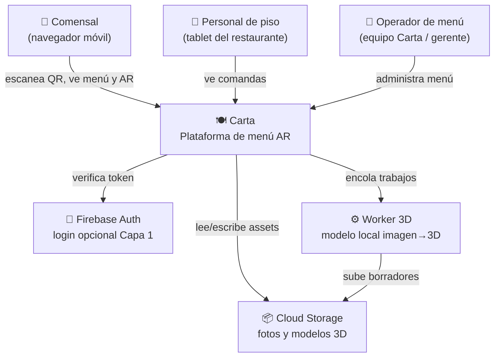
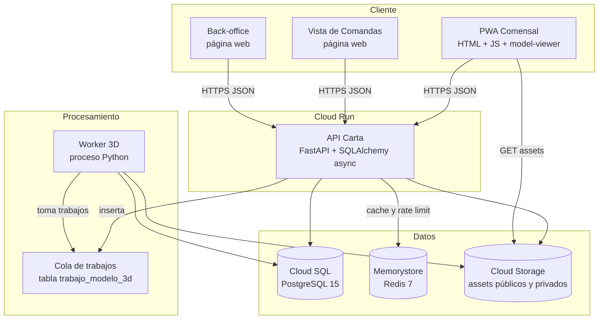
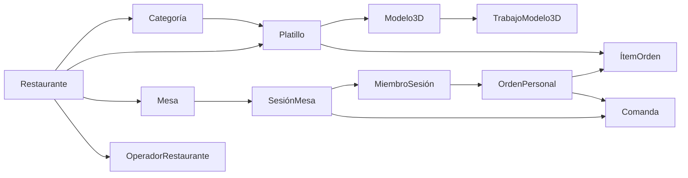
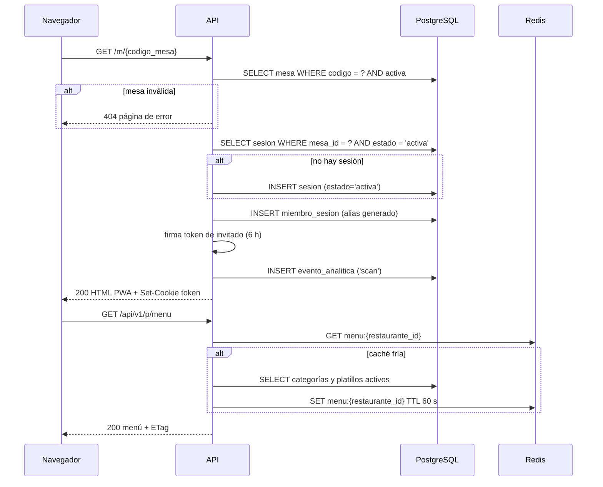
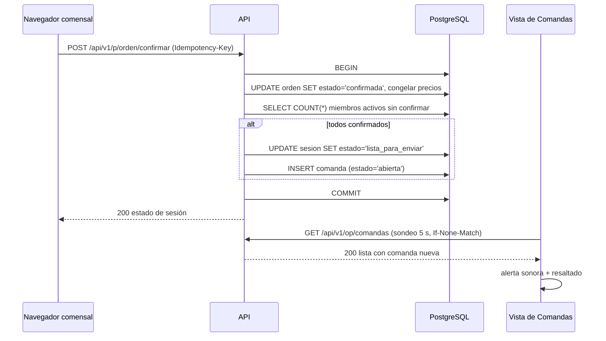
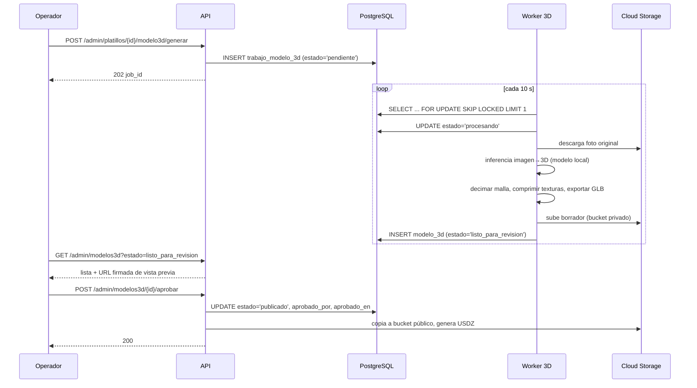

# Carta MVP — Technical Design Document

**Versión:** 1.0 · **Fecha:** 30 de agosto de 2026 · **Estado:** aprobado para construcción
**Precondición de lectura:** [01_PRD.md](01_PRD.md)

---

## 1. Resumen en una página

Carta MVP es una aplicación web (PWA) para el comensal, respaldada por una API en FastAPI sobre PostgreSQL, con un pipeline asíncrono que convierte fotos de platillos en modelos 3D usando un modelo local, y una vista web de comandas para el personal del restaurante.

**Principios de diseño del MVP:**

1. **Un solo despliegue.** Un servicio de API monolítico en Cloud Run. Nada de microservicios para 10 restaurantes.
2. **El comensal no instala nada.** PWA servida como estático + API. Ver [ADR-002](adr/ADR-002-pwa-vs-nativa.md).
3. **Sin realtime real.** Sondeo con ETag en lugar de WebSockets. Ver [ADR-004](adr/ADR-004-sondeo-vs-websockets.md).
4. **El 3D nunca llega al comensal sin aprobación humana.** Ver [ADR-005](adr/ADR-005-pipeline-3d.md).
5. **Ninguna comanda se pierde.** La comanda es un registro persistente, no una notificación.
6. **Nada se borra.** Desactivación lógica en todo lo que tenga historial.

---

## 2. Arquitectura

### 2.1 Contexto (C4 nivel 1)



### 2.2 Contenedores (C4 nivel 2)



### 2.3 Componentes de la API (C4 nivel 3)

| Módulo | Ruta | Responsabilidad |
|---|---|---|
| `app/api/publico/` | `/api/v1/p/*` | Endpoints del comensal. Autenticación por token de invitado. |
| `app/api/operacion/` | `/api/v1/op/*` | Vista de Comandas. Autenticación por token de dispositivo del restaurante. |
| `app/api/admin/` | `/api/v1/admin/*` | Back-office. Autenticación por Firebase + rol de operador. |
| `app/services/sesion.py` | — | Ciclo de vida de sesión de mesa, miembros, progreso. |
| `app/services/orden.py` | — | Órdenes personales, ítems, confirmación, congelado de precios. |
| `app/services/comanda.py` | — | Creación y atención de comandas. Garantía de no pérdida. |
| `app/services/menu.py` | — | Lectura y caché del menú; invalidación. |
| `app/services/assets.py` | — | Subida de fotos, variantes, URLs firmadas. |
| `app/services/modelo3d.py` | — | Trabajos de generación, revisión, publicación. |
| `app/services/analitica.py` | — | Ingesta de eventos y cálculo de M1–M5. |
| `app/core/seguridad.py` | — | Emisión y verificación de tokens; dependencias de FastAPI. |

---

## 3. Decisiones técnicas principales

Cada una tiene su ADR con alternativas evaluadas.

| ADR | Decisión | Resumen del porqué |
|---|---|---|
| [001](adr/ADR-001-monolito.md) | Monolito modular en Cloud Run | 10 restaurantes no justifican operar N servicios. La modularidad por paquetes permite extraer después. |
| [002](adr/ADR-002-pwa-vs-nativa.md) | PWA para el comensal | Un comensal no descarga una app para ver un menú. AR funciona por `<model-viewer>`. |
| [003](adr/ADR-003-identidad-invitado.md) | Token de invitado firmado, sin cuenta | Capa 0 exige cero fricción; el login es opcional y posterior. |
| [004](adr/ADR-004-sondeo-vs-websockets.md) | Sondeo con ETag cada 3 s | Sin estado en el servidor, sin sticky sessions, funciona con redes malas. |
| [005](adr/ADR-005-pipeline-3d.md) | Generación local + revisión humana | Controla calidad y costo; evita que un modelo malo llegue al comensal. |
| [006](adr/ADR-006-formatos-3d.md) | GLB + USDZ, presupuesto de peso | Es el mínimo para cubrir Android e iOS con AR nativo. |
| [007](adr/ADR-007-almacenamiento-assets.md) | GCS con CDN y URLs firmadas para borradores | Assets públicos cacheables; borradores no filtrables. |
| [008](adr/ADR-008-esquema-espanol.md) | Conservar nomenclatura en español del esquema Fase 1 | Ya existe código y migraciones; cambiarlo es puro costo. |
| [009](adr/ADR-009-driver-async.md) | `asyncpg` y corrección del engine | El código actual no arranca: `create_async_engine` con `psycopg2`. |
| [010](adr/ADR-010-hosting-frontend.md) | Frontend estático servido por la propia API | Un despliegue, un dominio, sin CORS ni segundo pipeline. |

---

## 4. Modelo de dominio (resumen)

Detalle completo en [03_Data_Model.md](03_Data_Model.md).



**Invariantes del dominio.** Se garantizan con restricciones de base de datos, no sólo con código:

- `INV-1` Una mesa tiene como máximo una sesión en estado `activa` (índice único parcial).
- `INV-2` Un miembro tiene como máximo una orden en estado distinto de `cerrada` por sesión.
- `INV-3` Un ítem de orden confirmada es inmutable: precio y cantidad congelados.
- `INV-4` Un platillo con historial de órdenes nunca se elimina físicamente.
- `INV-5` Un modelo 3D visible para el comensal está en estado `publicado` y tiene `aprobado_por` no nulo.
- `INV-6` Toda comanda creada tiene estado terminal `atendida` o `cancelada`; nunca desaparece.

---

## 5. Flujos principales

### 5.1 Escaneo y creación de sesión (US-01, US-02)



### 5.2 Confirmación de orden y creación de comanda (US-11, US-12)



**Nota de concurrencia.** El cierre de sesión usa `SELECT … FOR UPDATE` sobre la fila de `sesion_mesa` para evitar que dos confirmaciones simultáneas creen dos comandas. La creación de comanda es idempotente por `(sesion_id, secuencia)`.

### 5.3 Generación y publicación de modelo 3D (US-18, US-19)



---

## 6. Autenticación y autorización

Tres identidades distintas, tres mecanismos. Ninguna comparte credenciales.

| Identidad | Mecanismo | Vigencia | Alcance |
|---|---|---|---|
| **Invitado (comensal)** | JWT firmado (HS256) con `sub = miembro_id`, `mesa_id`, `sesion_id`. Cookie `HttpOnly`, `Secure`, `SameSite=Lax`. | 6 h | Sólo su sesión y su orden. |
| **Comensal registrado** | Firebase ID token verificado en cada petición; se resuelve a `usuario.id`. | Firebase (1 h, refrescable) | Su perfil + lo del invitado. |
| **Dispositivo de restaurante (Comandas)** | Token de dispositivo de larga duración emitido desde back-office, revocable. Cookie `HttpOnly`. | 90 días | Sólo comandas de su restaurante. |
| **Operador (back-office)** | Firebase ID token + fila en `operador_restaurante`. | Firebase | Restaurantes asignados. |

**Reglas transversales:**

- Toda consulta de datos de restaurante filtra por `restaurante_id` derivado del token, **nunca** de un parámetro de la petición.
- Acceso a recurso de otro restaurante devuelve **404**, no 403 (AC-15.3).
- El token de invitado no contiene datos personales y no sobrevive al cierre de la sesión de mesa.

---

## 7. Requisitos no funcionales

| ID | Requisito | Objetivo | Cómo se verifica |
|---|---|---|---|
| NFR-01 | Tiempo hasta menú visible | ≤ 3 s p75 en 4G | Lighthouse móvil + medición en campo |
| NFR-02 | Latencia de API (lecturas) | p95 ≤ 200 ms | Métricas de Cloud Run |
| NFR-03 | Latencia de API (escrituras) | p95 ≤ 400 ms | Métricas de Cloud Run |
| NFR-04 | Carga de modelo 3D | ≤ 2.5 s p75 en 4G | Presupuesto de peso + CDN |
| NFR-05 | Disponibilidad en horario de servicio | ≥ 99.5% (12:00–23:59 CDMX) | Uptime check cada 60 s |
| NFR-06 | Pérdida de comandas | 0 | Prueba de caos + reconciliación diaria |
| NFR-07 | Concurrencia soportada | 200 sesiones simultáneas, 10 restaurantes | Prueba de carga con k6 |
| NFR-08 | Peso inicial de la PWA | ≤ 250 KB comprimido sin contar modelos | Presupuesto en CI |
| NFR-09 | Costo de infraestructura | ≤ 150 USD/mes durante el piloto | Presupuesto GCP con alerta |
| NFR-10 | Recuperación ante desastre | RPO ≤ 24 h, RTO ≤ 4 h | Backup automático + restauración probada |
| NFR-11 | Compatibilidad | iOS 16+ Safari, Android 10+ Chrome | Matriz de dispositivos en pruebas |
| NFR-12 | Accesibilidad | Contraste AA en texto e íconos de acción | Auditoría axe en CI |

---

## 8. Plan de capacidad y costos

**Supuestos del piloto:** 10 restaurantes × 40 mesas × 3 rotaciones/día × 30 días ≈ 36 000 sesiones/mes, con pico de 200 sesiones concurrentes en franja 20:00–21:30.

| Recurso | Configuración | Costo mensual estimado |
|---|---|---|
| Cloud Run (API) | 1 vCPU, 512 MiB, mín. 1 instancia caliente en horario de servicio | ~35 USD |
| Cloud SQL | db-f1-micro con 10 GB SSD, backups diarios | ~30 USD |
| Memorystore Redis | Básico 1 GB | ~35 USD |
| Cloud Storage + egreso | ~20 GB de assets, ~200 GB de egreso | ~30 USD |
| Worker 3D | Ejecución local en máquina propia (no GCP) | 0 USD |
| **Total** | | **~130 USD/mes** |

**Palancas si se excede NFR-09:** reducir instancia mínima a 0 fuera de horario, sustituir Memorystore por caché en proceso (los datos cacheados son de solo lectura y tolerantes a inconsistencia de 60 s).

---

## 9. Estructura de carpetas objetivo

```
carta/
├── CLAUDE.md                      # reglas para Claude Code
├── app/
│   ├── main.py                    # creación de la app, montaje de estáticos
│   ├── core/
│   │   ├── config.py              # Settings (pydantic-settings)
│   │   ├── seguridad.py           # tokens, dependencias de auth
│   │   └── errores.py             # excepciones y handlers
│   ├── api/
│   │   ├── publico/               # comensal
│   │   ├── operacion/             # comandas
│   │   └── admin/                 # back-office
│   ├── services/                  # lógica de negocio (sin FastAPI)
│   ├── db/
│   │   ├── database.py
│   │   └── models.py
│   ├── schemas/                   # Pydantic v2
│   └── static/                    # PWA compilada, comandas, back-office
├── worker/
│   ├── main.py                    # bucle de trabajos
│   ├── generador.py               # inferencia imagen→3D
│   └── optimizador.py             # decimado, texturas, GLB/USDZ
├── migrations/versions/
├── tests/
│   ├── unit/
│   ├── integration/
│   └── e2e/
├── frontend/                      # fuentes de la PWA (build → app/static)
├── terraform/
└── docs/mvp/
```

---

## 10. Qué se reutiliza del código existente

| Existente | Estado | Acción |
|---|---|---|
| `app/db/models.py` (506 líneas, Fase 1) | Útil, cubre ~70% del dominio | Extender con `modelo_3d`, `trabajo_modelo_3d`, `comanda`, `operador_restaurante`, `dispositivo_restaurante`; renombrar `sesion_grupal` → mantener nombre por compatibilidad |
| `app/db/database.py` | **Roto**: `create_async_engine` con URL `postgresql://` y `psycopg2` | Corregir según [ADR-009](adr/ADR-009-driver-async.md) — Fase 0 |
| `app/api/routes.py` | Parcial (restaurantes, platillos) | Reubicar bajo `app/api/admin/` y aplicar autorización |
| `terraform/` | Correcto | Añadir bucket de assets y secretos |
| `.github/workflows/` | Correcto | Añadir pasos de pruebas y presupuesto de bundle |
| `tests/test_api.py` | Mínimo | Reemplazar por la estructura de [07_Test_Strategy](07_Test_Strategy.md) |
| `wireframes/*.jsx` | Obsoletos frente a las 27 pantallas Stitch | Archivar en `docs/archivo/` |

---

## 11. Deuda técnica aceptada conscientemente

Se documenta ahora para no discutirla después.

| Deuda | Por qué se acepta | Cuándo se paga |
|---|---|---|
| Sondeo en vez de WebSockets | Simplicidad y robustez en redes malas | Cuando haya >50 restaurantes o se pida latencia <1 s |
| Sin colas gestionadas (la cola es una tabla) | `FOR UPDATE SKIP LOCKED` es suficiente para decenas de trabajos/día | Cuando el volumen supere ~500 trabajos/día |
| Worker corriendo fuera de GCP | Evita costo de GPU en nube durante el piloto | Al escalar a 50+ restaurantes |
| Sin i18n | Piloto monolingüe | v2 |
| Analítica en PostgreSQL, no en warehouse | Volumen bajo; evita segunda base | Cuando `evento_analitica` supere ~10 M filas |
