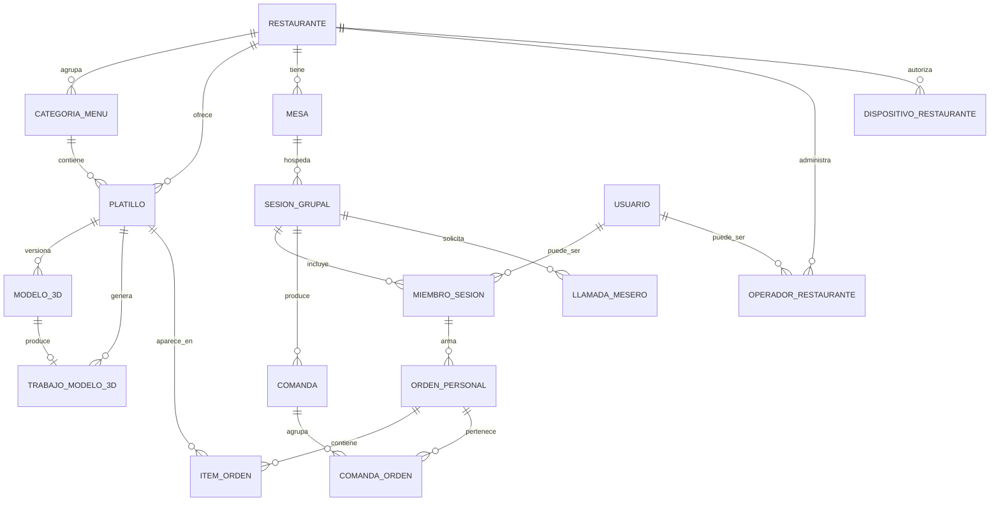

# Carta MVP — Modelo de Datos

**Versión:** 1.0 · **Fecha:** 30 de agosto de 2026
**Motor:** PostgreSQL 15 (Cloud SQL) · **ORM:** SQLAlchemy 2.0 async con `asyncpg`
**Base de partida:** [`docs/Carta_Schema_Fase1.md`](../Carta_Schema_Fase1.md)

---

## 1. Qué cambia respecto a Fase 1

Fase 1 ya definió el núcleo (restaurante, categoría, platillo, mesa, usuario, sesión, orden, ítem). Este documento **lo conserva** y agrega lo que el MVP necesita, además de corregir dos puntos.

### 1.1 Tablas nuevas

| Tabla | Para qué | User stories |
|---|---|---|
| `modelo_3d` | Versiones de modelo por platillo con su ciclo de revisión | US-18, US-19, US-20 |
| `trabajo_modelo_3d` | Cola de generación asistida | US-18 |
| `comanda` | Registro persistente del pedido enviado al piso | US-12, US-13 |
| `comanda_orden` | Relación comanda ↔ órdenes personales incluidas | US-12 |
| `llamada_mesero` | Solicitudes explícitas de atención | US-12, US-14 |
| `operador_restaurante` | Quién puede administrar qué restaurante | US-15 |
| `dispositivo_restaurante` | Tablets autorizadas para la Vista de Comandas | US-13 |
| `evento_analitica` | Eventos del piloto (sustituye `escaneo` y `vista_platillo`) | US-24 |

### 1.2 Cambios sobre tablas existentes

| Tabla | Cambio | Motivo |
|---|---|---|
| `mesa` | `qr_code` pasa a llamarse `codigo_publico`, se exige ≥ 128 bits de entropía y se añade `codigo_revocado_en` | AC-21.1, AC-21.3 |
| `platillo` | Se elimina `modelo_3d_url`; el modelo vive en `modelo_3d`. Se añaden `dimension_cm` (jsonb) y `disponible` | Versionado y AR a escala (AC-08.2), disponibilidad en vivo (AC-04.4) |
| `sesion_grupal` | Nuevo estado `lista_para_enviar`; se añade `ultima_actividad_en` | AC-12.1, AC-02.4 |
| `orden_personal` | Nuevo estado `enviada` ya existía; se añade `confirmada_en` obligatorio al confirmar y `bloqueada` | AC-11.1, INV-3 |
| `miembro_sesion` | Se añaden `alias`, `color_avatar`, `usuario_id` nullable ya existía | US-03 |
| `usuario` | `provider` acepta también `password` y `anonimo→vinculado` | AC-22.2 |

### 1.3 Tablas de Fase 1 que el MVP no usa

`ad_restaurante` (publicidad) permanece en el esquema pero sin endpoints en el MVP. `escaneo` y `vista_platillo` se sustituyen por `evento_analitica`; se conservan como vistas de compatibilidad para no romper consultas antiguas.

---

## 2. Diagrama de entidades del MVP



---

## 3. DDL de las tablas nuevas

> Las migraciones se generan con Alembic. Este DDL es la referencia de verdad; si Alembic produce algo distinto, gana este documento.

### 3.1 `modelo_3d`

```sql
CREATE TYPE estado_modelo_3d AS ENUM (
    'listo_para_revision',
    'publicado',
    'rechazado',
    'despublicado'
);

CREATE TYPE origen_modelo_3d AS ENUM ('generado', 'manual');

CREATE TABLE modelo_3d (
    id                UUID PRIMARY KEY DEFAULT uuid_generate_v4(),
    platillo_id       UUID NOT NULL REFERENCES platillo(id) ON DELETE CASCADE,
    version           INTEGER NOT NULL,
    origen            origen_modelo_3d NOT NULL,
    estado            estado_modelo_3d NOT NULL DEFAULT 'listo_para_revision',

    -- artefactos
    glb_url           VARCHAR(500),
    usdz_url          VARCHAR(500),
    poster_url        VARCHAR(500),
    glb_bytes         INTEGER,
    usdz_bytes        INTEGER,
    triangulos        INTEGER,

    -- escala física para AR (AC-08.2)
    dimension_cm      JSONB DEFAULT '{}',   -- {"ancho":22,"alto":6,"profundidad":22}

    -- revisión
    aprobado_por      UUID REFERENCES usuario(id) ON DELETE SET NULL,
    aprobado_en       TIMESTAMPTZ,
    motivo_rechazo    TEXT,

    creado_en         TIMESTAMPTZ NOT NULL DEFAULT NOW(),
    actualizado_en    TIMESTAMPTZ NOT NULL DEFAULT NOW(),

    UNIQUE (platillo_id, version),

    -- INV-5: publicado exige aprobación humana y artefactos completos
    CONSTRAINT ck_publicado_completo CHECK (
        estado <> 'publicado' OR (
            aprobado_por IS NOT NULL
            AND aprobado_en IS NOT NULL
            AND glb_url IS NOT NULL
            AND poster_url IS NOT NULL
        )
    ),
    -- ADR-006: presupuesto de peso
    CONSTRAINT ck_presupuesto CHECK (
        estado <> 'publicado' OR (
            COALESCE(glb_bytes, 0)  <= 4194304
            AND COALESCE(usdz_bytes, 0) <= 6291456
        )
    )
);

-- Un solo modelo publicado por platillo
CREATE UNIQUE INDEX uq_modelo_publicado
    ON modelo_3d (platillo_id)
    WHERE estado = 'publicado';

CREATE INDEX idx_modelo_platillo ON modelo_3d (platillo_id);
CREATE INDEX idx_modelo_revision ON modelo_3d (estado) WHERE estado = 'listo_para_revision';
```

### 3.2 `trabajo_modelo_3d`

```sql
CREATE TYPE estado_trabajo AS ENUM ('pendiente','procesando','completado','fallido','cancelado');

CREATE TABLE trabajo_modelo_3d (
    id                UUID PRIMARY KEY DEFAULT uuid_generate_v4(),
    platillo_id       UUID NOT NULL REFERENCES platillo(id) ON DELETE CASCADE,
    solicitado_por    UUID REFERENCES usuario(id) ON DELETE SET NULL,
    estado            estado_trabajo NOT NULL DEFAULT 'pendiente',
    foto_origen_url   VARCHAR(500) NOT NULL,
    parametros        JSONB DEFAULT '{}',
    modelo_3d_id      UUID REFERENCES modelo_3d(id) ON DELETE SET NULL,
    intentos          INTEGER NOT NULL DEFAULT 0,
    error_mensaje     TEXT,
    tomado_en         TIMESTAMPTZ,
    finalizado_en     TIMESTAMPTZ,
    creado_en         TIMESTAMPTZ NOT NULL DEFAULT NOW(),

    CONSTRAINT ck_intentos CHECK (intentos <= 3)
);

-- El worker consume con FOR UPDATE SKIP LOCKED sobre este índice
CREATE INDEX idx_trabajo_cola
    ON trabajo_modelo_3d (creado_en)
    WHERE estado = 'pendiente';

CREATE INDEX idx_trabajo_platillo ON trabajo_modelo_3d (platillo_id);
```

### 3.3 `comanda` y `comanda_orden`

```sql
CREATE TYPE estado_comanda AS ENUM ('abierta','atendida','cancelada');

CREATE TABLE comanda (
    id                UUID PRIMARY KEY DEFAULT uuid_generate_v4(),
    restaurante_id    UUID NOT NULL REFERENCES restaurante(id) ON DELETE CASCADE,
    mesa_id           UUID NOT NULL REFERENCES mesa(id) ON DELETE CASCADE,
    sesion_id         UUID NOT NULL REFERENCES sesion_grupal(id) ON DELETE CASCADE,
    secuencia         INTEGER NOT NULL DEFAULT 1,
    estado            estado_comanda NOT NULL DEFAULT 'abierta',
    total_estimado    NUMERIC(10,2) NOT NULL DEFAULT 0,
    num_comensales    INTEGER NOT NULL DEFAULT 1,
    creada_en         TIMESTAMPTZ NOT NULL DEFAULT NOW(),
    atendida_en       TIMESTAMPTZ,
    atendida_por      VARCHAR(120),          -- texto libre: no hay cuentas de mesero en el MVP
    nota_cancelacion  TEXT,

    -- AC-12.4: una sesión puede producir varias comandas (ronda 1, ronda 2)
    UNIQUE (sesion_id, secuencia),

    -- INV-6: estado terminal exige marca de tiempo
    CONSTRAINT ck_comanda_terminal CHECK (
        (estado = 'abierta'   AND atendida_en IS NULL) OR
        (estado = 'atendida'  AND atendida_en IS NOT NULL) OR
        (estado = 'cancelada')
    )
);

CREATE INDEX idx_comanda_abierta
    ON comanda (restaurante_id, creada_en)
    WHERE estado = 'abierta';

CREATE INDEX idx_comanda_mesa ON comanda (mesa_id, creada_en DESC);

CREATE TABLE comanda_orden (
    comanda_id  UUID NOT NULL REFERENCES comanda(id) ON DELETE CASCADE,
    orden_id    UUID NOT NULL REFERENCES orden_personal(id) ON DELETE CASCADE,
    PRIMARY KEY (comanda_id, orden_id)
);
```

### 3.4 `llamada_mesero`

```sql
CREATE TABLE llamada_mesero (
    id              UUID PRIMARY KEY DEFAULT uuid_generate_v4(),
    restaurante_id  UUID NOT NULL REFERENCES restaurante(id) ON DELETE CASCADE,
    mesa_id         UUID NOT NULL REFERENCES mesa(id) ON DELETE CASCADE,
    sesion_id       UUID NOT NULL REFERENCES sesion_grupal(id) ON DELETE CASCADE,
    miembro_id      UUID REFERENCES miembro_sesion(id) ON DELETE SET NULL,
    motivo          VARCHAR(40) NOT NULL DEFAULT 'atencion',
    atendida_en     TIMESTAMPTZ,
    creada_en       TIMESTAMPTZ NOT NULL DEFAULT NOW()
);

CREATE INDEX idx_llamada_pendiente
    ON llamada_mesero (restaurante_id, creada_en)
    WHERE atendida_en IS NULL;
```

### 3.5 `operador_restaurante` y `dispositivo_restaurante`

```sql
CREATE TYPE rol_operador AS ENUM ('propietario','gerente','carta_ops');

CREATE TABLE operador_restaurante (
    id              UUID PRIMARY KEY DEFAULT uuid_generate_v4(),
    usuario_id      UUID NOT NULL REFERENCES usuario(id) ON DELETE CASCADE,
    restaurante_id  UUID NOT NULL REFERENCES restaurante(id) ON DELETE CASCADE,
    rol             rol_operador NOT NULL DEFAULT 'gerente',
    activo          BOOLEAN NOT NULL DEFAULT true,
    creado_en       TIMESTAMPTZ NOT NULL DEFAULT NOW(),
    UNIQUE (usuario_id, restaurante_id)
);

CREATE INDEX idx_operador_usuario ON operador_restaurante (usuario_id) WHERE activo;

CREATE TABLE dispositivo_restaurante (
    id              UUID PRIMARY KEY DEFAULT uuid_generate_v4(),
    restaurante_id  UUID NOT NULL REFERENCES restaurante(id) ON DELETE CASCADE,
    nombre          VARCHAR(120) NOT NULL,         -- "iPad barra"
    token_hash      VARCHAR(128) NOT NULL UNIQUE,  -- hash del token, nunca el token
    ultima_conexion TIMESTAMPTZ,
    revocado_en     TIMESTAMPTZ,
    creado_en       TIMESTAMPTZ NOT NULL DEFAULT NOW()
);

CREATE INDEX idx_dispositivo_restaurante
    ON dispositivo_restaurante (restaurante_id)
    WHERE revocado_en IS NULL;
```

### 3.6 `evento_analitica`

```sql
CREATE TABLE evento_analitica (
    id              BIGSERIAL PRIMARY KEY,
    restaurante_id  UUID NOT NULL REFERENCES restaurante(id) ON DELETE CASCADE,
    mesa_id         UUID REFERENCES mesa(id) ON DELETE SET NULL,
    sesion_id       UUID REFERENCES sesion_grupal(id) ON DELETE SET NULL,
    miembro_id      UUID REFERENCES miembro_sesion(id) ON DELETE SET NULL,
    platillo_id     UUID REFERENCES platillo(id) ON DELETE SET NULL,
    tipo            VARCHAR(40) NOT NULL,
    propiedades     JSONB DEFAULT '{}',
    ip_hash         VARCHAR(64),          -- SHA-256 con sal rotativa diaria; nunca IP en claro
    user_agent_fam  VARCHAR(60),          -- familia, no cadena completa
    ocurrido_en     TIMESTAMPTZ NOT NULL DEFAULT NOW(),

    CONSTRAINT ck_tipo_evento CHECK (tipo IN (
        'scan','menu_view','dish_view','model_view','ar_open',
        'item_add','item_remove','order_confirm','order_unconfirm',
        'session_ready','waiter_call','login'
    ))
);

CREATE INDEX idx_evento_restaurante_fecha ON evento_analitica (restaurante_id, ocurrido_en);
CREATE INDEX idx_evento_tipo ON evento_analitica (tipo, ocurrido_en);
CREATE INDEX idx_evento_sesion ON evento_analitica (sesion_id);
```

---

## 4. Alteraciones a tablas existentes

```sql
-- MESA: código público no adivinable y revocable (AC-21.1, AC-21.3)
ALTER TABLE mesa RENAME COLUMN qr_code TO codigo_publico;
ALTER TABLE mesa ADD COLUMN codigo_revocado_en TIMESTAMPTZ;
ALTER TABLE mesa ADD CONSTRAINT ck_codigo_largo CHECK (length(codigo_publico) >= 22);

-- PLATILLO: el modelo se mueve a su propia tabla; disponibilidad y escala física
ALTER TABLE platillo DROP COLUMN modelo_3d_url;
ALTER TABLE platillo ADD COLUMN disponible BOOLEAN NOT NULL DEFAULT true;
ALTER TABLE platillo ADD COLUMN dimension_cm JSONB DEFAULT '{}';
ALTER TABLE platillo ADD COLUMN foto_thumb_url VARCHAR(500);
ALTER TABLE platillo ADD COLUMN foto_original_url VARCHAR(500);

-- SESION_GRUPAL: nuevo estado y control de inactividad
ALTER TABLE sesion_grupal DROP CONSTRAINT IF EXISTS sesion_grupal_estado_check;
ALTER TABLE sesion_grupal ADD CONSTRAINT sesion_grupal_estado_check
    CHECK (estado IN ('activa','lista_para_enviar','cerrada','cancelada'));
ALTER TABLE sesion_grupal ADD COLUMN ultima_actividad_en TIMESTAMPTZ NOT NULL DEFAULT NOW();

-- INV-1: una sola sesión viva por mesa
CREATE UNIQUE INDEX uq_sesion_viva_por_mesa
    ON sesion_grupal (mesa_id)
    WHERE estado IN ('activa','lista_para_enviar');

-- MIEMBRO_SESION: identidad ligera (US-03)
ALTER TABLE miembro_sesion ADD COLUMN alias VARCHAR(24);
ALTER TABLE miembro_sesion ADD COLUMN color_avatar VARCHAR(7);

-- ORDEN_PERSONAL: inmutabilidad tras confirmar (INV-3)
ALTER TABLE orden_personal ADD COLUMN bloqueada BOOLEAN NOT NULL DEFAULT false;

-- INV-2: una orden viva por miembro
CREATE UNIQUE INDEX uq_orden_viva_por_miembro
    ON orden_personal (miembro_id)
    WHERE estado IN ('armando','confirmada');
```

---

## 5. Reglas de integridad implementadas en la base

| Invariante | Mecanismo |
|---|---|
| INV-1 · una sesión viva por mesa | Índice único parcial `uq_sesion_viva_por_mesa` |
| INV-2 · una orden viva por miembro | Índice único parcial `uq_orden_viva_por_miembro` |
| INV-3 · ítems inmutables tras confirmar | Trigger `tr_item_orden_inmutable` (abajo) |
| INV-4 · sin borrado físico con historial | `ON DELETE RESTRICT` implícito por uso de `activo` + revisión de código |
| INV-5 · publicado exige aprobación | `CHECK ck_publicado_completo` + índice `uq_modelo_publicado` |
| INV-6 · comanda con estado terminal | `CHECK ck_comanda_terminal` |

```sql
CREATE OR REPLACE FUNCTION fn_item_orden_inmutable()
RETURNS TRIGGER AS $$
DECLARE
    v_bloqueada BOOLEAN;
BEGIN
    SELECT bloqueada INTO v_bloqueada
    FROM orden_personal
    WHERE id = COALESCE(NEW.orden_id, OLD.orden_id);

    IF v_bloqueada THEN
        RAISE EXCEPTION 'La orden está confirmada y no admite cambios (INV-3)'
            USING ERRCODE = 'check_violation';
    END IF;
    RETURN COALESCE(NEW, OLD);
END;
$$ LANGUAGE plpgsql;

CREATE TRIGGER tr_item_orden_inmutable
    BEFORE INSERT OR UPDATE OR DELETE ON item_orden
    FOR EACH ROW EXECUTE FUNCTION fn_item_orden_inmutable();
```

---

## 6. Estrategia de migraciones

| Regla | Detalle |
|---|---|
| Herramienta | Alembic, una migración por tarea del plan de implementación |
| Nombres | `NNNN_descripcion_corta.py`, numeración consecutiva |
| Reversibilidad | Toda migración implementa `downgrade()`; se prueba en CI aplicando `upgrade head` → `downgrade -1` → `upgrade head` |
| Datos | Las migraciones no cargan datos de negocio; los seeds viven en `scripts/seed.py` |
| Producción | `alembic upgrade head` se ejecuta como paso previo al despliegue, no al arranque de la app |
| Prohibido | `Base.metadata.create_all()` en producción. Se elimina de `app/main.py` en la tarea T-0.3 |

**Orden de migraciones del MVP:**

1. `0001_base_fase1` — esquema Fase 1 tal como existe hoy
2. `0002_mesa_codigo_publico` — renombrado y entropía
3. `0003_platillo_disponibilidad_escala`
4. `0004_modelo_3d_y_trabajos`
5. `0005_comanda_y_llamadas`
6. `0006_operadores_y_dispositivos`
7. `0007_sesion_estados_e_invariantes`
8. `0008_evento_analitica`

---

## 7. Consultas críticas y sus índices

| Consulta | Frecuencia | Índice que la sostiene |
|---|---|---|
| Menú activo de un restaurante | Muy alta (cada escaneo) | `idx_platillo_activo (restaurante_id, activo)` + caché Redis 60 s |
| Sesión viva de una mesa | Muy alta (cada sondeo) | `uq_sesion_viva_por_mesa` |
| Progreso de miembros de una sesión | Muy alta (sondeo 3 s) | `idx_miembro_sesion (sesion_id)` |
| Comandas abiertas de un restaurante | Alta (sondeo 5 s) | `idx_comanda_abierta` parcial |
| Siguiente trabajo 3D pendiente | Baja | `idx_trabajo_cola` parcial + `SKIP LOCKED` |
| Métricas M1–M5 por rango | Baja (diaria) | `idx_evento_restaurante_fecha` |

**Presupuesto de rendimiento:** ninguna consulta del camino crítico del comensal puede exceder 50 ms en la base. Se verifica con `EXPLAIN ANALYZE` en la tarea T-2.9.

---

## 8. Retención y borrado

| Dato | Retención | Justificación |
|---|---|---|
| `evento_analitica` | 13 meses, luego agregado y purga | Comparación interanual sin conservar detalle indefinido |
| `sesion_grupal`, `orden_personal`, `item_orden` | 24 meses | Análisis de ticket y comportamiento |
| `comanda` | 24 meses | Conciliación operativa con el restaurante |
| Fotos originales | Mientras el platillo esté activo + 6 meses | Permitir regenerar modelos |
| Borradores 3D rechazados | 90 días | Mejorar el proceso; después no aportan |
| `usuario` y perfil alimentario | Hasta que el usuario lo borre | Derecho ARCO (ver [08_Security_Compliance](08_Security_Compliance.md)) |

El borrado de un usuario anonimiza sus filas en `miembro_sesion` (deja `usuario_id` nulo) en lugar de eliminar la sesión, preservando la integridad de las órdenes históricas.
