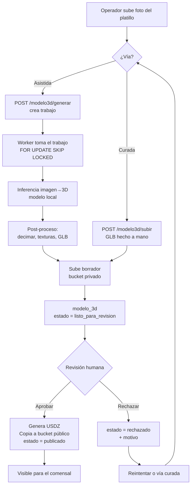

# Carta MVP — Pipeline de Assets 3D

**Versión:** 1.0 · **Fecha:** 30 de agosto de 2026
**Decisión de referencia:** [ADR-005](adr/ADR-005-pipeline-3d.md) y [ADR-006](adr/ADR-006-formatos-3d.md)

---

## 1. Principio rector

> **Ningún modelo llega al comensal sin que una persona lo haya aprobado.**

Un platillo mal modelado hace más daño que un platillo sin modelo. La automatización acelera la producción del borrador; **no** decide qué se publica. Esta regla está implementada en la base de datos (`CHECK ck_publicado_completo` + `uq_modelo_publicado`), no sólo en el código de aplicación, para que sea imposible saltársela por error.

---

## 2. Las dos vías de entrada



### 2.1 Vía asistida (por defecto)
El operador sube una foto y pulsa "Generar 3D". El sistema encola un trabajo y devuelve el control de inmediato (AC-18.1). El worker procesa fuera del camino crítico.

### 2.2 Vía curada (respaldo y calidad premium)
Para platillos estrella, o cuando la vía asistida falla dos veces, el equipo Carta produce el modelo con fotogrametría de escritorio o modelado manual y lo sube como `.glb` (US-20). Entra al mismo estado `listo_para_revision`: **una sola puerta de salida para ambas vías**.

---

## 3. El worker

### 3.1 Ubicación y ejecución
Durante el piloto el worker corre en una máquina local con GPU (`worker/main.py`), no en GCP. Se conecta a Cloud SQL por Cloud SQL Proxy y a Cloud Storage con una cuenta de servicio de permisos mínimos: lectura del bucket privado y escritura sólo en el prefijo `borradores/`.

**Por qué local:** el cómputo de inferencia 3D en GPU en la nube costaría más que todo el resto de la infraestructura junta durante un piloto cuyo volumen es de decenas de modelos por restaurante, una sola vez.

### 3.2 Bucle de trabajo

```python
# worker/main.py — pseudocódigo normativo
while True:
    trabajo = tomar_trabajo()           # FOR UPDATE SKIP LOCKED LIMIT 1
    if not trabajo:
        dormir(10); continue
    try:
        marcar(trabajo, "procesando")
        foto     = descargar(trabajo.foto_origen_url)
        malla    = generar_3d(foto)          # inferencia, modelo local
        glb      = optimizar(malla)          # decimado + texturas + Draco
        validar_presupuesto(glb)             # ADR-006
        url      = subir_borrador(glb)
        crear_modelo_3d(trabajo, url, estado="listo_para_revision")
        marcar(trabajo, "completado")
    except Exception as e:
        registrar_error(trabajo, e)
        if trabajo.intentos >= 3:
            marcar(trabajo, "fallido")
        else:
            marcar(trabajo, "pendiente")     # reintento con backoff
```

**Reglas del worker:**

1. Es el único proceso que escribe en `borradores/`. **Nunca** escribe en el bucket público.
2. **No puede** establecer `estado = 'publicado'`. La restricción de base lo impide aunque el código lo intentara.
3. Un trabajo que excede 20 minutos se marca `fallido` con causa `timeout` (AC-18.4).
4. Máximo 3 intentos por trabajo (`ck_intentos`).
5. Es idempotente: si muere después de subir el borrador pero antes de confirmar, el reintento sobrescribe el mismo objeto por hash de contenido.

### 3.3 Selección del modelo de inferencia

El pipeline trata el generador como una **interfaz reemplazable**:

```python
# worker/generador.py
class GeneradorImagen3D(Protocol):
    def generar(self, imagen: Path, params: dict) -> Malla: ...
```

Criterios para elegir la implementación concreta al arrancar la Fase 5:

| Criterio | Umbral aceptable |
|---|---|
| Licencia | Permite uso comercial sin regalías |
| Ejecución | Local, sin enviar imágenes a terceros |
| Tiempo por modelo | ≤ 5 min en la GPU disponible |
| Salida | Malla con textura, exportable a glTF |
| Calidad en comida | Evaluada con 20 fotos reales de platillos antes de comprometerse |

**Prueba de aceptación del generador (T-5.1):** se procesan 20 fotos de platillos reales de un restaurante piloto; al menos 12 (60%) deben pasar la revisión humana sin retoques. Si no se alcanza, se invierte la proporción de las vías: curada por defecto, asistida como experimento.

> Esta decisión se toma con datos, no de antemano. El documento no fija un modelo específico porque el panorama cambia rápido y la interfaz permite sustituirlo sin tocar el resto del sistema.

---

## 4. Post-proceso y presupuesto

Todo modelo, venga de donde venga, pasa por el mismo optimizador antes de publicarse.

| Paso | Objetivo | Herramienta |
|---|---|---|
| Decimado de malla | ≤ 40 000 triángulos | `pymeshlab` o `blender --background` |
| Reducción de texturas | ≤ 1024×1024, formato KTX2/Basis o JPEG | `Pillow` |
| Compresión de geometría | Draco nivel 7 | `gltf-transform` |
| Empaquetado GLB | Un archivo, una malla, un material | `gltf-transform` |
| Conversión USDZ | Para AR Quick Look en iOS | `usd_from_gltf` |
| Póster | WebP 1200 px del render frontal | `Pillow` |

**Presupuesto duro (rechaza la publicación si se excede):**

| Artefacto | Límite |
|---|---|
| `.glb` | 4 MB |
| `.usdz` | 6 MB |
| Triángulos | 40 000 |
| Texturas | 1024×1024 |

Estos números salen del objetivo NFR-04: cargar en ≤ 2.5 s sobre 4G real (~1.5 MB/s efectivos en un restaurante lleno) con margen para la primera pintura.

---

## 5. Escala física para AR

Para que el platillo aparezca a tamaño real sobre la mesa (AC-08.2), cada modelo lleva `dimension_cm`. El operador la captura una sola vez, en centímetros:

| Campo | Ejemplo | Cómo se obtiene |
|---|---|---|
| `ancho` | 22 | Diámetro del plato |
| `alto` | 6 | Altura del montaje |
| `profundidad` | 22 | Igual al ancho en platos redondos |

Si no se declara, se aplica un valor por defecto de 24 × 5 × 24 cm y el modelo se marca con `escala_estimada: true` en `parametros`. El visor nunca muestra un platillo del tamaño de una mesa: existe un límite de 60 cm en cualquier eje.

---

## 6. Almacenamiento y URLs

| Contenido | Bucket | Acceso | Caché |
|---|---|---|---|
| Fotos originales | `carta-assets-privados/originales/` | URL firmada 15 min | No |
| Borradores 3D | `carta-assets-privados/borradores/` | URL firmada 15 min | No |
| Modelos publicados | `carta-assets-publicos/modelos/{hash}.glb` | Público vía CDN | `max-age=31536000, immutable` |
| Fotos publicadas | `carta-assets-publicos/fotos/{hash}.webp` | Público vía CDN | `max-age=31536000, immutable` |

El nombre incluye el hash del contenido, así que publicar una versión nueva nunca requiere invalidar caché: es otra URL.

---

## 7. Cola de revisión (experiencia del revisor)

La pantalla de revisión en el back-office muestra, por cada borrador:

- Visor 3D interactivo del borrador junto a la foto original, lado a lado.
- Metadatos: triángulos, peso, tiempo de generación, intento número.
- Tres acciones: **Aprobar** · **Rechazar con motivo** · **Reintentar generación**.

**Motivos de rechazo tipificados** (alimentan la mejora del proceso):

| Motivo | Significado |
|---|---|
| `geometria_deforme` | La malla no representa el platillo |
| `textura_incorrecta` | Colores o materiales equivocados |
| `escala_incorrecta` | Proporciones irreales |
| `fondo_incluido` | El modelo capturó plato ajeno o mantel |
| `calidad_insuficiente` | Correcto pero no a la altura de la marca |
| `excede_presupuesto` | Automático: supera peso o triángulos |

Meta operativa: revisar un borrador toma menos de 30 segundos. Un menú de 40 platillos se revisa en 20 minutos.

---

## 8. Modos de fallo y respuestas

| Fallo | Detección | Respuesta del sistema | Impacto en el comensal |
|---|---|---|---|
| El generador produce basura | Revisión humana | Rechazo, reintento o vía curada | Ninguno: nunca lo ve |
| El worker está caído | Trabajos `pendiente` con antigüedad > 1 h | Alerta al operador; los trabajos esperan | Ninguno |
| El modelo excede presupuesto | Validación automática al publicar | Rechazo con `excede_presupuesto` | Ninguno |
| El GLB falla al cargar en el dispositivo | Evento `model_error` desde el cliente | Se muestra la foto; se registra para revisión | Ve la foto, no una pantalla rota (AC-07.3) |
| iOS sin USDZ generado | `usdz_url` nulo | Se oculta el botón AR, se mantiene el visor 3D | Pierde AR, conserva 3D (AC-08.3) |
| Bucket público inaccesible | Uptime check sobre una URL canónica | Alerta; la PWA cae a fotos | Menú funcional sin 3D |

---

## 9. Flujo operativo de onboarding de un restaurante

Secuencia real de trabajo para dar de alta un menú completo:

1. **Sesión de fotos** (1–2 h en sitio). El equipo Carta fotografía cada platillo con luz consistente, fondo limpio, ángulo de 30–45°, con una referencia de escala en cuadro.
2. **Carga masiva** (30 min). Se crean categorías y platillos en el back-office y se suben las fotos.
3. **Generación en lote** (2–4 h desatendidas). Se encolan todos los trabajos; el worker procesa en serie.
4. **Revisión** (20–30 min). Se aprueba, rechaza o reintenta cada borrador.
5. **Vía curada para los rechazados** (variable). Los platillos estrella que no pasaron se modelan a mano.
6. **Impresión de QR** (15 min). Se generan y se pegan en las mesas.
7. **Verificación en sitio** (30 min). Se recorren todas las mesas escaneando el QR con un iPhone y un Android, comprobando que el AR abre.

**Tiempo total de onboarding objetivo: menos de un día de trabajo por restaurante.** Es la métrica que decide si el modelo de negocio escala.

---

## 10. Qué cambia en v2

| Hoy (MVP) | v2 |
|---|---|
| Revisión humana de todos los borradores | Umbral de confianza automático; revisión sólo de los dudosos |
| Worker local con GPU propia | Worker en la nube con autoescalado |
| Captura de fotos por el equipo Carta | Fotogrametría guiada en el teléfono del restaurante |
| Un modelo por platillo | Variantes por tamaño de porción o presentación |
| Escala declarada a mano | Estimación automática de escala desde referencia en la foto |
